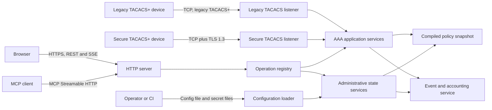
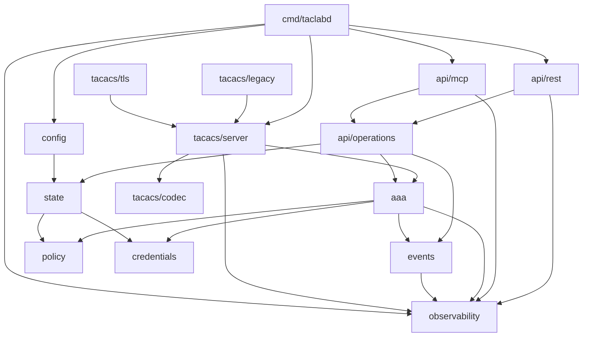
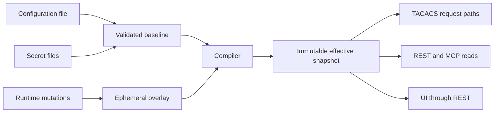
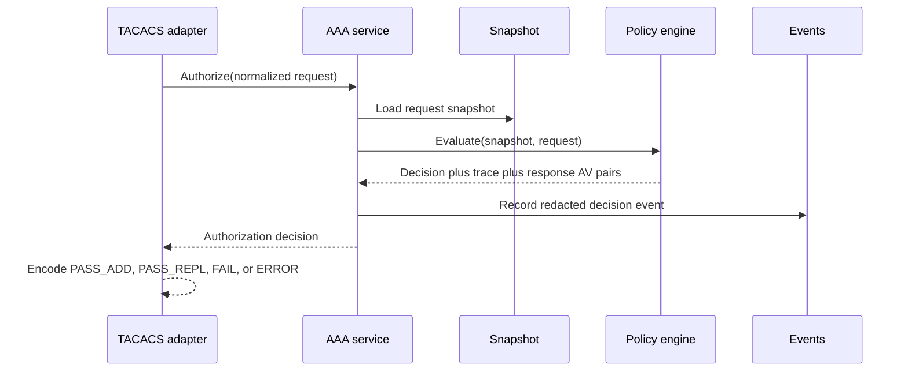

# TacLab Architecture

Status: implementation contract  
Last updated: 2026-08-14

## 1. Architectural summary

TacLab is a single Go process with multiple listeners and one authoritative in-memory effective-state snapshot. The React/TypeScript application is compiled to static assets and embedded into the Go binary. REST and MCP are transport adapters over the same operation registry. TACACS+ protocol handlers are adapters over the same AAA and policy services.

RADIUS is adopted as a **peer** of TACACS in this process ([ADR 0013](decisions/0013-add-radius-to-existing-taclab-process.md)–[0018](decisions/0018-preserve-product-and-module-names-for-first-radius-release.md)). Target packages live under `internal/radius` and must not import `internal/tacacs` (or the reverse). Neutral AAA contracts are additive ([ADR 0014](decisions/0014-neutral-aaa-contract-and-protocol-taxonomy.md)); `domain.Transport` stays TACACS `legacy`/`tls`. Config schema version 2 plus an in-memory v1 migrator is the RADIUS configuration path ([ADR 0017](decisions/0017-config-schema-v2-with-v1-migration.md)). This document does **not** claim a production RADIUS listener exists yet. Do not advertise complete RADIUS until [docs/RADIUS_CONFORMANCE.md](https://github.com/hilather/go-lab-tacacs-mcp/blob/main/docs/RADIUS_CONFORMANCE.md) MVP rows have evidence. Implementation names and seams are frozen in [docs/designs/radius-authentication.md](https://github.com/hilather/go-lab-tacacs-mcp/blob/main/docs/designs/radius-authentication.md).

The source configuration is a read-only baseline. Runtime mutations form an in-memory overlay. A successful mutation or reload compiles a new immutable effective snapshot and swaps it atomically. Read-heavy protocol and API paths do not mutate the active snapshot.

## 2. System context



## 3. Process and listener model

One `taclabd` process hosts:

| Listener | Default container bind | Typical host mapping | Purpose |
|---|---:|---:|---|
| Legacy TACACS+ | `0.0.0.0:4949` | `49/tcp` | RFC 8907 legacy transport with per-client shared-secret obfuscation |
| Secure TACACS+ | `0.0.0.0:4300` | `300/tcp` | RFC 9887 TACACS+ over TLS 1.3 |
| HTTP admin | `0.0.0.0:8080` | `8080/tcp` or reverse proxy | UI, REST, MCP, events, health, metrics when enabled |
| RADIUS access (planned) | `0.0.0.0:1812` | `1812/udp` | RFC 2865 Access-Request/Accept/Reject over UDP. Default `enabled: false` until a later PR registers the listener |
| RADIUS accounting (planned) | `0.0.0.0:1813` | `1813/udp` | RFC 2866 Accounting-Request/Response over UDP. Default `enabled: false` until a later PR registers the listener |

The listeners have independent enablement, connection limits, timeouts, and shutdown deadlines. A failure to bind a configured required listener makes readiness fail and normally terminates startup. An explicitly optional listener may fail only when configuration defines the degraded behavior.

The secure and legacy TACACS+ listeners must be distinct. The secure listener begins TLS immediately and never performs an in-band upgrade. The co-located lab topology and its mandatory safeguards are governed by [ADR 0001](decisions/0001-all-in-one-dual-listener-lab.md); TLS-only or separate instances remain the preferred production-like security profile.

## 4. Major components

### 4.1 `cmd/taclabd`

Responsibilities:

- Parse process-level flags.
- Load and validate configuration.
- Construct dependencies.
- Start listeners.
- Install signal handling.
- Coordinate readiness, reload, and graceful shutdown.

It contains no protocol, policy, or storage logic.

### 4.2 `internal/config`

Responsibilities:

- Decode versioned YAML.
- Reject unknown fields unless a schema migration explicitly permits them.
- Resolve secret references without putting secret values into serializable configuration objects.
- Enforce legacy shared-secret length/complexity policy, compile lifecycle status, and emit redacted reuse/rotation diagnostics.
- Validate local structure and cross-references.
- Normalize usernames, CIDRs, listener addresses, rule identifiers, and durations.
- Produce a baseline domain model and a diagnostics report.

Configuration loading is split into stages:

```text
bytes -> syntax model -> normalized model -> cross-reference validation -> compiled baseline
```

No stage may partially publish state.

### 4.3 `internal/state`

Responsibilities:

- Own the immutable configured baseline.
- Own the mutable runtime overlay under a narrow write lock.
- Compile the effective snapshot.
- Publish snapshots through an atomic pointer.
- Maintain the active revision and source metadata.
- Implement reset, rebase, import, and sanitized export.
- Enforce optimistic concurrency.

Suggested shape:

```go
type Manager struct {
    mu       sync.Mutex
    baseline Baseline
    overlay  Overlay
    current  atomic.Pointer[Snapshot]
    revision atomic.Uint64
}
```

All mutations follow:

1. Acquire the write lock.
2. Verify expected revision when provided.
3. Copy the overlay.
4. Apply the proposed mutation to the copy.
5. Validate and compile a complete candidate snapshot.
6. On failure, discard the candidate and leave current state unchanged.
7. On success, update overlay, increment revision, and atomically publish the snapshot.
8. Emit a state-change event after publication.

Protocol request paths load the snapshot once and retain it for the request. They never hold the state write lock.

### 4.4 `internal/policy`

Responsibilities:

- Compile client selectors, user/group membership, command matchers, AV-pair predicates, and response templates.
- Evaluate authentication eligibility and authorization rules.
- Return a decision and deterministic explanation trace.
- Preserve input AV-pair order and duplicates.
- Apply default-deny semantics.

The policy package must not know about HTTP, MCP, JSON-RPC, React, TCP connection objects, or YAML syntax types.

### 4.5 `internal/credentials`

Responsibilities:

- Verify ASCII/PAP passwords using the configured password verifier.
- Verify CHAP, MS-CHAP v1, and MS-CHAP v2 using separate clear-equivalent challenge secrets.
- Verify ENABLE credentials.
- Apply password changes to runtime credential overrides only.
- Generate and verify high-entropy API tokens.
- Provide redacted credential metadata.

Credential material is represented with types that make accidental serialization difficult. Clear-equivalent challenge secrets must be stored in guarded byte containers, zeroed when replaced where practical, and never included in ordinary domain copies.

### 4.6 `internal/aaa`

Protocol-independent AAA service boundary:

```go
type Service interface {
    BeginAuthentication(context.Context, AuthenticationStart) (AuthenticationStep, error)
    ContinueAuthentication(context.Context, AuthenticationContinue) (AuthenticationStep, error)
    AbortAuthentication(context.Context, AuthenticationAbort) error
    VerifyCredentials(context.Context, userID, clientID string, ev CredentialEvidence) (domain.AuthOutcome, error)
    Authorize(context.Context, AuthorizationRequest) (AuthorizationDecision, error)
    RecordAccounting(context.Context, AccountingRecord) (AccountingResult, error)
    ExplainAuthorization(context.Context, AuthorizationRequest) (PolicyTrace, error)
}
```

`VerifyCredentials` is the shared password/CHAP verifier (`RAD-DOM-002`). TACACS one-shot PAP/CHAP call it and map `AuthPass`/`AuthReject`/`AuthError` onto existing `AuthenticationStep` statuses. `AuthenticateAccess` is not exported. The vertical skeleton implements ASCII LOGIN, `Authorize` via the two policy evaluators (a service permit never authorizes a command), and the full RFC 8907 accounting flag table accepted into the event ring. SUCCESS is returned only after ring accept. Unimplemented authentication flows return ERROR. TACACS packet structs stay in `internal/tacacs`; `server.Bridge` translates.

### 4.7 `internal/tacacs/codec`

Responsibilities:

- Encode and decode headers and all packet bodies.
- Enforce bounded lengths before allocation.
- Handle legacy obfuscation only for the legacy transport.
- Preserve raw values needed for conformance diagnostics.
- Produce typed protocol errors with required reply/session disposition.

The codec is independent of network I/O and can be tested using byte slices and readers with deliberate short reads.

1.0 implements this package in-tree ([ADR 0007](decisions/0007-codec-approach.md)). Header encode/decode, unknown-type §3.6 replies, bounded body allocation, RFC 8907 §4.5 pad, and packet-family bodies live here. Header/obfuscation experiments live under `tools/spike` and must not be imported from production packages. The independent test client keeps a separate codec copy under `internal/tacacs/testclient/codec`.

### 4.8 `internal/tacacs/server`

Responsibilities:

- Accept connections from transport-specific listeners.
- Resolve and bind a network client identity before accepting sessions.
- Negotiate single-connect mode.
- Demultiplex sessions by session ID.
- Enforce odd/even sequence rules and non-wrapping sequences.
- Apply connection, session, read, write, idle, and body-size limits.
- Translate protocol packets to AAA service calls.
- Translate AAA results to RFC-correct replies.
- Coordinate shutdown without abandoning accepted accounting records.

The session map is connection-local. Single-connect sessions may execute concurrently, but packets within one authentication session are serialized in sequence order. Transport adapters call `ServeConn` after identity bind; the first request/reply pair is processed synchronously so a second session cannot start before single-connect negotiation completes.

### 4.9 `internal/tacacs/legacy`

Responsibilities:

- Bind the legacy listener.
- Match the remote IP to a configured client.
- select the client's shared secret.
- apply RFC 8907 obfuscation/de-obfuscation.
- reject cleartext-body packets and shared-secret mismatches with correct connection handling.

`taclabd serve --config` binds enabled TACACS listeners (legacy and/or TLS) and, when enabled, the HTTP admin listener (REST + MCP).

### 4.10 `internal/tacacs/tls`

Responsibilities:

- Bind the secure listener.
- Require TLS 1.3 or newer.
- Require mutual certificate authentication for the baseline implementation.
- Validate certificate chains and configured identity mappings.
- support SNI selection when multiple server identities are configured.
- disable 0-RTT.
- pass un-obfuscated TACACS packets to the common server while enforcing the RFC 9887 flag behavior.
- make resumption policy and ticket lifetime configurable.

Optional external PSK or raw-public-key support must be isolated behind a transport authentication interface and may not weaken certificate-based mutual-authentication support.

### 4.10.1 `internal/tacacs/testclient`

Independent TACACS+ test client. Encode/decode uses `internal/tacacs/testclient/codec` only. Production code must not import the server codec, `internal/tacacs/tls`, or `internal/tacacs/server`.

`DialTLS` implements the RFC 9887 **client role** (T98-ROLE-001–005):

- Begin TLS 1.3 immediately; send no TACACS bytes before handshake completion.
- Never fall back to legacy `Dial` after a TLS failure.
- Validate server identity with RFC 9525 DNS-ID / IP-ID / SRV-ID. URI-ID is rejected and URI SANs are never consulted.
- Set `TAC_PLUS_UNENCRYPTED_FLAG` on every TLS packet; terminate if a reply lacks it. Obfuscation is never applied.
- Send no 0-RTT and include no `early_data` extension (`ClientSessionCache` is unset).

T98-ROLE evidence uses independent `crypto/tls` peers and raw 12-byte header fixtures. Shared-codec loopback against the production listener is not T98-ROLE evidence.

### 4.11 `internal/api/operations`

The canonical administrative application API. Each operation has:

- stable operation ID.
- request and response types.
- required scopes.
- mutability and idempotency metadata.
- parity disposition.
- REST binding metadata.
- MCP binding metadata.
- audit-event metadata.

Operation handlers invoke state, AAA, event, and token services. REST and MCP register adapters from this registry or are verified against it by generated tests.

The Go registry loads `api/operations.yaml` and requires a handler plus request/response types for every row. Implemented handlers are `system.status.get`, `system.build.get`, `policy.evaluate`, `tokens.list` / `tokens.create` / `tokens.revoke`, and `session.create` / `session.delete`. Other operations are registered as stubs that return `unavailable` until their handlers are filled. There is no HTTP in this package.

### 4.11b `internal/api/auth`

Responsibilities:

- Verify lab static bearer tokens against the snapshot digest index (SHA-256, constant-time compare).
- Evaluate the exact-match scope matrix. `state:write` does not grant `tokens:manage`, `runtime:reset`, or `config:reload`.
- Load bootstrap tokens from secret files through `config.FileLookup` at snapshot compile.
- Exchange a verified principal for an HttpOnly UI session cookie (`SameSite=Strict`, `Secure` follows `listeners.http.tls.enabled`).
- Require a CSRF token on cookie-authenticated mutations whenever UI sessions are enabled.

Lab static bearer is `EXEMPT_BY_ADR` versus the MCP OAuth protected-resource-metadata SHOULD. See [ADR 0010](https://github.com/hilather/go-lab-tacacs-mcp/blob/main/docs/decisions/0010-lab-static-bearer.md).

### 4.12 `internal/api/rest`

Responsibilities:

- Serve `/api/v1` endpoints.
- Decode and validate wire requests.
- Authenticate bearer tokens or browser sessions.
- enforce scopes.
- map common errors to HTTP status and problem details.
- support cursor pagination, conditional revision writes, and idempotency keys.
- serve OpenAPI.
- provide SSE event streams.

PR-16b serves the full REST column: `/health/live`, `/health/ready`, `/api/openapi.json`, status/build, config effective/validate/reload/export, runtime reset, user/group/client/token CRUD, policy.evaluate, authentication.test, session (CSRF on cookie mutations; `cookie_secure` follows HTTP TLS), `GET /api/v1/events`, and `GET /api/v1/events/stream` (SSE bodies, Last-Event-ID, write-deadline opt-out). MCP-only operations are not bound. Adapters invoke the operation registry and never the MCP package. Authentication uses `auth.Service` (snapshot bearer + UI session + CSRF).

It contains no independent business rules.

### 4.13 `internal/api/mcp`

Responsibilities:

- Expose MCP 2026-07-28 Streamable HTTP on `POST /mcp` (GET/DELETE return 405).
- Register every implemented `PARITY_REQUIRED` operation as a typed tool (`taclab.<id>`).
- Expose read resources `taclab://status`, `taclab://build`, `taclab://config/effective`, `taclab://users`, `taclab://groups`, `taclab://clients`, and `taclab://events/recent`.
- Implement `subscriptions/listen` as a URI-only notify channel (C8). Event bodies are pulled through `taclab.events.list`.
- Enforce the same `auth.Service` bearer and scopes as REST (lab static bearer, [ADR 0010](https://github.com/hilather/go-lab-tacacs-mcp/blob/main/docs/decisions/0010-lab-static-bearer.md)).
- Require `MCP-Protocol-Version`, `Mcp-Method`, per-request `_meta`, and `Mcp-Name` when applicable.
- Return `resultType: complete`. List/read results set `CacheableResult` `{ttlMs: 0, cacheScope: "private"}` in receiving middleware (the SDK default is `public`).

MCP is not an internal RPC bus. It calls the operation registry directly.

Framing, `server/discover`, tools, and resources go through `github.com/modelcontextprotocol/go-sdk` v1.7.0 (`StreamableHTTPOptions.Stateless = true`). Lab bearer, origin policy, and URI-only `subscriptions/listen` stay in this package ([ADR 0011](https://github.com/hilather/go-lab-tacacs-mcp/blob/main/docs/decisions/0011-mcp-thin-adapter-go-124.md)). Origin policy: missing Origin is allowed when a valid bearer is present unless `api.mcp.require_origin` is true; a present Origin must match `api.mcp.allowed_origins` or the same-host UI origin.

### 4.14 `internal/events`

Responsibilities:

- Synchronously accept protocol, state-change, security, and API audit events.
- assign event sequence IDs and timestamps.
- retain a bounded in-memory ring.
- support cursor-based reads.
- fan out live events to REST SSE and MCP subscribers.
- emit redacted structured logs and metrics.

This is a bounded overwrite-oldest ring with a cursor read API (`events.list`) and a non-blocking stdout JSON sink. Accounting success is returned only after the accounting record has been accepted by the ring. REST SSE streams redacted event bodies from `Subscribe` plus a Last-Event-ID replay. A slow subscriber is detached without closing the event channel; the ring closes a separate dropped signal and REST writes `event: reset` then ends the stream. MCP `subscriptions/listen` is C8 URI-only: `notifications/resources/updated` for `taclab://events/recent` (and list-changed on overlay revision when requested); event bodies are pulled through `taclab.events.list`. Downstream optional exporters are asynchronous and must surface backpressure or loss metrics. The overwrite counter is observable on list responses.

### 4.15 `web`

React/TypeScript responsibilities:

- Provide the operator UI.
- use generated REST clients and types.
- manage server state with a query/cache library.
- consume SSE for live events and state-change invalidation.
- show source and revision metadata.
- provide accessible forms and conflict handling.
- never reproduce credential verification or authorization policy on the client.

The compiled application is copied into `internal/ui/dist` (`make web-build`) and embedded with `go:embed`. `web/` is a nested module, so the parent cannot embed it directly. Unknown non-API, non-health, non-MCP, non-metrics routes fall back to `index.html`. Hashed `/assets/*` files are served with `Cache-Control: public, max-age=31536000, immutable`; `index.html` is `no-cache`. The UI exchanges a bearer for an HttpOnly session cookie and never stores the token in `localStorage` or `sessionStorage`.

### 4.16 `internal/observability`

Responsibilities:

- Structured JSON logs (`log/slog`) with redacted fields.
- Prometheus text metrics with a closed label allowlist.
- Disabled-by-default tracing hook with redacted attributes.
- Disabled-by-default `net/http/pprof` on the dedicated metrics socket only.
- Resource governors (connection/session semaphores, field limits).

Metrics must not label by username, command text, token ID, raw address, or fingerprint. `taclab_secret_lifecycle` and `taclab_secret_warnings_total` accept only `status`. Profiling is never mounted on the admin listener.

## 5. Dependency rules



Rules:

- Domain packages may depend on small interfaces, not concrete adapters.
- Configuration syntax types do not escape `internal/config`.
- Protocol packet types do not escape `internal/tacacs`.
- REST and MCP wire models do not escape their adapters unless they are generated aliases of canonical operation types.
- The web application depends on generated public API contracts only.
- No package may import `cmd/taclabd`.
- Shared utility packages require a clear owner; avoid an unbounded `util` package.

## 6. Effective state model



The snapshot contains only compiled, request-safe data:

- deterministic client-match structure.
- user and group indexes.
- compiled regexes and selectors.
- redacted token descriptors plus token verification index.
- credential references suitable for verification.
- listener-independent policy data.
- revision and source metadata.

The snapshot does not contain mutable maps accessible to callers.

## 7. Source and override semantics

Objects expose one of:

- `config`: supplied only by the baseline.
- `runtime`: created only in the overlay.
- `override`: baseline object with one or more runtime replacements.

`tombstone` is not a source value. Overlay deletions are a distinct entry kind exposed as `deleted: true` (plus tombstone metadata) and appear only when `include_deleted=true`.

Every administrative object view includes:

```text
id, display_name?, source, shadows_source?, deleted,
revision_created, revision_updated, effective_revision,
enabled, labels, created_at, updated_at
```

`effective_revision` is a read alias of the published snapshot `revision` this view was loaded from. `revision_created` / `revision_updated` record when the object identity was first created / last mutated and do not replace `effective_revision` for `If-Match`.

Object identity is type plus stable `id`. Runtime updates do not edit the original configuration file.

On configuration reload, the default behavior is `rebase`:

1. Validate a new baseline.
2. Reapply the current overlay.
3. Reject reload if the combined state is invalid.
4. Atomically publish the combined snapshot on success.

Alternative overlay-conflict behavior requires an ADR and explicit configuration.

## 8. Network-client selection

Legacy client selection uses the actual TCP peer address after any explicitly configured and trusted proxy protocol processing.

Deterministic precedence:

1. Filter enabled client definitions compatible with the listener transport (`legacy` vs `tls`).
2. For TLS, apply configured certificate identity constraints (dNSName / iPAddress SAN).
3. Unless `match.mode` is `certificate_only`, choose the longest matching source CIDR prefix using compiled IPv4 and IPv6 indexes. `certificate_only` does not use CIDR as a match key.
4. Choose the lowest numeric priority.
5. A remaining tie is a configuration error (`CLIENT_MATCH_AMBIGUOUS`) and prevents publication. Lexicographic client ID is not a runtime tie-breaker.

Network address and certificate identity must both satisfy the client definition unless the definition explicitly uses `certificate_only`.

A connection is bound to one client definition for its lifetime. Reload does not change the identity or secret of an already accepted connection; new sessions on an existing single-connect connection continue under the bound connection context until closure. A configurable maximum connection age limits stale bindings.

## 9. Authorization evaluation pipeline



Rule order:

1. Explicit user rules in declared order.
2. Group policies ordered by ascending group priority, then normalized group name.
3. Rules within a group in declared order.
4. Global fallback rules in declared order.
5. Default deny.

A rule may match client, username, group, service, protocol, authentication type, privilege level, port, remote address, command name, ordered command arguments, normalized command string, and AV-pair predicates. It may return `permit-add`, `permit-replace`, or `deny`, plus response AV pairs and an operator-safe reason code.

Client-reported `authen_method` is preserved for events but never treated as trusted policy evidence.

## 10. Authentication-session state

Multi-step ASCII, ENABLE, and password-change exchanges require per-session state. State is owned by the connection session object and contains only:

- current flow type.
- expected next sequence number.
- bound client and snapshot revision.
- normalized username when known.
- requested privilege level and service.
- bounded retry counters.
- flow-specific non-secret state.
- a cancellation context and deadline.

Password values are passed directly to the credential verifier and are not retained in event objects. If flow coordination requires temporary secret bytes, they must be cleared as soon as the step completes.

## 11. Reactive update model

The UI receives:

- an initial REST snapshot.
- SSE events with monotonically increasing event IDs.
- `state.revision.changed` events that invalidate affected query keys.
- protocol/accounting events for the live console.

SSE reconnect uses the last event ID when it remains in the ring. If the cursor is too old, the server returns a reset signal and the UI refetches current state.

MCP read resources use the same revision and event service. Resource/list changes and subscriptions must reflect the same underlying changes, subject to the caller's scopes.

## 12. Error architecture

Domain errors use stable codes:

| Code | Meaning |
|---|---|
| `invalid_argument` | Validation or malformed input |
| `not_found` | Object does not exist in effective view |
| `already_exists` | Identity conflicts with an existing object |
| `conflict` | State conflict not represented by revision only |
| `revision_mismatch` | Optimistic-concurrency precondition failed |
| `unauthenticated` | No valid API principal |
| `permission_denied` | Valid principal lacks scope |
| `rate_limited` | Request or connection budget exceeded |
| `unavailable` | Required subsystem temporarily unavailable |
| `internal` | Unexpected server failure |

Adapters map these codes without changing semantics. Protocol adapters separately map protocol processing results to RFC statuses and connection disposition.

## 13. Concurrency and resource bounds

Required configurable bounds include:

- maximum simultaneous TCP connections globally and per client.
- maximum sessions per single-connect connection.
- maximum packet body size.
- read/write/header/session/idle timeouts.
- maximum authentication prompts/retries.
- maximum users, groups, rules, clients, and runtime tokens.
- maximum API body size and concurrent requests.
- event ring size and subscriber queue size.
- maximum event subscribers.
- maximum config reload rate.

No untrusted length or count may cause an allocation before the configured bound is checked.

Slow event subscribers are disconnected or receive a reset marker; they do not block accounting acknowledgements or state publication.

## 14. Lifecycle

Startup:

1. Read process flags.
2. Read configuration and secret files.
3. Validate and compile the initial snapshot.
4. Construct event and API services.
5. Bind listeners.
6. Mark live.
7. Run listener self-checks.
8. Mark ready.

Reload:

- Triggered by `SIGHUP` or an authorized operation.
- Serialized with other state writes.
- Fully validated before publication.
- Emits success/failure events without exposing secrets.

Shutdown:

1. Mark unready.
2. Stop accepting new HTTP and TACACS connections.
3. Cancel new administrative mutations.
4. Allow active protocol sessions a bounded drain period.
5. Flush accepted structured events to configured synchronous sinks.
6. Close subscribers.
7. Exit non-zero when shutdown invariants fail.

## 15. Observability boundaries

Metrics must use bounded-cardinality labels. Do not label metrics by username, command text, token ID, raw client address, or arbitrary AV pairs.

Safe dimensions include listener, transport, result class, authentication type, client definition name when bounded by configuration, operation ID, and error code.

Traces and logs use redacted fields. Detailed policy explanations are available through authorized diagnostics, not ordinary logs.

## 16. Extension points

The initial architecture allows but does not require:

- optional SQLite accounting persistence.
- external identity/credential providers.
- additional event exporters.
- alternative API authorization using an external OAuth/OIDC provider.
- TLS external PSK or raw-public-key adapters.
- Kubernetes packaging.

No extension may change the default ephemeral runtime behavior or bypass common operations and policy services.
