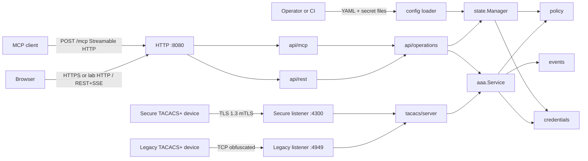
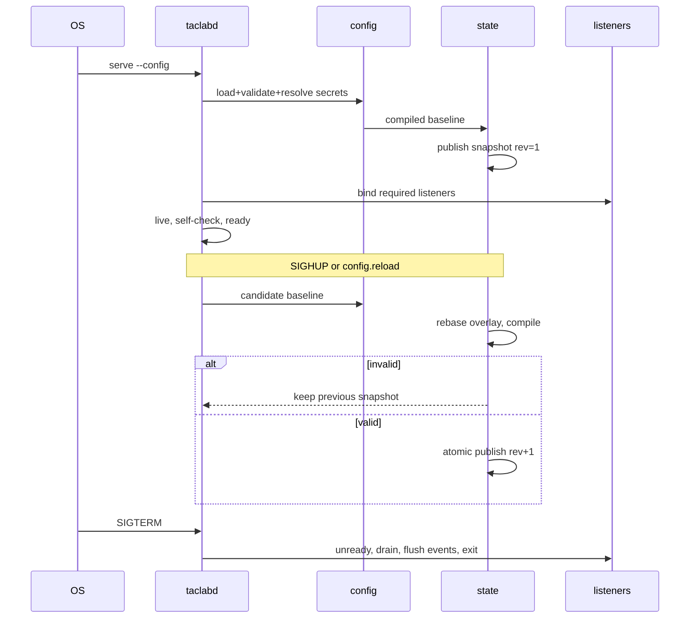
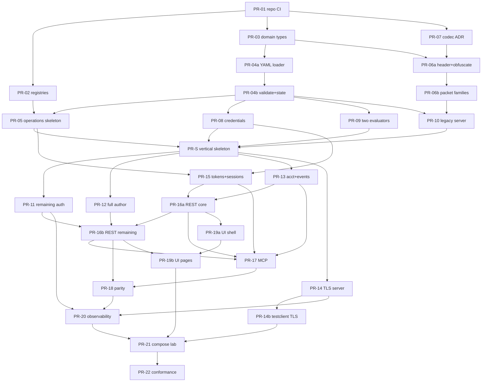

# TacLab Canonical Implementation Design

| Field | Value |
|---|---|
| Document title | TacLab Canonical Implementation Design |
| Author | Design synthesis (from TacLab source packet) |
| Date | 2026-08-12 |
| Status | Approved |
| Product | TacLab — all-in-one Go TACACS+ / RADIUS / MCP lab appliance |
| Binary | `taclabd` |
| Repository | https://github.com/hilather/go-lab-tacacs-mcp.git |
| Go module | `github.com/hilather/go-lab-tacacs-mcp` |
| Image | `ghcr.io/hilather/go-lab-tacacs-mcp` |
| License | Apache-2.0 |
| Implementation workspace | `/home/mbrewer/projects/go-lab-tacacs-mcp` (empty; no commits) |
| Source packet | `/home/mbrewer/Downloads/tacacs-mcp` |
| Specification baseline | RFC 8907, RFC 9887, MCP 2026-07-28; RADIUS MVP RFCs 2865/2866/2869/3579 (MA only)/5080 |
| Target release | 1.0 lab appliance (TACACS complete; RADIUS not advertised until MVP rows pass) |
| RADIUS design | [docs/designs/radius-authentication.md](https://github.com/hilather/go-lab-tacacs-mcp/blob/main/docs/designs/radius-authentication.md) |
| RADIUS ADRs | [0013](https://github.com/hilather/go-lab-tacacs-mcp/blob/main/docs/decisions/0013-add-radius-to-existing-taclab-process.md)–[0018](https://github.com/hilather/go-lab-tacacs-mcp/blob/main/docs/decisions/0018-preserve-product-and-module-names-for-first-radius-release.md) |
| Source pin for RADIUS adoption | `3322c26bd78969498e6fa0cd6e4b30902d5c8a94` |

This document is the **single implementation contract** for engineers and implementation subagents. It synthesizes the existing TacLab source packet. It does not invent a contradictory greenfield architecture. Where source documents conflict or underspecify, this document records the finding and states the binding resolution.

Agents implementing from this document must still treat RFC 8907, RFC 9887, and MCP 2026-07-28 as normative for wire behavior. This document owns product architecture, package contracts, configuration keys, parity, lab topology, and the implementation DAG.

---

## Overview

Lab teams need a disposable, protocol-complete TACACS+ appliance they can start from one YAML file plus secret files, exercise every current core AAA flow on both legacy TCP and TLS 1.3, mutate users/groups/clients/tokens at runtime without rewriting the baseline, and inspect decisions through a React UI, a versioned REST API, and an MCP server with feature parity.

TacLab is **one Go process** (`taclabd`) with these externally visible surfaces:

1. Legacy TACACS+ over TCP (RFC 8907 obfuscation, host port 49 → container 4949).
2. Secure TACACS+ over TLS 1.3 (RFC 9887, host port 300 → container 4300).
3. Versioned REST API + embedded React/TypeScript UI on the HTTP admin listener (host/container 8080).
4. MCP Streamable HTTP on the same HTTP listener (`/mcp`), calling the same operation registry as REST.
5. RADIUS/UDP access and accounting (host 1812/1813) — adopted by [ADR 0013](https://github.com/hilather/go-lab-tacacs-mcp/blob/main/docs/decisions/0013-add-radius-to-existing-taclab-process.md)–[0018](https://github.com/hilather/go-lab-tacacs-mcp/blob/main/docs/decisions/0018-preserve-product-and-module-names-for-first-radius-release.md). Default YAML stays `enabled: false`. Enabled sockets use a stub reject/response path. Do not advertise complete RADIUS until [docs/RADIUS_CONFORMANCE.md](https://github.com/hilather/go-lab-tacacs-mcp/blob/main/docs/RADIUS_CONFORMANCE.md) MVP rows pass.

The source YAML is an immutable baseline. Runtime mutations live in a memory-only overlay, compile into an immutable effective snapshot, and vanish on restart. REST and MCP are adapters over one typed operation layer. TACACS and future RADIUS listeners are adapters over one AAA/policy/credential core. The UI consumes only public REST.

Multi-protocol configuration uses schema version 2 with a deterministic in-memory v1 migrator ([ADR 0017](https://github.com/hilather/go-lab-tacacs-mcp/blob/main/docs/decisions/0017-config-schema-v2-with-v1-migration.md)). Current binaries accept `schema_version: 1` and `schema_version: 2` for listener syntax. Existing v1 files keep loading unchanged and compile to the same TACACS effective fields; RADIUS listeners are synthesized `enabled: false`. Enabled v2 RADIUS/UDP sockets start through `internal/runtime.Registry` (access is still a stub Access-Reject; accounting records through `RecordRADIUSAccounting`). Process start requires at least one AAA listener unless `server.admin_only: true`. v2 clients accept `endpoints[]`; flatten TACACS fields are a projection of TACACS endpoints. Role-specific RADIUS LPM indexes compile at validate time. `radius_policies` are later work. `config.export` never emits v2 YAML for a v1 source without the explicit convert flag (`normalize=true`; not implemented on export yet).

---

## Background & Motivation

Existing TACACS+ lab tools typically fail in one or more of these ways: ASCII-only authentication; opaque command authorization; configuration that can only change by rewrite/restart; REST/UI/MCP feature drift; runtime experiments that contaminate the reusable baseline; or a multi-service stack (database, identity provider, privileged host setup).

The source packet already chose the product: a deterministic, single-replica, single-image lab appliance with complete RFC 8907 core AAA, complete RFC 9887 mandatory server behavior, explainable policy, and REST/MCP parity. The implementation workspace is empty. Subsequent agents need one executable contract rather than twelve overlapping documents.

Pain points this design removes for implementers:

- Contradictory client-match and overlay rules across `ARCHITECTURE.md`, `CONFIGURATION.md`, and `DESIGN.md`.
- Two policy schema languages (abstract rule predicates vs. YAML `services` + `command_rules`).
- Underspecified MCP 2026-07-28 transport (stateless Streamable HTTP, required headers, `subscriptions/listen`).
- Open TLS `SHOULD`s (cipher policy, Cached Information, ticket lifetime) left as “figure it out later” without a 1.0 disposition.
- A backlog (`TASKS.md`) that is correct as a phase list but not yet a reviewable PR DAG.

---

## Goals & Non-Goals

### Goals

- Implement all current core RFC 8907 server-side authentication flows: ASCII LOGIN, PAP, CHAP, MS-CHAP v1, MS-CHAP v2, ENABLE, ASCII CHPASS.
- Implement authorization request/reply semantics, the RFC 8907 common AV-pair dictionary, command and session authorization, and arbitrary vendor AV pairs.
- Implement all valid accounting forms and reject invalid flag combinations with ERROR.
- Implement single-connect multiplexing and non-single-connect close-after-session behavior.
- Implement per-client shared-secret legacy transport; reject cleartext legacy bodies.
- Implement all RFC 9887 `MUST` / `MUST NOT` server behavior on a distinct TLS listener.
- Restore the exact configured baseline on restart; keep runtime overlay ephemeral.
- Keep REST and MCP administrative behavior in parity through one operation registry.
- Ship a React UI that uses only the public REST API.
- Run as one non-root, read-only-root OCI image via Docker Compose.
- Treat tests, fuzz seeds, race coverage, secret canaries, and benchmarks as product contract.
- Add RADIUS/UDP access and accounting in the same `taclabd` process, same snapshot, and same operation registry, behind schema version 2. Do not advertise RADIUS completeness until MVP conformance rows have evidence.

### Non-goals for 1.0

- Enterprise identity lifecycle, nested groups, role hierarchies, approval workflows, delegated admin.
- Multi-replica or highly available runtime state.
- Required external database. Optional SQLite accounting is post-1.0 and ADR-gated.
- Acting as LDAP/SAML/OIDC/Kerberos IdP.
- RADIUS EAP method termination, Access-Challenge as an advertised feature, CoA/Disconnect, RadSec/DTLS/RADIUS/1.1, proxying, MS-CHAP, custom dictionary files, named `Cisco-AVPair` decoding, persistent RADIUS accounting, or a second daemon/module rename.
- Rewriting the baseline YAML in place.
- Implementing SENDPASS, SENDAUTH, or FOLLOW as supported features (explicit rejection is required).
- Kubernetes as the primary deployment.
- `config.import` / replication-bundle import (ARCHITECTURE §4.3). 1.0 has validate, reload, export, and reset only.
- One port with protocol sniffing or in-band TLS upgrade.
- Automatic secure-to-legacy fallback.
- External TLS PSK and raw public keys, unless a spike proves they can be isolated without weakening mTLS (default: `DEFERRED_MAY`).

---

## Source Document Evaluation

Each source file was read in full. Scores are 1–5 for **implementability as a standalone contract** (not for quality of intent). The source set as a whole is a strong product specification and a weak single implementation spec — that is why this document exists.

### Per-file scores

| File | Score | What it got right | Gaps / issues |
|---|---:|---|---|
| `README.md` | 4 | Product surfaces, release gates, planned repo shape, required reading order | Paths assume `docs/` layout while the packet files sit at packet root; no executable interfaces |
| `AGENTS.md` | 5 | Non-negotiable rules: no adapter-to-adapter calls, parity-in-same-change, fail-closed, secret types, determinism, DoD | Not an implementation design; assumes other docs are consistent |
| `0001-all-in-one-dual-listener-lab.md` | 5 | Binding topology ADR: distinct sockets, no upgrade, no fallback, typed secrets, TLS-only profile required | Does not specify package APIs |
| `ARCHITECTURE.md` | 5 | Package ownership, dependency DAG, snapshot model, listener ports, error codes, lifecycle | Client-match tie rule conflicts with `CONFIGURATION.md`; TLS cert-only mode mentioned but not keyed |
| `DESIGN.md` | 5 | End-to-end product design, domain fields, auth/author/acct, operations, UI pages, security, open ADRs | Policy model is abstract predicates; overlay “patch” vs complete-object replacement conflict; ends mid-acceptance list then open ADRs |
| `CONFIGURATION.md` | 4 | Concrete YAML, secret types, reload algorithm, validation codes, annotated lab example | Client-match lex-ID tie-breaker contradicts fail-closed docs; `action: permit` underspecifies PASS_ADD vs PASS_REPL; example token omits `events:sensitive`; `cookie_secure: false` vs DESIGN Secure cookie |
| `API_PARITY.md` | 5 | Operation IDs, REST paths, MCP tools/resources, scopes, error mapping, test suite | REST `{name}` vs config `id`; MCP subscription mechanism predates 2026-07-28 `subscriptions/listen` wording |
| `TACACS_CONFORMANCE.md` | 5 | Release-blocking row IDs, evidence types, fuzz target list, interop matrix | Status columns empty (expected); some `SHOULD`s still need 1.0 disposition |
| `LAB_DEPLOYMENT.md` | 5 | Compose contract, ports, secrets, scenarios LAB-*, health, evidence bundle | Image registry is `ghcr.io/example/...` placeholder |
| `TESTING_AND_BENCHMARKS.md` | 5 | Test layers, canaries, race/fuzz, bench names, regression thresholds | Absolute load numbers wait on `benchmarks/budgets.yaml` after first baseline |
| `TASKS.md` | 4 | Phase DAG P0–P16, complete task bullets (P10.4 is a finished four-bullet task), exit gates, first-sprint vertical slice | Phases are themes, not independently mergeable PRs; this document’s PR Plan is the merge DAG and must not be confused with TASKS `P*` IDs |
| `REFERENCES.md` | 5 | Normative links, Go `crypto/tls` hook warnings, candidate libraries, update procedure | Candidate library evaluation is homework for P1, not a decision |

### What the source set got right (preserve)

1. **All-in-one process, dual distinct listeners** (ADR 0001). Shared AAA/state; transport-specific flag/obfuscation/identity adapters.
2. **Immutable baseline + ephemeral overlay + atomic compiled snapshot.** Fail closed on invalid reload/mutation.
3. **Operation registry as the only admin API.** REST and MCP are adapters; UI is REST-only; no MCP↔REST proxy.
4. **Credential separation.** Argon2id (or equivalent slow verifier) for ASCII/PAP; separate clear-equivalent challenge secret for CHAP/MS-CHAP; distinct ENABLE material.
5. **Secret hygiene.** File-referenced secrets, write-only outputs, typed holders, canary tests, process-local keyed HMAC for reuse detection (never exported).
6. **Conformance as release gate.** Machine-readable row IDs; independent fixtures; shared-codec client/server tests are not sufficient evidence.
7. **Lab deployment contract.** Non-root, read-only rootfs, dropped caps, host 49/300/8080, Docker secrets, restart restores baseline.
8. **Determinism.** Sorted outputs, compiled matchers, injectable clock/random, stable traces.

### Contradictions and resolutions

These resolutions are binding for implementation. Source packet files remain historical SoT for intent; this document wins on conflict.

#### C1. Client-match final tie-breaker

| Source | Rule |
|---|---|
| `ARCHITECTURE.md` §8, `TACACS_CONFORMANCE.md` T89-L-009, `AGENTS.md` fail-closed | After longest prefix + lowest priority, a remaining tie is a **configuration error** (`CLIENT_MATCH_AMBIGUOUS`) |
| `CONFIGURATION.md` §7.8 | Same steps, then **lexicographic client ID** as a silent tie-breaker; also “reject indistinguishable clients unless explicit ordering makes the result unambiguous” |

**Resolution:** Fail closed. Matching order is:

1. Listener/transport compatibility (`legacy` vs `tls`).
2. For TLS: configured certificate identity constraints (dNSName / iPAddress SAN, or the configured identity fields).
3. If `match.mode` is `address_and_certificate` (default) or the client is legacy: longest matching source CIDR prefix over a **compiled IPv4 and IPv6** LPM index. If `match.mode` is `certificate_only`, **`source_cidrs` is not a match key** (presence is a compile warning, not a selector). Two `certificate_only` clients that share an identity after step 2 still go through step 4–5.
4. Lowest numeric `priority`.
5. If two enabled clients still tie → **do not publish** the snapshot; error `CLIENT_MATCH_AMBIGUOUS`.

Lexicographic ID is **not** a runtime tie-breaker. It may appear only in error text to name the colliding IDs.

IPv4 and IPv6 are both PROJECT MUST (T89-L-008, T98-TLS-009). Indexes and fixtures cover both families. PROXY protocol is out of 1.0; the match key is the TCP peer address. Published-port NAT may collapse sources — LAB_DEPLOYMENT §4.3 (host network / macvlan) applies before claiming a topology.

#### C2. Overlay: patch vs complete-object replacement

| Source | Rule |
|---|---|
| `CONFIGURATION.md` §3.2 | Runtime object with the same ID **replaces** the baseline object as a complete logical object; no recursive merge |
| `DESIGN.md` §9.2 | Update of a baseline object creates/updates an **overlay patch**; create of an existing baseline identity requires explicit override semantics |

**Resolution:**

- Overlay **storage** is complete-object replacement (CONFIGURATION §3.2). The stored overlay entry is a full object, never a sparse RFC 7396 document.
- REST/MCP **wire** updates use **typed Go patch structs** (one `UpdateUser`, `UpdateGroup`, `UpdateClient` per resource), serialized as JSON objects. This is **not** RFC 7396 merge-patch and **not** RFC 6902 JSON Patch. Pointer/optional fields distinguish “omitted” from “set”.
- Apply algorithm (normative):
  1. Start from the **current effective** object (baseline ⊕ overlay), not from the overlay entry alone.
  2. Copy every non-secret field that the patch sets; leave omitted non-secret fields unchanged.
  3. **Secret/credential fields** (`login.verifier`, `challenge.secret`, `enable.verifier`, `legacy.shared_secret`, TLS private key refs): omitted ⇒ retain previous effective material; explicit new value ⇒ replace; explicit `null` or empty ref ⇒ **`invalid_argument`** unless the corresponding method/transport is also disabled in the same patch. A patch that would leave an enabled method without required material fails with `AUTH_METHOD_CREDENTIAL_MISSING` and does not publish.
  4. Server-set and rejected on input: `source`, `shadows_source`, `deleted`, hashes, `revision_*`, `effective_revision`, `created_at`, `updated_at`.
  5. Unknown mutation fields rejected.
  6. Validate + compile the **complete** candidate; store that complete object in the overlay.
- `*.create` of an ID that exists in the baseline returns `already_exists` unless the request sets `override: true` (requires `runtime.allow_shadowing: true`, default true). Create-override must either send a complete object **or** inherit unspecified non-secret fields and all omitted secrets from the baseline (same apply rules as update).
- `*.update` of a baseline object creates or replaces the overlay object (source becomes `override`).
- `*.delete` of a baseline object writes a tombstone (`deleted: true`); delete of a runtime object removes it; delete of an override without `tombstone: true` reveals the baseline.
- `runtime.reset` drops the entire overlay including tombstones.
- Required table tests: PATCH `{display_name}` must not drop verifiers; create-override with `override: true` inherits omitted secrets; nulling a secret while the method stays enabled is rejected.

#### C3. Object identity: `id` vs `name`

| Source | Rule |
|---|---|
| `CONFIGURATION.md` | Stable key is `id` |
| `API_PARITY.md` | REST paths use `{name}` for users/groups/clients |
| `DESIGN.md` | “id or normalized name” |

**Resolution:** The stable key is `id`. For users, `id` **is** the TACACS username after RFC 8265 UsernameCasePreserved (not blindly lowercased). `display_name` is cosmetic. REST paths are `/api/v1/{collection}/{id}`. MCP tool inputs use `id`. `API_PARITY.md` `{name}` is an alias for `{id}`; generated OpenAPI parameter name is `id`.

#### C4. Policy schema: abstract rules vs YAML services/command_rules

| Source | Rule |
|---|---|
| `DESIGN.md` §8.5 | Generic `AuthorizationRule` with predicates and `permit-add` / `permit-replace` / `deny` |
| `CONFIGURATION.md` §6 | Groups have `services[]` (`action: permit`) and `command_rules[]` (`action: permit`/`deny`) |
| `ARCHITECTURE.md` §9 | User rules → groups by priority/name → rules in declared order → global fallback → default deny |

**Resolution:**

- **Config/YAML** uses the CONFIGURATION shape. Groups have `services[]` and `command_rules[]`. `users[].rules` has the **same two arrays** (not DESIGN abstract predicates):

  ```yaml
  users:
    - id: lab-admin
      rules:
        services: []
        command_rules: []
  fallback_rules:          # optional; default empty
    services: []
    command_rules: []
  ```

- **Domain** compiles those into `AuthorizationRule` values with `Kind = service | command`. The two kinds are **never mixed in one first-match list**.
- **Two evaluators** share source precedence (user → groups → fallback → deny) but see only their kind:
  1. Session/service authorization (`cmd` empty or absent): only `Kind=service` / `services[]`. Match `service` + `protocol` + context. A service `permit*` **never** authorizes a non-empty `cmd`.
  2. Command authorization (`cmd` present and non-empty): only `Kind=command` / `command_rules[]`. Match `cmd` / ordered `cmd-arg`. A command rule **never** decides a session request.
- Each evaluator default-denies independently (CONFIGURATION §8.4; T89-AV-003 / T89-AU-021).
- `groups[].default_command_action` is accepted. In 1.0 it **must be `deny`** (or omitted, which means deny). `permit` / `permit_add` / `permit_replace` here is a validation error — it would invert default-deny. It is not a hidden permit-all.
- `clients[].authorization.default_group_ids`: appended **after** `user.group_ids`, de-duplicated by group `id`, then both lists participate in group-precedence evaluation. They are extra membership, not a substitute for user rules.
- Config/YAML `action` values: `permit` | `permit_add` | `permit_replace` | `deny`. Bare `permit` is a **YAML-only** alias of `permit_add` so the annotated example stays valid (comment it in `lab.example.yaml`). REST/MCP writes accept **only** `permit_add` | `permit_replace` | `deny`.
- `authen_method` is never a trusted predicate.
- Required golden fixtures: `administrators` session (`cmd` empty) → priv-lvl 15; `administrators` `cmd=configure` → command `permit-all`; `readonly` session → priv-lvl 1; `readonly` `cmd=configure` → deny (must **not** hit the shell `services` permit).

#### C5. Source metadata fields

| Source | Fields |
|---|---|
| `DESIGN.md` §8.1 | `source: config\|runtime\|override`, `revision_created`, `revision_updated` |
| `ARCHITECTURE.md` §7 | also `tombstone` |
| `CONFIGURATION.md` §9.3 | `source`, `shadows_source`, `effective_revision`, `created_at`, `updated_at` |

**Resolution:** Every admin object view includes:

```text
id, display_name?, source, shadows_source?, deleted,
revision_created, revision_updated, effective_revision,
enabled, labels, created_at, updated_at
```

- `source` ∈ {`config`, `runtime`, `override`} only. **`tombstone` is not a source value.** Overlay tombstones are a distinct entry kind exposed as `deleted: true` (plus tombstone metadata) and appear only when `include_deleted=true`.
- Envelope `revision` = the published snapshot this response was read from. Optimistic concurrency (`If-Match` / `expected_revision`) compares against this value.
- Object `effective_revision` is a **read alias of that same snapshot `revision`** (CONFIGURATION §9.3 compatibility). OpenAPI property name is `effective_revision`; do not emit a third competing field.
- `revision_created` / `revision_updated` record when this object identity was first created / last mutated in overlay (or the baseline compile revision for config-only objects). They do not replace `effective_revision` for `If-Match`.
- Timestamps are metadata and never affect policy order.

#### C6. Metrics bind address

**Resolution:** Default `observability.metrics.bind: 127.0.0.1:9090` (CONFIGURATION / LAB). Optional `observability.metrics.expose_on_admin: true` serves `/metrics` on the admin listener in addition. Never expose profiling on the admin listener by default.

#### C7. Browser cookie `Secure` flag

**Resolution:** `api.ui_session.cookie_secure` defaults to **true when `listeners.http.tls.enabled` is true**, false otherwise. The lab example may set `cookie_secure: false` for HTTP-only lab use. CSRF protection is mandatory whenever cookie auth is enabled. The UI never stores the bearer token in `localStorage` / `sessionStorage`.

#### C8. MCP event subscription mechanism

Source docs say “current MCP resource/subscription mechanism.” MCP 2026-07-28 removed protocol sessions, GET SSE, and `Last-Event-ID` resume. Long-lived notifications use `subscriptions/listen`.

**Resolution:** Use the official Go SDK (`github.com/modelcontextprotocol/go-sdk v1.7.0`) for Streamable HTTP framing, `server/discover`, tools, and resources ([ADR 0011](https://github.com/hilather/go-lab-tacacs-mcp/blob/main/docs/decisions/0011-mcp-thin-adapter-go-124.md)). Lab bearer, origin policy, and URI-only `subscriptions/listen` stay in `internal/api/mcp`. Event parity is `PARITY_DIFFERENT_BINDING` — MCP `subscriptions/listen` is **not** a TacLab event firehose and MUST NOT invent a non-conformant notification type.

REST:

- `GET /api/v1/events/stream` (SSE) streams redacted event **bodies** from the ring, with category filters, `Last-Event-ID` cursor, heartbeats, and `events:sensitive` gating.

MCP (core 2026-07-28 only):

1. Client opens `subscriptions/listen` with `resourceSubscriptions: ["taclab://events/recent"]` (and optionally `toolsListChanged` / `resourcesListChanged`).
2. Server first emits `notifications/subscriptions/acknowledged` listing the accepted filter subset, then keeps the SSE response open.
3. New ring events and `state.revision.changed` cause `notifications/resources/updated` for `taclab://events/recent` (URI + `subscriptionId` only — **no** accounting/authn payload, category, cursor, or sensitive fields on the notification).
4. The client then calls `taclab.events.list` (or reads `taclab://events/recent`) with its cursor. Category and `events:sensitive` filtering happen on **`events.list` / resource read**, not on the listen stream.
5. Overlay mutations that change discovery emit `notifications/tools/list_changed` and/or `notifications/resources/list_changed`.
6. Graceful listen close uses `resultType: complete`. TacLab does not use `Last-Event-ID` resume on MCP (removed in 2026-07-28).

If a product later requires a firehose of event bodies over MCP, that is `EXEMPT_BY_ADR` / an extension, not core 2026-07-28.

Do not implement MCP 2025-11-25 sessions, GET `/mcp`, or `Mcp-Session-Id`. Respond `405` to GET/DELETE on `/mcp`.

#### C9. `config.validate` scope

`API_PARITY.md` assigns `state:write`. Validate never publishes state.

**Resolution:** Keep `state:write` as specified (previewing a candidate is a privileged lab action). Document that it is not a mutation. Do not invent a new scope.

#### C10. File-path layout of the packet vs the planned repo

Packet files live at the packet root. README required-reading links assume `docs/...`.

**Resolution:** Implementation repo uses the planned shape: contracts live under `docs/` (`docs/DESIGN.md` becomes a pointer to this canonical doc or a copy of the packet). Packet files are copied in P0. This document is the execution SoT.

### Underspecification filled by this document

| Gap | Binding fill |
|---|---|
| Go module path / image registry / license | **Resolved:** module `github.com/hilather/go-lab-tacacs-mcp`; image `ghcr.io/hilather/go-lab-tacacs-mcp`; license Apache-2.0; owner `hilather` |
| Exact Go / Node / MCP SDK versions | Pin in P0 after `go version` / SDK 2026-07-28 compatibility check |
| Codec: library vs internal | **Internal codec** ([ADR 0007](decisions/0007-codec-approach.md)). A later library override requires a new ADR and must meet the isolation/conformance bar |
| Username profile implementation | `golang.org/x/text/secure/precis` `UsernameCasePreserved` |
| Password KDF | Argon2id via `golang.org/x/crypto/argon2`; parameters recorded in [ADR-0002](https://github.com/hilather/go-lab-tacacs-mcp/blob/main/docs/decisions/0002-password-kdf.md) |
| TLS revocation | 1.0: **configured CRL** (`revocation.mode: configured_crl`). OCSP/AIA is post-1.0 or ADR |
| RFC 7924 Cached Information | **DISPOSITIONED_SHOULD** if pinned `crypto/tls` has no hook (expected). ADR-0003 |
| TLS 1.3 cipher-policy YAML | **DISPOSITIONED_SHOULD**: honor Go TLS 1.3 mandatory suites; reject any YAML that claims a cipher the stack cannot enforce. ADR-0004 |
| Ticket lifetime | `0` → `SessionTicketsDisabled`. Non-zero: request via available hooks; if Go’s max ticket lifetime cannot honor the configured value, **reject the config** or ADR-0005 with the exact enforced cap. Never silently ignore |
| Resumption + revocation | `VerifyPeerCertificate` is skipped on resume. Use `VerifyConnection` for identity/revocation on every connection, or disable resumption. Default lab: resumption on, `recheck_client_revocation: true` via `VerifyConnection` |
| Rate-limit algorithm | Token bucket using the CONFIGURATION keys (`per_token_requests_per_second` / `burst`) |
| OpenAPI toolchain | `oapi-codegen` (or equivalent pinned at P0) from `api/openapi.yaml` generated from the operation registry |
| UI stack | React + TypeScript strict + Vite + TanStack Query + React Router. Component library is an implementation choice among small accessible sets; no large custom design system |
| Independent test client | `internal/tacacs/testclient` with **its own codec copy under `internal/tacacs/testclient/codec`** generated or vendored separately so shared-codec bugs cannot hide. PR-14b owns TLS client-role (T98-ROLE-*) |
| PROXY protocol | Not in 1.0. Client match uses the TCP peer address only. Dual-stack LPM and LAB §4.3 source-IP fidelity are still 1.0 |
| Global `fallback_rules` | Supported; same `services` / `command_rules` shape as a group; same `priority` then `id` order as group arrays; default empty |
| `config.import` | ARCHITECTURE §4.3 lists import. **Out of 1.0** (no API_PARITY operation). Non-goal until an ADR adds it |
| `users[].rules` | Same YAML as groups: `services` + `command_rules` |
| `default_command_action` | Accepted; 1.0 must be `deny` or omitted |
| `default_group_ids` | Appended after `user.group_ids`, de-duped |
| Overlay wire encoding | Typed Go patch structs, not RFC 7396 / 6902 |

---

## Key Decisions

1. **One process, two TACACS sockets, one HTTP admin socket, and (when enabled later) RADIUS/UDP access + accounting.** ADR 0001 remains accepted for TACACS. [ADR 0013](https://github.com/hilather/go-lab-tacacs-mcp/blob/main/docs/decisions/0013-add-radius-to-existing-taclab-process.md) adds RADIUS as a peer protocol in the same process. Distinct binds; immediate TLS on the secure TACACS socket; no sniffing, upgrade, or fallback. Co-location is a documented lab convenience; TLS-only is the preferred production-like TACACS profile. RADIUS/UDP is a controlled-network profile ([ADR 0016](https://github.com/hilather/go-lab-tacacs-mcp/blob/main/docs/decisions/0016-radius-udp-security-retransmission-and-scope.md)).

2. **Internal TACACS codec by default.** Protocol types stay in `internal/tacacs`. [ADR 0007](decisions/0007-codec-approach.md) records the accepted 1.0 decision: no third-party TACACS library. A later override requires a new ADR and an adapter that does not leak policy/credentials. The independent test client does not import the server codec package.

3. **Single authoritative in-memory snapshot.** `internal/state.Manager` owns baseline + overlay, compiles an immutable `Snapshot`, publishes via `atomic.Pointer`. Protocol and API reads never take the write lock.

4. **Complete-object overlay + typed patch structs on the wire.** Overlay entries are full objects. REST/MCP updates are typed Go patch structs applied to the current effective object with **secret-preserving omit semantics**, then compiled as a whole. Not RFC 7396 merge-patch. Invalid candidates never publish.

5. **Client match is deterministic and fail-closed.** Transport → cert constraints → (unless `certificate_only`) longest v4/v6 CIDR → lowest priority → compile error on tie. Connections bind one client for their lifetime; reload does not retarget an accepted connection. Configurable max connection age limits stale bindings.

6. **AAA is protocol-independent.** `internal/aaa.Service` takes domain types, not TACACS packets. Listeners translate. Policy never sees HTTP, MCP, YAML syntax types, or `net.Conn`. RADIUS uses additive neutral contracts (`Protocol`, `ListenerRole`, `Carrier`, `AuthenticateAccess`); `domain.Transport` stays TACACS `legacy`/`tls` ([ADR 0014](https://github.com/hilather/go-lab-tacacs-mcp/blob/main/docs/decisions/0014-neutral-aaa-contract-and-protocol-taxonomy.md)). `domain.AVPair` stays TACACS-only ([ADR 0015](https://github.com/hilather/go-lab-tacacs-mcp/blob/main/docs/decisions/0015-radius-codec-attribute-and-dictionary-boundary.md)).

7. **Credential separation is mandatory.** ASCII/PAP use a slow verifier (Argon2id). CHAP/MS-CHAP use a separate challenge secret. ENABLE is distinct. Password change writes a runtime verifier override only; it never derives a new challenge secret and never edits the baseline file.

8. **REST and MCP share one operation registry.** Same Go request/response types, scopes, revision, idempotency, redaction, events, and error codes. MCP is not an HTTP client of REST. Parity tests are merge-blocking.

9. **MCP 2026-07-28 Streamable HTTP as specified.** POST `/mcp` only. Official Go SDK (`v1.7.0`, `Stateless = true`). Required headers `MCP-Protocol-Version`, `Mcp-Method`, and `Mcp-Name` when applicable. Per-request `_meta`, `server/discover`, `resultType`. Origin policy as specified under `internal/api/mcp`. Same bearer token + scopes as REST. Listen is a change-notification channel, **not** an event firehose ([ADR 0011](https://github.com/hilather/go-lab-tacacs-mcp/blob/main/docs/decisions/0011-mcp-thin-adapter-go-124.md)). Lab static bearer is `EXEMPT_BY_ADR` vs the HTTP-authorization SHOULD.

10. **Secrets are typed and write-only.** File references by default; env refs opt-in for local dev. Canary tests scan every output surface. Shared-secret reuse uses a process-local HMAC key that is never persisted or exported.

11. **Two default-deny evaluators, compiled matchers.** Session/service and command authorization are separate first-match walks over `Kind=service` and `Kind=command` only. RE2 compiled at snapshot time. AV pairs preserve order, duplicates, and `=` / `*` separators. `authen_method` is observational only. A service permit never authorizes a command.

12. **Accounting SUCCESS only after ring accept.** The 1.0 authoritative sink is the bounded in-memory event/accounting ring. Downstream exporters are async and cannot change the TACACS acknowledgement. RADIUS accounting follows the same rule after `events.Ring.Accept`. **Documented exception (fail-open-to-ack, not fail-open-to-fill-the-ring):** an Accounting-Request with no Acct-Session-Id **and** no NAS-IP/NAS-Identifier still receives Accounting-Response so the NAS does not retry-storm; ring append is sample-capped (`ambiguous_accounting_per_minute`, default 60) and journal-capped. This is the only approved exception to fail-closed for RADIUS accounting identity ([ADR 0016](https://github.com/hilather/go-lab-tacacs-mcp/blob/main/docs/decisions/0016-radius-udp-security-retransmission-and-scope.md)).

13. **Reference deploy is Compose, non-root, read-only, single replica.** High container ports; host maps 49 and 300 (TACACS) and later 1812/1813 (RADIUS/UDP). Runtime state is not on a volume. Product/module/binary/image names stay unchanged for the first RADIUS release ([ADR 0018](https://github.com/hilather/go-lab-tacacs-mcp/blob/main/docs/decisions/0018-preserve-product-and-module-names-for-first-radius-release.md)).

14. **Tests are the product.** Independent golden fixtures, fuzz seeds, `-race`, secret canaries, REST/MCP equivalence, container lab, and benchstat regression gates. No “complete TACACS” claim while a MUST row is unchecked.

15. **TLS 1.0 dispositions for Go stack limits.** mTLS + TLS 1.3 + CRL + SNI + no 0-RTT are mandatory. Cached Information, arbitrary cipher lists, and exact ticket lifetimes that the stack cannot enforce are ADR-dispositioned `SHOULD`s — never silently approximated.

---

## Proposed Design

### System context



### Process and listeners

| Listener | Config key | Container bind | Host map | Role |
|---|---|---|---|---|
| Legacy TACACS+ | `listeners.legacy_tacacs` | `0.0.0.0:4949` | `49/tcp` | RFC 8907 + per-client obfuscation |
| Secure TACACS+ | `listeners.secure_tacacs` | `0.0.0.0:4300` | `300/tcp` | RFC 9887 TLS 1.3 immediate handshake |
| HTTP admin | `listeners.http` | `0.0.0.0:8080` | `8080/tcp` | UI, `/api/v1`, `/mcp`, health, optional SSE |
| Metrics (optional) | `observability.metrics` | `127.0.0.1:9090` | none by default | Prometheus scrape |

Each TACACS listener has independent enablement, limits, timeouts, and shutdown deadline. Failure to bind a **required** enabled listener fails readiness and aborts startup (`server.startup_failure_mode: fail_closed`). An explicitly optional listener may degrade only when configuration says so.

When both TACACS listeners are enabled, status/UI/logs MUST display a non-secret **co-located lab topology** warning. A TLS-only Compose profile MUST exist.

### Repository layout

```text
.
├── AGENTS.md
├── README.md
├── LICENSE                    # Apache-2.0
├── Makefile                   # or task/just — one checked-in runner
├── go.mod                     # module github.com/hilather/go-lab-tacacs-mcp
├── cmd/taclabd/               # flags, wire-up, signals only
├── internal/
│   ├── aaa/                   # protocol-independent AAA
│   ├── api/
│   │   ├── auth/              # bearer + UI session + CSRF + scopes
│   │   ├── mcp/               # Streamable HTTP adapter
│   │   ├── operations/        # canonical handlers + registry
│   │   └── rest/              # /api/v1 + SSE + OpenAPI
│   ├── config/                # YAML syntax → domain baseline
│   ├── credentials/           # verifiers, challenge secrets, tokens
│   ├── domain/                # shared value types (AV pair, IDs, errors)
│   ├── events/                # ring + fanout
│   ├── observability/         # logs, metrics, tracing hooks
│   ├── policy/                # compile + evaluate
│   ├── state/                 # baseline, overlay, snapshot
│   └── tacacs/
│       ├── codec/             # header/body, no net
│       ├── legacy/            # bind, match, obfuscate
│       ├── server/            # sessions, single-connect, dispatch
│       ├── tls/               # bind, mTLS, flags
│       └── testclient/        # independent client + separate codec
├── web/                       # React + TypeScript
├── api/
│   ├── operations.yaml        # or generated from Go; CI-owned
│   └── openapi.yaml
├── configs/lab.example.yaml
├── testdata/{protocol,policies,vendors,conformance}
├── deployments/compose/
├── benchmarks/budgets.yaml
├── tools/                     # generators, lab-cert/secret scripts
└── docs/                      # packet + this canonical doc + ADRs
```

`internal/domain` is the small shared types package implied by ARCHITECTURE (“avoid unbounded util”). It may hold `AVPair`, `Revision`, `ObjectSource`, `Error`, and enums. It must not import config, HTTP, MCP, or `tacacs`.

### Dependency rules (binding)

```text
cmd/taclabd → adapters + config + wiring
api/rest  → api/operations → (state, aaa, events, credentials)
api/mcp   → api/operations   (never api/rest)
tacacs/{legacy,tls} → tacacs/server → aaa
tacacs/server → tacacs/codec
state → policy, credentials, domain
aaa → policy, credentials, events, domain
config → domain, state baseline types (not adapters)
```

Forbidden: `policy → rest`, `state → mcp`, `tacacs → web`, `mcp → rest` (HTTP or package), `rest → mcp`, `web → private Go handler`, any package → `cmd/taclabd`.

YAML syntax types do not leave `internal/config`. TACACS packet structs do not leave `internal/tacacs`.

### Lifecycle



Startup: flags → config+secrets → compile snapshot → construct events/ops → bind → live → self-check → ready.

Reload: serialized with state writes; full validate before publish; previous snapshot retained on failure.

Shutdown: unready → stop accepts → cancel new mutations → drain protocol sessions (grace `server.shutdown_grace`, default 15s) → flush sync event sinks → close subscribers → non-zero exit if shutdown invariants fail.

### CLI

```text
taclabd serve --config PATH
taclabd validate --config PATH
taclabd print-effective --config PATH --redacted
taclabd healthcheck --url URL
taclabd version
```

`healthcheck` is what Compose uses against `http://127.0.0.1:8080/health/ready`.

---

## Package contracts

### `internal/domain`

```go
package domain

type Revision uint64
type ObjectSource string // config | runtime | override — never tombstone
type Tombstone struct {
    Kind      string
    ID        string
    Deleted   bool // always true
    ActorID   string
    AtRevision Revision
}

type AVPair struct {
    Name      string
    Separator byte // '=' or '*'
    Value     string
}

type Error struct {
    Code    Code
    Message string
    Path    string
    Details map[string]any
}

type Code string // invalid_argument, not_found, already_exists, conflict,
                 // revision_mismatch, unauthenticated, permission_denied,
                 // rate_limited, unavailable, internal
```

`AVPair` encoded length on the wire is 2–255 bytes (name + one separator + value). Parser splits on the **first** `=` or `*`. Name must not contain a separator. Zero-length protocol fields are treated as absent.

Secret-bearing types live in `internal/credentials` and **must not** implement `String()`, `GoString()`, `MarshalJSON`, or `fmt.Formatter` in a way that emits the raw value. Provide `Redacted() string` only.

Clock and randomness:

```go
type Clock interface{ Now() time.Time }
type Entropy interface{ Read(p []byte) (int, error) }
```

Production uses `time.Now` and `crypto/rand`. Tests inject both.

### `internal/config`

Stages (no partial publish):

```text
bytes → syntax model → normalized model → secret resolution
     → cross-reference validation → compiled baseline
```

Rules:

- Current binaries accept `schema_version: 1` and `schema_version: 2`. v1 is migrated **in memory** to the normalized named-listener model ([ADR 0017](https://github.com/hilather/go-lab-tacacs-mcp/blob/main/docs/decisions/0017-config-schema-v2-with-v1-migration.md)); RADIUS listener YAML requires `schema_version: 2`; mixed v1/v2 syntax is rejected. Source files are never rewritten. Enabled RADIUS/UDP sockets start through the listener registry; default YAML stays off.
- YAML 1.2, UTF-8, single document, no aliases/anchors, no duplicate keys.
- Default max file size 4 MiB.
- Unknown fields are errors with path + “did you mean?”; never echo secrets.
- Secret refs: `{file: PATH}` required; `{environment: NAME}` only when `security.allow_environment_secrets: true` (default false).
- Trim at most one trailing LF/CRLF unless `preserve_trailing_newline: true`.
- Reject directories, world-writable files, oversized files; reject symlinks when `security.strict_secret_files: true` (default true in the reference container).

Typed secret purposes: `legacy_shared_secret`, `login_verifier`, `challenge_secret`, `enable_verifier`, `api_bearer_token`, `tls_private_key`, `tls_psk` (deferred). Cross-purpose assignment is a validation error.

### `internal/state`

```go
type Manager struct {
    mu       sync.Mutex
    baseline Baseline
    overlay  Overlay
    current  atomic.Pointer[Snapshot]
    revision atomic.Uint64
}

type Snapshot struct {
    Revision     Revision
    BaselineHash string
    OverlayHash  string
    CompiledAt   time.Time
    // immutable indexes only — no caller-mutable maps
    // TACACS ClientIndex plus RADIUS access/accounting LPM indexes
    // dictionary is an empty placeholder until attribute.Builtin
}
```

Mutation algorithm (every write, including reload and reset):

1. Acquire write lock.
2. Verify `expected_revision` when provided (compares to the published snapshot `revision`).
3. Copy overlay.
4. Apply the mutation using C2: start from the **current effective** object; apply the typed patch; **preserve omitted secrets**; reject `null` secrets unless the method is disabled; reject unknown fields and server-set metadata.
5. Validate + compile a complete candidate (including `AUTH_METHOD_CREDENTIAL_MISSING`).
6. On failure: discard; leave current unchanged.
7. On success: store the **complete** overlay object, increment revision, `Store` snapshot, emit event.

Protocol sessions bind the snapshot loaded at Authentication START. Later reloads do not change an in-progress authentication flow. New sessions see the new snapshot. Accepted connections keep their bound **client identity and legacy secret** until close; `listeners.*.single_connect.max_lifetime` (default 10m) bounds stale bindings.

### `internal/policy`

Compile at snapshot time: **separate IPv4 and IPv6** CIDR LPM indexes, user/group indexes, RE2 command matchers, AV predicates, response templates.

`Authorize` dispatches on the request, not on a mixed rule list:

| Request | Evaluator | Rules considered |
|---|---|---|
| `cmd` empty or absent (session/service) | `EvaluateService` | `Kind=service` only (`users[].rules.services`, `groups[].services`, `fallback_rules.services`) |
| `cmd` present and non-empty (command) | `EvaluateCommand` | `Kind=command` only (`users[].rules.command_rules`, `groups[].command_rules`, `fallback_rules.command_rules`) |

A service `permit*` **must not** match a command request. A command rule **must not** match a session request. Each evaluator default-denies independently.

Source precedence **inside one evaluator** (ARCHITECTURE §9 is source order, not mixed kinds):

1. Enabled user-specific rules of that kind, in declared order (rule `priority` then `id`).
2. Effective groups: `user.group_ids` in listed order, then `client.authorization.default_group_ids` not already present (de-dup by `id`). Groups themselves are then walked by ascending group `priority`, then normalized group `id`.
3. Inside a group, only that evaluator’s array, by ascending rule `priority` then rule `id`. The recommended validation profile **rejects duplicate priorities** inside one array.
4. `fallback_rules` of that kind, **same order as group arrays**: ascending rule `priority` then `id`. Declared order is only the documented tie-break after those keys. The recommended validation profile **rejects duplicate priorities** inside each `fallback_rules` array, as for groups.
5. Default deny. `groups[].default_command_action` must be `deny` or omitted in 1.0; it does not add a permit.

No shell parsing, quote expansion, or execution.

Required golden fixtures (same snapshot):

- `administrators` + empty `cmd` + `service=shell` → `permit_add` / `priv-lvl=15` from `services` (not from `permit-all`).
- `administrators` + `cmd=configure` → command-rule `permit-all`.
- `readonly` + empty `cmd` → `priv-lvl=1`.
- `readonly` + `cmd=configure` → **deny** (must not hit `services[].shell` permit).

Decision mapping:

| Domain | TACACS status |
|---|---|
| `permit_add` | `TAC_PLUS_AUTHOR_STATUS_PASS_ADD` (0x01) |
| `permit_replace` | `TAC_PLUS_AUTHOR_STATUS_PASS_REPL` (0x02) |
| `deny` | `TAC_PLUS_AUTHOR_STATUS_FAIL` (0x10) |
| internal error | `TAC_PLUS_AUTHOR_STATUS_ERROR` (0x11) |

FOLLOW is never emitted.

Every evaluation produces a full internal `PolicyTrace`. Ordinary events store a compact redacted summary. `policy.evaluate` returns the redacted full trace.

### `internal/credentials`

```go
type Verifier interface {
    VerifyASCIIOrPAP(ctx context.Context, userID string, password []byte) error
    VerifyCHAP(ctx context.Context, userID string, id byte, challenge, response []byte) error
    VerifyMSCHAPv1(ctx context.Context, userID string, id byte, challenge, response []byte) error
    VerifyMSCHAPv2(ctx context.Context, userID string, id byte, challenge, response []byte) error
    VerifyEnable(ctx context.Context, userID string, secret []byte) error
    ChangeASCIIPassword(ctx context.Context, userID string, old, new []byte) (runtimeVerifier []byte, err error)
}
```

- ASCII/PAP: Argon2id encoded verifier (PHC-style string in the secret file).
- CHAP: RFC 1994 / RFC 8907 §5.4.2.3 — START `data = PPP_id(1) || challenge(N) || response(16)`; MD5(`id || secret || challenge`); reject challenge length below configured minimum (default 8).
- MS-CHAP v1 (RFC 8907 §5.4.2.4 / RFC 2433): START `data = PPP_id(1) || challenge(8) || response(49)`. Challenge **exactly** 8 bytes. Response **exactly** 49 bytes (24 LM + 24 NT + 1 flags). Do not drop the PPP id.
- MS-CHAP v2 (RFC 8907 §5.4.2.5 / RFC 2759): START `data = PPP_id(1) || challenge(16) || response(49)`. Challenge **exactly** 16 bytes. Response **exactly** 49 bytes (16 peer-challenge + 8 reserved + 24 NT-response + 1 flags). Username canonicalization per ADR-0002 (default: UsernameCasePreserved output as used for lookup).
- Codec rejects any other concatenation length before calling the verifier (protocol ERROR vs credential FAIL: malformed wire → ERROR; well-formed wrong authenticator → FAIL).
- Constant-time compare on authenticator bytes.
- Challenge secret absence ⇒ method unavailable (FAIL, no fallback to login hash).
- API tokens: ≥256 bits `crypto/rand`, store SHA-256 (or keyed hash) of the token, lookup by token ID prefix or by hash index; compare digest in constant time.

### `internal/aaa`

```go
type Service interface {
    BeginAuthentication(context.Context, AuthenticationStart) (AuthenticationStep, error)
    ContinueAuthentication(context.Context, AuthenticationContinue) (AuthenticationStep, error)
    AbortAuthentication(context.Context, AuthenticationAbort) error
    Authorize(context.Context, AuthorizationRequest) (AuthorizationDecision, error)
    RecordAccounting(context.Context, AccountingRecord) (AccountingResult, error)
    RecordRADIUSAccounting(context.Context, RADIUSAccountingRecord) (AccountingResult, error)
    ExplainAuthorization(context.Context, AuthorizationRequest) (PolicyTrace, error)
}
```

No TACACS header/body types here. `RecordRADIUSAccounting` is additive and does not use `AccountingRecord.Flags`. RADIUS `Acct-Session-Id` is `Event.AcctSessionID` (string).

Authentication policy: the **intersection** of global, listener, client, and user allowed methods applies (most restrictive). Challenge-only mode is a first-class client/listener profile.

**RESTART vs FAIL vs ERROR** (T89-AS-006, RFC 8907 §5.4.3 / §5.4.2 / §3.6):

| Condition | Status | Session |
|---|---|---|
| Implemented type, bad/unknown/disabled credentials | `FAIL` (0x02) | terminate |
| Implemented type **disallowed** by the effective method policy (e.g. ASCII on a challenge-only client) | `RESTART` (0x06) | end this session; client may START again with a new session id and another type. Clients that ignore RESTART treat it as FAIL |
| Defined header option / action / type / service **not implemented** (SENDAUTH, SENDPASS, unknown type) | `ERROR` (0x07) when the packet type is known (§3.6), else FAIL for an unimplemented *authentication option* that the selected profile does not implement (§5.4.2 / T89-AS-011) | terminate |
| Internal processing failure | `ERROR` | terminate; client must treat the server as unreachable |
| Continue ABORT | no further REPLY required after recording; if a REPLY is sent it is not PASS | terminate |

Username enumeration: GETUSER/GETPASS prompts and FAIL messages MUST be uniform for unknown, disabled, and wrong-password users. Distinguish only in redacted internal events. RESTART is reserved for “try another type”, not for hiding user existence.

### `internal/tacacs/codec`

12-byte header, network byte order:

```text
version(1) type(1) seq_no(1) flags(1) session_id(4) length(4)
major = version >> 4   // must be 0xc
minor = version & 0x0f // 0 or 1 in valid contexts
```

Constants (RFC 8907):

| Name | Value |
|---|---|
| `TAC_PLUS_MAJOR_VER` | `0xc` |
| `TAC_PLUS_AUTHEN` / `AUTHOR` / `ACCT` | `0x01` / `0x02` / `0x03` |
| `TAC_PLUS_UNENCRYPTED_FLAG` | `0x01` |
| `TAC_PLUS_SINGLE_CONNECT_FLAG` | `0x04` |
| Authen actions LOGIN / CHPASS / SENDAUTH | `0x01` / `0x02` / `0x04` |
| Types ASCII / PAP / CHAP / MSCHAP / MSCHAPV2 | `0x01` / `0x02` / `0x03` / `0x05` / `0x06` |
| Authen statuses PASS…ERROR / FOLLOW | `0x01`–`0x07` / `0x21` |
| Author PASS_ADD / PASS_REPL / FAIL / ERROR / FOLLOW | `0x01` / `0x02` / `0x10` / `0x11` / `0x21` |
| Acct flags START / STOP / WATCHDOG | `0x02` / `0x04` / `0x08` (WATCHDOG+update = `0x0a`) |

Rules:

- Read exactly 12 header bytes, then at most `min(header.length, max_packet_body_bytes)` body bytes. Default/recommended `max_packet_body_bytes` = 65536 (RFC recommended 2^16).
- Sum of decoded component lengths MUST equal header length or the packet is discarded and ERROR is signaled (secret-mismatch heuristic on legacy).
- seq 1 first; client odd, server even; **never wrap** — reaching a need for seq 256 terminates the session.
- Unknown flag bits ignored on read, zero on write.
- Unknown/unsupported defined options: ERROR + terminate when type is known.
- Unknown type: return **identical cleartext header**, seq+1, length 0.
- Version / action / type matrix (binding; T89-FLOW-003 covers wrong-version PAP):

  | Packet family | action | type | valid minor | Other minor | Notes |
  |---|---|---|---:|---|---|
  | AUTHEN | LOGIN | ASCII (`service≠ENABLE`) | 0 | **FAIL** | unimplemented option for that flow (§5.4.2) |
  | AUTHEN | LOGIN | PAP / CHAP / MSCHAPv1 / MSCHAPv2 (`service≠ENABLE`) | 1 | **FAIL** | RFC §5.4.1 restricts minor 1 to these logins |
  | AUTHEN | LOGIN | **ignored** when `service=ENABLE` | 0 | **FAIL** | §5.4.2.6: type unused; do not dispatch on type |
  | AUTHEN | CHPASS | ASCII | 0 | **FAIL** | |
  | AUTHEN | SENDAUTH | any | — | **ERROR** | disabled; defined header option we do not implement (§3.6) |
  | AUTHEN | SENDPASS / unknown action | any | — | **ERROR** | removed / unknown defined option |
  | AUTHEN | LOGIN | unknown type | valid for family | **ERROR** | unknown defined option |
  | AUTHOR / ACCT | n/a | n/a | 0 | **ERROR** | minor 1 is not defined for these families |

  “Wrong minor” is a flow/option error (**FAIL** for LOGIN/CHPASS types in the table) rather than a header-undecodable **ERROR**, except AUTHOR/ACCT and unknown actions. Never silent-accept.
- SENDPASS: treat as unknown/unsupported (removed). SENDAUTH: reject (disabled). FOLLOW: never emit; treat received FOLLOW as FAIL (auth) / ignore as deprecated.
- **Authentication service codes** (parser, policy, events, config restrictions; T89-SVC-001–010): recognize `NONE 0x00`, `LOGIN 0x01`, `ENABLE 0x02`, `PPP 0x03`, `PT 0x05`, `RCMD 0x06`, `X25 0x07`, `NASI 0x08`, `FWPROXY 0x09`, and unknown. Recognition does not invent a custom flow.
- **ENABLE vs type** (RFC 8907 §5.4.2.6, T89-FLOW-007): if `action=LOGIN` and `authen_service=ENABLE`, **`authen_type` is unused — ignore it** and run the ENABLE conversation (ASCII-like prompts, minor 0). Do **not** FAIL because the client filled ASCII, PAP, or any other type. Required goldens: ENABLE START with `authen_type=ASCII` and with `authen_type=PAP` both enter the ENABLE flow (they do not FAIL at type dispatch).
- Invalid **service** combinations still **FAIL**: `authen_service=ENABLE` on a non-LOGIN action (e.g. CHPASS); `NONE` used as an ASCII/PAP/CHAP login service; unknown service on a flow that requires a specific one. `authen_service=ENABLE` MUST NOT be used for any other operation. Wrong minor on ENABLE LOGIN (not 0) → **FAIL**, same as ASCII LOGIN.
- **Printable US-ASCII** (RFC 8907 §3.7, T89-H-013): every text field except usernames and arbitrary-byte `data` MUST reject control characters (RFC 20 §5.2). Usernames use UsernameCasePreserved (PRECIS). `data` (CHAP/MS-CHAP/PAP password bytes) is **not** treated as text. Fixtures required per packet family.
- **Session IDs** (T89-H-008): the client normally generates `session_id`. If the server generates an ID (test helpers, future use), it MUST come from `Entropy` (cryptographically strong). The codec does not overwrite a client-supplied session id. IDs stay stable for the session.

Legacy obfuscation (legacy adapter only):

```text
MD5_1 = MD5(session_id || key || version_byte || seq_no)
MD5_n = MD5(session_id || key || version_byte || seq_no || MD5_{n-1})
pad   = concat(MD5_i) truncated to len(body)
body' = body XOR pad
```

`session_id` is the 4-byte header field in **network byte order**, as on the wire.

### `internal/tacacs/server`

- Accept from transport adapters after identity bind.
- Negotiate single-connect **only** on the first request/reply pair; ignore the flag afterward.
- Client MUST NOT send a second packet before negotiation completes.
- If single-connect is not established, close TCP after the session.
- Demux by `session_id`. One session: packets serialized in seq order. Sessions on one connection may run concurrently.
- Per-connection session cap; serialized writes; fairness so one session cannot starve others.
- After a connection-level secret/flag error: accept no new sessions; drain existing; then close.
- Authentication session state holds only non-secret flow fields (ARCHITECTURE §10). Passwords go to the verifier and are wiped.
- Map domain errors to RFC statuses without leaking internals on the wire.

### `internal/tacacs/legacy`

- Match the TCP peer address (no PROXY protocol in 1.0) using **compiled IPv4 and IPv6** longest-prefix indexes. Dual-stack fixtures are required even when CI IPv6 is limited (unit tests with synthetic `net.IP`).
- Require a legacy shared secret on the selected client.
- Reject `TAC_PLUS_UNENCRYPTED_FLAG = 1`.
- Never interpret a TLS ClientHello as a route to the secure listener.
- Shared-secret policy: configurable min length (default ≥16), accept ≥32 without truncation, character-class count 0–4, known-weak reject, reuse warning via process-local HMAC, lifecycle `current|due_soon|overdue|unknown`.

### `internal/tacacs/tls`

- Distinct socket; `Handshake` immediately on accept; no preface.
- `MinVersion = tls.VersionTLS13`. Reject 1.2 and below.
- `ClientAuth = tls.RequireAndVerifyClientCert` in the baseline profile.
- SNI via `GetConfigForClient` / `GetCertificate`.
- Disable 0-RTT: do not set `tls.Config.MaxEarlyData`; reject peers that send early data; do not advertise `early_data`.
- Do not apply obfuscation.
- Require `TAC_PLUS_UNENCRYPTED_FLAG = 1` on every packet; otherwise type-specific ERROR with the flag set, then terminate.
- Map cert identity: MUST support dNSName and iPAddress SAN matching; network-address validation as additional constraint unless `match.mode: certificate_only`.
- Wildcard server identities: warn and require TACACS-only subdomain (RFC 9525).
- Revocation: load CRL bundle; fail closed on revoked. Re-check on resume via `VerifyConnection`.
- Identity + source must select exactly one client or the handshake/session fails closed.

### `internal/events`

- Synchronous accept of protocol, state, security, and API audit events.
- Monotonic sequence + timestamp (injectable clock).
- Bounded ring (default 10_000). Overwrite oldest; increment `events_overwritten` counter.
- Cursor reads; fan-out:
  - REST SSE (`GET /api/v1/events/stream`): full redacted event bodies.
  - MCP `subscriptions/listen`: **URI-only** `notifications/resources/updated` for `taclab://events/recent` (and list-changed notifications). Not a body firehose (C8).
- Slow subscribers: disconnect or send reset marker; **never** block TACACS accounting ACK or snapshot publish.
- Redact before enqueue. Usernames and command text require `events:sensitive` to view unredacted.

Accounting SUCCESS is returned only after the record is validated, assigned an event ID, and accepted into the ring. Invalid flag combinations:

| Flags | Result |
|---|---|
| `0x02` START | accept |
| `0x04` STOP | accept |
| `0x08` WATCHDOG no update | accept; **ignore arguments** |
| `0x0a` WATCHDOG + update | accept |
| `0`, START+STOP, WATCHDOG+STOP, other | ERROR |

`task_id` is an opaque string.

### `internal/api/operations`

Authoritative registry (Go-first, YAML generated **or** YAML-first, Go generated — pick one in P0 and freeze). Each operation:

```yaml
id: users.create
parity: PARITY_REQUIRED
mutating: true
idempotent: conditional
scopes: [state:write]
request_type: CreateUserRequest
response_type: User
rest: { method: POST, path: /api/v1/users }
mcp: { kind: tool, name: taclab.users.create }
audit_event: api.user.created
```

Handlers receive `ExpectedRevision *uint64` and `IdempotencyKey string`. Idempotency store is memory-only, bounded, discarded on restart.

### `internal/api/auth`

Scopes (exact match, no implicit hierarchy):

| Scope | Capability |
|---|---|
| `state:read` | status, lists, gets, effective config |
| `state:write` | mutations + `config.validate` |
| `config:reload` | reload |
| `config:export` | export |
| `policy:test` | evaluate + authentication.test |
| `events:read` | events list/stream |
| `events:sensitive` | unredacted username/command fields (in addition to `events:read`) |
| `tokens:manage` | token CRUD |
| `runtime:reset` | reset overlay |

`state:write` does **not** grant `tokens:manage`, `runtime:reset`, or `config:reload`.

Browser: `POST /api/v1/session` exchanges `Authorization: Bearer` for an HttpOnly cookie (`SameSite=Strict`, `Secure` per C7). CSRF token required on cookie-authenticated mutations. `DELETE /api/v1/session` logs out. These endpoints are `REST_ONLY_PROTOCOL`.

### `internal/api/rest`

- Base `/api/v1`, JSON, OpenAPI 3.1, RFC 9457 problem details **plus** TacLab `code`.
- `If-Match: "revision-N"` or documented equivalent.
- `Idempotency-Key` on create/reset/reload.
- Unknown mutation fields rejected.
- Body limit enforced **before** full decode (`listeners.http.max_request_body_bytes`, default 2 MiB).
- Cursor pagination; deterministic sort (`id` ascending unless documented).
- `GET /api/v1/events/stream`: SSE, scope + filters, last-event cursor, heartbeat comments (`:` lines), `X-Accel-Buffering: no`, reset when cursor evicted.
- `GET /health/live`, `GET /health/ready` — no secrets.
- `GET /api/openapi.json` — REST_ONLY.
- SPA fallback to `index.html` for non-API, non-`/mcp`, non-health, non-metrics paths.
- CORS disabled or allowlist only.
- **Long-lived streams vs timeouts:** `listeners.http.write_timeout` (reference 30s) and `idle_timeout` (reference 60s) apply to ordinary request/response. SSE (`/api/v1/events/stream`) and MCP `subscriptions/listen` MUST clear or extend the write deadline per response (`http.ResponseController.SetWriteDeadline` / hijack equivalent) and emit SSE comment keep-alives at least every `min(write_timeout, idle_timeout, 15s) / 2`. A subscriber MUST survive **> `write_timeout`** in tests. Do not set `http.Server.WriteTimeout` to a value that kills these handlers unless they opt out.

### `internal/api/mcp`

Official Go SDK v1.7.0 (`Stateless = true`) for framing, `server/discover`, tools, and resources ([ADR 0011](https://github.com/hilather/go-lab-tacacs-mcp/blob/main/docs/decisions/0011-mcp-thin-adapter-go-124.md)). Lab bearer, origin policy, and URI-only `subscriptions/listen` stay in `internal/api/mcp`. Mount POST `/mcp` on the same `http.Server`. Implementers MUST follow this 2026-07-28 checklist — naming an SDK does not replace it.

| Requirement | TacLab 1.0 |
|---|---|
| `server/discover` | **MUST** implement (no `initialize` handshake) |
| Per-request `_meta` | Require `io.modelcontextprotocol/protocolVersion` and `clientCapabilities` (and `clientInfo` when the SDK exposes it) |
| Header / `_meta` version | `MCP-Protocol-Version` MUST equal `_meta.io.modelcontextprotocol/protocolVersion`; mismatch → 400 `HeaderMismatch` |
| Unsupported version | 400 + `UnsupportedProtocolVersionError` listing supported versions (`2026-07-28` only unless an ADR adds one). Discover `supportedVersions` is filtered to the same exclusive list |
| `Mcp-Method` | Required on every request |
| `Mcp-Name` | Required for `tools/call`, `resources/read`, and `prompts/get`. ASCII only — the SDK does not decode `=?base64?...?=`. TacLab 1.0 does not ship prompts; if a client calls `prompts/get` with a valid name header, the SDK returns `-32602` unknown prompt |
| Header/body mismatch | 400 JSON-RPC `-32020` `HeaderMismatch` |
| Unknown RPC method | HTTP **404** + JSON-RPC `-32601`. Domain not-found on a registered tool uses `-32000` so the SDK does not rewrite it as "method not found" |
| Client `Accept` | Must handle `application/json` and `text/event-stream`; tools normally return JSON; listen returns SSE |
| `resultType` | Every result includes `resultType`. TacLab tools do not use MRTR/elicitation → always `complete`. Listen close → `complete` |
| List/read `CacheableResult` | Every list/read result sets `ttlMs: 0` and `cacheScope: "private"` (receiving middleware overrides the SDK default `"public"`). `cacheScope` is the MCP enum `"public"` \| `"private"` only — **never** a token id, user id, or other principal identifier. `server/discover` keeps the SDK default `public` |
| GET/DELETE `/mcp` | 405 |
| `Mcp-Session-Id` / `Last-Event-ID` | Ignore; do not mint sessions |

**Origin policy** (spec: validate on all connections):

- If `Origin` is present and not in `api.mcp.allowed_origins` (default: empty list plus same-host UI origin when the UI is served) → **403**.
- If `Origin` is **absent**: allow when `Authorization: Bearer` is valid (non-browser MCP clients). This is the lab default.
- `api.mcp.require_origin: true` rejects missing Origin (strict / browser-only). Document that browsers always send Origin.

**Authorization:** MCP HTTP authorization is OPTIONAL in the spec. Lab **static bearer** (same verifier/scopes as REST) is `EXEMPT_BY_ADR` relative to the OAuth PRM SHOULD. 1.0 does **not** implement `.well-known/oauth-protected-resource`. Unauthenticated requests return 401; optionally `WWW-Authenticate: Bearer realm="taclab"` as a courtesy. Standard clients that insist on OAuth PRM will not complete discovery — document this interop limit in operator docs. Do not pretend OAuth works.

**Tools / resources:** names `taclab.<operation.id>`; scope-filtered `tools/list` in deterministic order; resources `taclab://status`, `taclab://build`, `taclab://config/effective`, `taclab://users`, `taclab://groups`, `taclab://clients`, `taclab://events/recent`. Structured content matches `outputSchema`. No secrets in HTTP headers (including `Mcp-Param-*`).

**Events:** C8 binding only — listen notifies; `taclab.events.list` carries bodies. Keep-alives and write-deadline opt-out as in `internal/api/rest`.

### `web`

Pages (DESIGN §18.2): sign-in, dashboard/listeners, users, groups/rules, clients (incl. secret lifecycle), tokens, live events, authentication test, policy explain, effective config/export, reset/reload, about/build/conformance.

Rules:

- Generated OpenAPI client only.
- Source badges `CONFIG` / `RUNTIME` / `OVERRIDE`.
- SSE invalidates query keys on `state.revision.changed`.
- Keyboard, labels, focus, error summaries; color is not the only status cue.
- One-time token shown once, then cleared from component state.
- `go:embed` of production build; hashed assets immutable cache; `index.html` no-cache.

---

## Configuration contract (canonical keys)

Root: current binaries accept `schema_version: 1` and `schema_version: 2`. v1 remains valid and is migrated in memory to the normalized v2 model ([ADR 0017](https://github.com/hilather/go-lab-tacacs-mcp/blob/main/docs/decisions/0017-config-schema-v2-with-v1-migration.md)). RADIUS listener YAML requires `schema_version: 2`. v2 client `endpoints[]` are accepted; v1 client YAML is unchanged.

| Section | Runtime-mutable? | Notes |
|---|---|---|
| `metadata` | no (reload) | Must not affect policy |
| `server` | no | `instance_id`, `shutdown_grace`, `startup_failure_mode`, `log_level`; v2 `admin_only` (default false; only way to start without an AAA listener) |
| `runtime` | no | `persistence: memory` only; `allow_shadowing`; `delete_baseline_behavior: tombstone`; `reload_overlay_behavior: rebase\|reset`; object caps |
| `security` | no | shared-secret policy; `allow_environment_secrets`; `strict_secret_files` |
| `listeners` | no | v1: `legacy_tacacs` / `secure_tacacs` / `http`. v2: `tacacs.legacy` / `tacacs.tls` / `radius.access` / `radius.accounting` / `http`. Distinct TACACS binds when both enabled. RADIUS UDP defaults `enabled: false`; when enabled, access is stub Access-Reject and accounting records the five MVP status types. HTTP `write_timeout` / `idle_timeout` do **not** apply raw to SSE / `subscriptions/listen` (see REST timeouts) |
| `api` | tokens overlay yes | bootstrap tokens from files; UI session; rate limits; `api.mcp.allowed_origins` (string list; default empty, plus the same-host UI origin when the UI is served); `api.mcp.require_origin` (bool; default `false`) |
| `limits` | no | security bounds |
| `clients` | overlay yes | transport + match + secrets + methods |
| `groups` | overlay yes | flat; `services` + `command_rules`; `default_command_action` must be `deny` or omitted |
| `users` | overlay yes | credentials by reference or runtime write-only; optional `rules.services` / `rules.command_rules` |
| `fallback_rules` | overlay yes | optional; `{services, command_rules}`; same `priority` then `id` order as group arrays; default empty |
| `events` | no | ring + redact flags |
| `observability` | no | metrics/tracing/pprof |

Reload overlay default is **rebase**: new baseline + current overlay; invalid combination rejects the entire reload. File-watcher reload is **off** in every reference profile; reload is explicit only (`SIGHUP` or `config.reload`).

The annotated example in `CONFIGURATION.md` is the reference lab document, with these canonical amendments implementers must apply when copying it:

1. Client match has **no** lex-ID tie-breaker; IPv4 and IPv6 LPM; `certificate_only` ignores CIDR as a match key.
2. YAML `action: permit` is a YAML-only alias of `permit_add` (comment in the example). REST/MCP writes use only `permit_add` / `permit_replace` / `deny`.
3. Add `events:sensitive` to the bootstrap token **only if** the lab wants unredacted usernames/commands; default example may omit it (fail closed).
4. `lab-disabled` persona from LAB_DEPLOYMENT must exist in the checked-in example.
5. HTTP TLS remains off in the reference Compose (**C7, user-confirmed**); `cookie_secure` follows `listeners.http.tls.enabled`; CSRF still required; operator docs warn this is lab-only.
6. Comment that `default_command_action: deny` is required-if-present and does not permit commands.
7. There is no `config.import` in 1.0.
8. Comment `api.mcp.allowed_origins` (empty list + same-host UI origin) and `api.mcp.require_origin: false`. Strict YAML must accept these keys in PR-04a.

---

## API / Interface Changes

There is no prior implementation. The public 1.0 surface is:

### REST (`/api/v1`)

| Operation | Scope | Binding |
|---|---|---|
| `system.status.get` | `state:read` | `GET /status` |
| `system.build.get` | `state:read` | `GET /build` |
| `config.effective.get` | `state:read` | `GET /config/effective` |
| `config.validate` | `state:write` | `POST /config/validate` |
| `config.reload` | `config:reload` | `POST /config/reload` |
| `config.export` | `config:export` | `GET /config/export` |
| `runtime.reset` | `runtime:reset` | `POST /runtime/reset` |
| `users.list/get/create/update/delete` | read / `state:write` | `/users`, `/users/{id}` |
| `groups.*` | same | `/groups`, `/groups/{id}` |
| `clients.*` | same | `/clients`, `/clients/{id}` |
| `tokens.list/create/revoke` | `tokens:manage` | `/tokens`, `/tokens/{id}` |
| `policy.evaluate` | `policy:test` | `POST /policy/evaluate` |
| `authentication.test` | `policy:test` | `POST /authentication/test` |
| `events.list` | `events:read` | `GET /events` |
| `events.subscribe` | `events:read` | `GET /events/stream` (SSE) |

Protocol-only: `/health/live`, `/health/ready`, `/api/openapi.json`, `/api/v1/session`.

Not in 1.0: `config.import` (ARCHITECTURE §4.3). No REST or MCP binding.

Common envelope:

```json
{ "revision": 42, "request_id": "01J...", "data": {} }
```

Lists: `{ "revision": 42, "items": [], "next_cursor": null }`.

REST errors: problem+json with `code` from the domain taxonomy (API_PARITY §6). `revision_mismatch` → 412.

### MCP tools / resources

Tool names: `taclab.<operation.id>`. Inputs include `expected_revision` and `idempotency_key` where the REST side has `If-Match` / `Idempotency-Key`. Resources listed above are convenience views over the same handlers.

`events.subscribe` is `PARITY_DIFFERENT_BINDING` (C8): REST streams bodies; MCP listen notifies `taclab://events/recent` and the client pulls via `taclab.events.list`.

---

## Data Model Changes

No existing database. 1.0 state is process memory.

### Administrative objects

**Client:** `id`, `display_name`, `priority`, `enabled`, `match.source_cidrs` (v4 and v6; match key unless `certificate_only`), `match.transports[]` (`legacy`|`tls`), `match.mode` (`address_and_certificate` default | `certificate_only`), `match.certificate` (dns_sans, ip_sans), `legacy.shared_secret` ref, `legacy.shared_secret_lifecycle`, `authentication.allowed_methods`, `authorization.default_group_ids` (appended after the user’s groups, de-duped), per-client limits/timeouts/single-connect, labels.

**User:** `id` (UsernameCasePreserved), `display_name`, `enabled`, `group_ids`, optional `rules.services` / `rules.command_rules` (same schema as groups), credential refs (`login.verifier`, `challenge.secret`, `enable.verifier`), `restrictions.client_ids`, `valid_after`/`valid_before`, labels.

**Group:** `id`, `display_name`, `priority`, `enabled`, `services[]`, `command_rules[]`, `default_command_action` (`deny` or omitted), optional allow-lists, labels. No nesting.

**Token:** `id`, `name`, digest, `scopes`, expiry, last-used (coarse), enabled/revoked, source. Value returned once.

**Event:** monotonic id, timestamp, category/type, result, transport, client id, TACACS session id (`uint32`), optional RADIUS `acct_session_id` (string; `events:sensitive`), revision, redacted context, optional sensitive fields gated by scope. Do not stuff RADIUS `Acct-Session-Id` into the TACACS session id.

### Migration

Current binaries accept `schema_version: 1` and `schema_version: 2`. The loader deterministically migrates v1 **in memory** to the normalized v2 model ([ADR 0017](https://github.com/hilather/go-lab-tacacs-mcp/blob/main/docs/decisions/0017-config-schema-v2-with-v1-migration.md)); schema version 2 is required for RADIUS listeners; mixed v1/v2 syntax is a fatal load error. Source files are never rewritten automatically. `config.export` never emits v2 YAML for a v1 source without the explicit convert flag (`normalize=true`; default false; export convert is not implemented yet). Golden tests compare v1 and equivalent v2 effective TACACS snapshots. Runtime overlay is not migrated across process restart (it is discarded). RADIUS listeners compile with `enabled: false` by default; when enabled they bind UDP (access stub Access-Reject; accounting records via `RecordRADIUSAccounting`). v2 client `endpoints[]` are accepted; flatten TACACS fields are a projection of TACACS endpoints.

---

## Protocol behavior notes (implementer checklist)

### Authentication flows

| Flow | minor | Shape | Notes |
|---|---:|---|---|
| ASCII LOGIN | 0 | START ± GETUSER ± GETPASS | `data` ignored; retries bounded (default 3); NOECHO on GETPASS |
| PAP LOGIN | 1 | one START, one REPLY | user + password in `data` |
| CHAP | 1 | one START, one REPLY | id+challenge+16-byte MD5 response |
| MS-CHAP v1 | 1 | one START, one REPLY | `data = PPP_id(1) \|\| challenge(8) \|\| response(49)` |
| MS-CHAP v2 | 1 | one START, one REPLY | `data = PPP_id(1) \|\| challenge(16) \|\| response(49)` (peer-challenge is inside the 49) |
| ENABLE | 0 | multi-step like ASCII | `action=LOGIN`, `authen_service=ENABLE`; **ignore `authen_type`** (ASCII or PAP in START still runs ENABLE). Goldens required. |
| ASCII CHPASS | 0 | multi-step | old password: GETDATA; new password: GETPASS (may repeat) |

ABORT continue flag terminates the auth session and records a redacted reason. Disallowed-but-implemented types emit **RESTART**, not FAIL (see `internal/aaa`). Wrong minor for PAP/CHAP/MS-CHAP is **FAIL**. Printable-ASCII and service-code rules are in `internal/tacacs/codec`.

### Independent test client (T98-ROLE)

`internal/tacacs/testclient` must encode/decode with a **separate** codec. It MUST also implement the RFC 9887 **client role** (owned by PR-14b, not the server TLS PR):

- Begin TLS immediately; send no TACACS bytes before handshake completion (T98-ROLE-001).
- Never fall back to legacy after a TLS failure (T98-ROLE-002).
- Validate server identity with DNS-ID / IP-ID / SRV-ID; **not** URI-ID (T98-ROLE-003).
- Set `TAC_PLUS_UNENCRYPTED_FLAG` on every TLS packet; terminate if a server reply lacks it (T98-ROLE-004).
- Send no 0-RTT and no `early_data` extension (T98-ROLE-005).

Shared-codec loopback is never T98-ROLE evidence.

### Authorization / accounting dictionaries

Implement the full RFC 8907 common dictionaries in `TACACS_CONFORMANCE.md` §§10 and 13. Preserve unknown vendor attributes. Numeric conversions check width before parse. Absolute times are UTC unless a `timezone` AV is present.

Golden files under `testdata/protocol` include provenance metadata. Shared-codec loopback is allowed as a fast test but never as the only evidence for a conformance row.

---

## Alternatives Considered

### A. Separate processes/containers per transport (default)

**Pros:** Stronger fault and credential isolation; closer to RFC 9887 operational guidance.  
**Cons:** Breaks the single in-memory overlay; two images/state planes; worse lab UX.  
**Decision:** Rejected as default. Allowed as two instances of the same image for production-like labs. ADR 0001.

### B. External TACACS daemon + Go management plane

**Pros:** Inherit a mature protocol engine.  
**Cons:** Splits state/policy; runtime mutation and parity become distributed systems problems; contradicts all-in-one goal.  
**Decision:** Fallback only if P1/P15 proves in-process conformance is unachievable.

### C. One port with sniffing / STARTTLS

**Pros:** Fewer ports.  
**Cons:** Violates RFC 9887 immediate TLS; downgrade and misconfig risk.  
**Decision:** Rejected.

### D. MCP implemented as localhost REST proxy

**Pros:** Faster to stub.  
**Cons:** Forbidden by `AGENTS.md`; doubles auth/error mapping; parity lies.  
**Decision:** Rejected.

### E. Reuse Meta Tacquito / gotacacs / wxccs/tacacs as the in-process engine

**Pros:** Less codec work.  
**Cons:** Risk of policy/transport coupling, incomplete RFC 9887, unacceptable licenses, or untestable internals.  
**Decision:** Accepted internal codec ([ADR 0007](decisions/0007-codec-approach.md)). A library may later supply **only** encode/decode behind that API if a new ADR proves the isolation/conformance bar.

### F. Lexicographic client-ID tie-break

**Pros:** Config always compiles.  
**Cons:** Hides overlapping clients; non-deterministic operator intent; contradicts T89-L-009 and fail-closed.  
**Decision:** Rejected. Ambiguous matches fail compilation.

### G. Durable overlay in 1.0 (SQLite)

**Pros:** Survives restart.  
**Cons:** Changes the lab contract (“restart restores baseline”), HA/backup scope, and threat model.  
**Decision:** Out of 1.0. ADR + explicit `runtime.persistence` value required later. Default remains `memory`.

---

## Security & Privacy Considerations

### Threat model (condensed)

| Threat | Severity | Mitigation |
|---|---|---|
| Malformed TACACS / length bombs | High | Bounded reads before alloc; fuzz; body cap 65536 |
| Shared-secret mismatch / garbage decode | High | Length-sum check; ERROR; stop new sessions; canaries |
| Connection/session exhaustion | High | Global + per-client caps; idle/lifetime timeouts |
| Secret leakage via logs/API/UI/events | Critical | Typed secrets; canary CI; write-only OpenAPI |
| Weak/reused/stale legacy secrets | High | Length/class/weak-list policy; HMAC reuse warning; lifecycle status |
| Command auth bypass via normalization | High | No shell parse; preserve cmd/cmd-arg; RE2; golden traces |
| Stale-write overlay clobber | Medium | `expected_revision` / `If-Match` |
| REST vs MCP authz drift | High | One handler + parity + scope matrix tests |
| CSRF / token theft | High | HttpOnly cookie, CSRF, no localStorage token |
| TLS downgrade / plaintext on 300 | High | Immediate TLS; 1.3 min; no fallback; negative tests |
| 0-RTT replay | High | Reject early data; no `early_data` extension |
| mTLS identity mix-up | High | SAN + CIDR; unique client; CRL |
| Event subscriber resource abuse | Medium | Bounded queues; disconnect slow consumers |
| SPA path traversal / embed abuse | Medium | `go:embed` allowlist; no `..`; do not serve outside assets |
| Username enumeration | Medium | Uniform FAIL/prompts |
| DNS rebinding on `/mcp` | Medium | Origin validation |
| Metric cardinality explosion | Medium | Bounded labels only |

### AuthN / AuthZ

- TACACS: known-client allowlist; mTLS for secure listener.
- Admin: scoped bearer tokens; UI session derived from token.
- Missing scope ⇒ `permission_denied`.
- Unknown client / user / unmatched rule ⇒ deny.

### Data handling

Never log, export, trace, metric-label, event, or UI-display: shared secrets, challenge secrets, passwords, token values after create, TLS private keys, session cookies, raw CHAP/MS-CHAP material.

Optional export of **password verifier strings** (not plaintext) requires a dedicated future scope and is **disabled** in 1.0. Challenge secrets are never exported.

---

## Observability

### Logs

JSON to stdout in containers (`log/slog`). Fields: timestamp, level, event, operation, listener, client definition, result code, revision, correlation/request ID, instance ID. Username/command logging off by default (`events.redact_user_input: true`).

### Metrics (bounded labels)

Labels allowed: `listener`, `transport` (`legacy`|`tls`), `result_class`, `authen_type`, `client_id` (config-bounded, **never** on lifecycle/warning series), `operation_id`, `error_code`, `secret_lifecycle_status`.

Required series (names indicative):

- `taclab_connections_active`, `_accepted_total`, `_rejected_total`
- `taclab_sessions_active`
- `taclab_authen_total`, `taclab_author_total`, `taclab_acct_total`
- `taclab_protocol_errors_total`
- `taclab_api_requests_total`, `taclab_api_request_duration_seconds`
- `taclab_mcp_tools_total`, `taclab_mcp_tool_duration_seconds`
- `taclab_state_revision`, `taclab_reload_total`
- `taclab_secret_lifecycle{status=...}`, `taclab_secret_warnings_total` — **forbidden labels:** `client_id`, fingerprint, raw address. Status is the only extra label on these two series.
- `taclab_event_subscribers`, `taclab_event_overwritten_total`, `taclab_event_subscriber_reset_total`
- Go runtime metrics

### Tracing

Disabled by default. When enabled: redacted attributes only; propagate through connection and operation context; never attach packet bodies.

### Alerting (lab)

No pager contract. Compose/CI treat readiness failure, secret-canary hit, race fail, and conformance FAIL as blocking. Operators may scrape metrics; document example alerts for listener down, ring overwrite rate, reload failure, overdue secrets.

### Build info

`taclabd version` and `GET /api/v1/build` expose: version, commit, build time, Go version, UI build id, config schema version, TACACS conformance baseline, MCP spec version. Unauthenticated callers must not receive filesystem paths or secret metadata. `/health/*` stays empty of config.

---

## Rollout Plan

Use **PR-IDs from the PR Plan**, not TASKS.md `P*` phase numbers (those are theme checklists; `P10` is REST in TASKS and the legacy listener in an earlier draft of this doc).

1. **PR-01–PR-05 / PR-07** land in the empty repo with no public TACACS claim.
2. **PR-S (vertical skeleton)** is the first mergeable end-to-end slice: one client, one user, ASCII + one command rule + one START acct + status/explain on REST and MCP + Compose on high ports.
3. **PR-11–PR-14b** fill protocol completeness behind “experimental” README language until MUST rows pass.
4. **PR-15–PR-18** complete the control plane; UI (PR-19*) unblocked when OpenAPI from PR-16a generates.
5. **PR-21** is the full lab image (TLS-only and dual-listener profiles).
6. **PR-22** is qualification: conformance, interop, benches; freeze `benchmarks/budgets.yaml`.
7. **1.0 tag** only when product-level release gates in the source README are true.

Feature flags: listener `enabled` bits are the flags. No dark-launch of a second policy engine.

Rollback: pin previous image digest; runtime overlay is intentionally lost. Export sanitized effective config before replace if evidence is needed. Invalid config reload already rolls back to the previous snapshot in-process.

---

## Testing plan (binding)

Follow `TESTING_AND_BENCHMARKS.md`. CI contract is the **AGENTS.md §5** set (wrap in `Makefile`). Commands that need artifacts from later PRs are **required in CI as soon as those PRs merge**, not optional:

```bash
go test ./...
go test -race ./...
go vet ./...
staticcheck ./...
go test ./internal/tacacs/... -run 'Fuzz'

go test -bench=. -benchmem ./internal/tacacs/... ./internal/policy/... ./internal/state/...

npm --prefix web ci
npm --prefix web run typecheck
npm --prefix web run lint
npm --prefix web test
npm --prefix web run build
npm --prefix web run test:e2e          # required from PR-19a onward

docker build --check .                 # required from PR-21 (skeleton may start at PR-S)
docker compose -f deployments/compose/compose.yaml config
docker compose -f deployments/compose/compose.yaml up --abort-on-container-exit --exit-code-from integration-tests
                                       # required from PR-21; PR-S may use a high-port smoke compose
```

Regression thresholds: >10% median/p95 latency or >15% allocs/bytes (benchstat, same runner class) needs an approved explanation. Password KDF cost is a **separate** security benchmark.

Required fuzz targets: header, each body decoder, legacy deobfuscate, AV pairs, connection sequence, authentication flow, config compile (secrets stubbed).

Secret canaries: unique string per secret class; fail CI if found outside the one-time token create response.

Lab scenarios LAB-* in `LAB_DEPLOYMENT.md` §13 are the container acceptance suite.

---

## Performance targets

Until the first baseline is frozen in `benchmarks/budgets.yaml`, treat these as **design envelopes**, not advertised SLAs:

| Profile | Clients | Users | Groups | Rules | Concurrency | Combined RPS |
|---|---:|---:|---:|---:|---:|---:|
| Small (CI) | 10 | 100 | 10 | 100 | 100 | 500 |
| Standard (nightly) | 500 | 5_000 | 100 | 5_000 | 1_000 | 5_000 |
| Max (release) | config caps | config caps | config caps | config caps | host-safe | host-safe |

Hot paths: header/body codec, obfuscation, client LPM lookup, policy eval, event append, API list encode. Design: immutable snapshots, compiled indexes, no DB, no unsafe zero-copy without ADR + fuzz/race evidence.

Sustained-load shapes: TESTING §10 (250 conns author/acct mix 10 min; KDF-bounded auth; 25 SSE + MCP subscribers).

---

## Risks

| Risk | Severity | Mitigation |
|---|---|---|
| Go `crypto/tls` cannot express every RFC 9887 SHOULD | Medium | Spike + ADR disposition; reject unenforceable YAML |
| MS-CHAP crypto correctness | High | Independent RFC 2433/2759 vectors; no copied TACACS crypto |
| Shared-codec false conformance | High | Separate testclient codec; external peer required for 1.0 when available |
| Dual-listener resource coupling | Medium | Per-listener quotas; mixed-load benches |
| MCP SDK / 2026-07-28 mismatch | Medium | Pin SDK; transport contract tests for headers and `subscriptions/listen` |
| Device interop unavailable | Medium | Software peer required for 1.0; Cisco / second-NOS rows skip with a documented equipment gap |
| Scope of 1.0 vs empty repo | Medium | PR DAG; vertical skeleton first; no “complete” badge early |

---

## Open Questions

All previously user-owned items are **Resolved**. Implementers must use these values; do not re-open them in PRs.

1. **Go module path, GitHub org, image registry, and license.**  
   **Resolved:** Current repo https://github.com/hilather/go-lab-tacacs-mcp.git. Go module `github.com/hilather/go-lab-tacacs-mcp`. Image `ghcr.io/hilather/go-lab-tacacs-mcp`. License **Apache-2.0**. GitHub owner `hilather`.

2. **Vendor/device interop 1.0 gate.**  
   **Resolved:** Independent **software peer required**. Cisco / second-NOS device rows are **optional** with a documented skip when lab hardware is absent. Do not claim those rows as PASS without equipment.

3. **Reference Compose HTTP vs HTTPS for the admin listener.**  
   **Resolved (C7):** HTTP lab. `cookie_secure` follows `listeners.http.tls.enabled`. CSRF still required.

4. **Public product name / binary branding.**  
   **Resolved:** Ship as **TacLab** / **`taclabd`**. Repository name stays `go-lab-tacacs-mcp`.

5. **Argon2id parameter set.**  
   **Resolved:** Not a user product pick. ADR-0002 records Argon2id m=65536 KiB, t=3, p=1, 16-byte salt, 32-byte tag.

6. **File-watcher reload.**  
   **Resolved:** **Off** in all reference profiles. Reload is explicit only (`SIGHUP` or authorized `config.reload`).

---

## Implementation ADRs required during the DAG (not user-product questions)

These are engineering ADRs implementers must file; default dispositions are above.

| ADR | Topic | Default if spike is inconclusive |
|---|---|---|
| 0001 | Dual-listener all-in-one | **Accepted** (already written; copy into `docs/decisions/`) |
| 0002 | Password KDF + username profile + MS-CHAP username canonicalization | Argon2id + precis UsernameCasePreserved |
| 0003 | RFC 7924 Cached Information | DISPOSITIONED_SHOULD if no Go hook |
| 0004 | TLS 1.3 cipher-policy configurability | DISPOSITIONED_SHOULD; Go mandatory suites |
| 0005 | Ticket lifetime / resumption / linkability | Disable on 0; VerifyConnection always; document Go cap |
| 0006 | External PSK / RPK | DEFERRED_MAY |
| 0007 | Codec: internal vs library | Internal |
| 0008 | OpenAPI/MCP schema generation toolchain | oapi-codegen + registry-driven MCP schemas |
| 0009 | UI component library | Small accessible set; no design-system rewrite |
| 0010 | Lab static bearer vs MCP OAuth PRM SHOULD | `EXEMPT_BY_ADR`; document 401 without PRM |

---

## References

Normative:

- https://www.rfc-editor.org/rfc/rfc8907.html
- https://www.rfc-editor.org/rfc/rfc9887.html
- https://modelcontextprotocol.io/specification/2026-07-28
- https://modelcontextprotocol.io/specification/2026-07-28/basic/transports/streamable-http
- https://www.rfc-editor.org/rfc/rfc8446.html (TLS 1.3)
- https://www.rfc-editor.org/rfc/rfc9325.html (BCP 195)
- https://www.rfc-editor.org/rfc/rfc5280.html (PKIX/CRL)
- https://www.rfc-editor.org/rfc/rfc9525.html (service identity)
- https://www.rfc-editor.org/rfc/rfc8265.html (UsernameCasePreserved)
- https://www.rfc-editor.org/rfc/rfc1994.html (CHAP)
- https://www.rfc-editor.org/rfc/rfc2433.html (MS-CHAP v1)
- https://www.rfc-editor.org/rfc/rfc2759.html (MS-CHAP v2)
- https://www.rfc-editor.org/rfc/rfc9457.html (problem details)

Source packet (intent SoT):

- `/home/mbrewer/Downloads/tacacs-mcp/README.md`
- `/home/mbrewer/Downloads/tacacs-mcp/AGENTS.md`
- `/home/mbrewer/Downloads/tacacs-mcp/DESIGN.md`
- `/home/mbrewer/Downloads/tacacs-mcp/ARCHITECTURE.md`
- `/home/mbrewer/Downloads/tacacs-mcp/0001-all-in-one-dual-listener-lab.md`
- `/home/mbrewer/Downloads/tacacs-mcp/CONFIGURATION.md`
- `/home/mbrewer/Downloads/tacacs-mcp/API_PARITY.md`
- `/home/mbrewer/Downloads/tacacs-mcp/TACACS_CONFORMANCE.md`
- `/home/mbrewer/Downloads/tacacs-mcp/TESTING_AND_BENCHMARKS.md`
- `/home/mbrewer/Downloads/tacacs-mcp/LAB_DEPLOYMENT.md`
- `/home/mbrewer/Downloads/tacacs-mcp/TASKS.md`
- `/home/mbrewer/Downloads/tacacs-mcp/REFERENCES.md`

Implementation workspace: `/home/mbrewer/projects/go-lab-tacacs-mcp`

Candidate codec libraries (evaluation only): Tacquito, gotacacs, wxccs/tacacs — see REFERENCES.md.

---

## PR Plan

Each **leaf** PR below is independently reviewable and mergeable with a frozen file list and green CI for the packages it owns. Later PRs must not re-implement domain logic in adapters.

**TASKS.md `P*` IDs are phase checklists, not PR numbers.** Cross-links in parentheses are for agents filling TASKS boxes; merge order is the DAG here.



### PR-01 — Repository skeleton, toolchains, and CI

- **Files/components:** `go.mod` (`github.com/hilather/go-lab-tacacs-mcp`), `cmd/taclabd` stub, `web/` Vite+TS stub, `Makefile`, CI workflow, `AGENTS.md`, packet copy into `docs/`, `LICENSE` (Apache-2.0), `.gitignore`, directory tree.
- **Depends on:** none.
- **TASKS:** P0.1–P0.3.
- **Changes:** Pin Go and Node. Product name TacLab, binary `taclabd`. `go test` and `npm test` no-ops pass. Benchmark target fails clearly until benches exist. Secret scanning + generated-file drift hooks. Copy ADR 0001 into `docs/decisions/`.

### PR-02 — Machine-readable conformance and operation registries

- **Files/components:** `testdata/conformance/rfc8907.yaml`, `rfc9887.yaml`, `api/operations.yaml`, generators under `tools/`, CI checks for duplicate IDs / missing dispositions.
- **Depends on:** PR-01.
- **TASKS:** P0.4.
- **Changes:** Encode every T89-* / T98-* row and every parity operation. Empty `NOT_STARTED` tables required. Missing REST/MCP binding fixtures fail even before handlers exist. `events.subscribe` disposition is `PARITY_DIFFERENT_BINDING` per C8.

### PR-03 — Domain types and secret holders

- **Files/components:** `internal/domain`, `internal/credentials` types only (no verifiers yet).
- **Depends on:** PR-01.
- **TASKS:** P2.1.
- **Changes:** `AVPair`, enums, `Error`, `Revision`, `ObjectSource` (`config|runtime|override`), `Tombstone`, secret byte types that refuse JSON/string. Tests: encode bounds 2–255, first-separator split, secret non-serialization.

### PR-04a — Strict YAML loader

- **Files/components:** `internal/config` decode/normalize only, `configs/lab.example.yaml` (amended comments), golden parse/reject fixtures.
- **Depends on:** PR-03.
- **TASKS:** P2.2.
- **Changes:** Schema version, unknown fields, no anchors, typed secret refs, path-qualified errors. Decode `api.mcp.allowed_origins` and `api.mcp.require_origin` (defaults: empty list / `false`). Comment both in `configs/lab.example.yaml`. No snapshot publication yet.

### PR-04b — Validation, overlay, snapshots

- **Files/components:** `internal/config` cross-refs, `internal/state`, client-match compile, rebase/reset.
- **Depends on:** PR-04a.
- **TASKS:** P2.3–P2.6.
- **Changes:** C1 match (v4/v6 LPM, `certificate_only`, no lex-ID). C2 typed-patch apply + secret preserve. Atomic snapshot, expected revision. Benchmarks: parse/compile small+medium.

### PR-05 — Operation registry skeleton (no HTTP)

- **Files/components:** `internal/api/operations` registry, direct handler tests for `system.status.get` / `system.build.get` against a real snapshot.
- **Depends on:** PR-02, PR-04b.
- **TASKS:** P9.1 (skeleton).
- **Changes:** Registry completeness tests. Status/build handlers only. Pattern later PRs fill.

### PR-06a — Header codec and legacy obfuscation

- **Files/components:** `internal/tacacs/codec` header + pad, `internal/tacacs/testclient/codec` header+pad (independent), `testdata/protocol` header fixtures, fuzz seeds.
- **Depends on:** PR-03, PR-07.
- **TASKS:** P3.1–P3.2.
- **Changes:** 12-byte header, bounds, unknown-type zero-body ERROR, MD5 pad. Independent vectors. Benchmarks: header + 64B/1KiB obfuscate.

### PR-06b — Packet families and sequence machines

- **Files/components:** remainder of `internal/tacacs/codec`, matching testclient codec bodies, golden bodies, sequence fuzz.
- **Depends on:** PR-06a.
- **TASKS:** P3.3–P3.6.
- **Changes:** START/CONTINUE/REPLY, author, acct, printable-ASCII, service-code enums, MS-CHAP `id||challenge||response` decode, version/status matrix.

### PR-07 — Protocol implementation spike and ADR-0007

- **Files/components:** `docs/decisions/0007-codec-approach.md`, spike harness under `tools/spike` (archived after decision).
- **Depends on:** PR-01.
- **TASKS:** P1.
- **Changes:** Evaluate Tacquito/gotacacs/wxccs. Default remains internal codec. Initial fuzz corpus + header bench.

### PR-08 — Credential service

- **Files/components:** `internal/credentials` verification, Argon2id, CHAP/MS-CHAP, token digest helpers, ADR-0002.
- **Depends on:** PR-04b.
- **TASKS:** P5.1.
- **Changes:** Independent algorithm vectors including PPP id. Canary tests. Separate KDF benchmark. No network.

### PR-09 — Two policy evaluators

- **Files/components:** `internal/policy`, `testdata/policies`, golden traces including administrators/readonly session vs `configure`.
- **Depends on:** PR-04b.
- **TASKS:** P6.1–P6.3.
- **Changes:** `EvaluateService` vs `EvaluateCommand`. Dictionaries, PASS_ADD/REPL, default deny, `default_group_ids`, `default_command_action=deny`. Benchmarks exact + regex worst case.

### PR-10 — Connection server and legacy listener

- **Files/components:** `internal/tacacs/server`, `internal/tacacs/legacy`, `cmd/taclabd` serve path for legacy only.
- **Depends on:** PR-06b, PR-04b.
- **TASKS:** P4.
- **Changes:** Bind, limits, v4/v6 client match, single-connect, dispatch to stub AAA, graceful drain, race/leak tests.

### PR-S — Vertical skeleton (first mergeable product slice)

- **Files/components:** thin `internal/aaa` (ASCII + one service + one command + START acct), `internal/events` ring (minimal), `internal/api/rest` status + `policy.evaluate` + health, `internal/api/mcp` `server/discover` + those two tools, high-port Compose smoke, one e2e.
- **Depends on:** PR-05, PR-08, PR-09, PR-10.
- **TASKS:** §21 first sprint (not a TASKS `P*` id).
- **Changes:** Proves package boundaries and parity mechanics. **Does not** claim complete TACACS. Remaining auth/author/acct/TLS/UI land in later PRs rather than as unofficial slices of those PRs.

### PR-11 — Remaining authentication flows

- **Files/components:** `internal/aaa` auth beyond ASCII, flow tests T89-FLOW-*.
- **Depends on:** PR-S.
- **TASKS:** P5.2–P5.9 remainder.
- **Changes:** PAP, CHAP, MS-CHAP v1/v2, ENABLE, CHPASS, abort, RESTART vs FAIL vs ERROR, challenge-only profile, uniform FAIL. ENABLE START goldens with `authen_type=ASCII` and `authen_type=PAP` both proceed (type ignored).

### PR-12 — Full authorization path

- **Files/components:** `internal/aaa` authorize + explain, server author adapter, vendor fixtures.
- **Depends on:** PR-S.
- **TASKS:** P6 remainder.
- **Changes:** Live author packets through the same two evaluators. Dictionary + vendor AV tests.

### PR-13 — Accounting and event ring

- **Files/components:** `internal/aaa` accounting, `internal/events` (full ring + stdout JSON).
- **Depends on:** PR-S.
- **TASKS:** P7.
- **Changes:** Flag table, SUCCESS after ring accept, overwrite counters, cursor API.

### PR-14 — Secure TACACS+ TLS 1.3 **server**

- **Files/components:** `internal/tacacs/tls`, ADRs 0003–0006, lab cert fixtures.
- **Depends on:** PR-S.
- **TASKS:** P8.1–P8.6 server side.
- **Changes:** Immediate TLS 1.3, mTLS, CRL, SNI, flag/obfuscation rules, 0-RTT reject, no fallback, plaintext-on-300 and ClientHello-on-49 negatives, resumption/`VerifyConnection`. Handshake benches.

### PR-14b — Independent test-client TLS and client-role

- **Files/components:** `internal/tacacs/testclient` TLS dial, identity (DNS-ID/IP-ID/SRV-ID, not URI-ID), UNENCRYPTED flag, no 0-RTT, no legacy fallback.
- **Depends on:** PR-14.
- **TASKS:** T98-ROLE-001–005 evidence.
- **Changes:** Negative downgrade tests. Shared-codec loopback is **not** T98-ROLE evidence.

### PR-15 — Tokens, scopes, UI session

- **Files/components:** `internal/api/auth`, token ops in `operations`, bootstrap token load, ADR-0010.
- **Depends on:** PR-05, PR-08.
- **TASKS:** P9.3–P9.4.
- **Changes:** Bearer verify, scope matrix, one-time create, revoke/expiry, session cookie + CSRF. Canaries.

### PR-16a — REST core (middleware, health, OpenAPI, existing handlers)

- **Files/components:** `internal/api/rest` server, middleware, `/health/*`, `/api/openapi.json`, generated TS types for **already-implemented** operations (status, build, policy.evaluate, session). SSE infrastructure + write-deadline opt-out (no body stream until PR-13 handlers exist — PR-S may stub).
- **Depends on:** PR-15, PR-13 (for real event stream; health/status can land with PR-S and this PR rebases).
- **TASKS:** P10.1–P10.2, P10.5.
- **Changes:** Problem details, body limits, CSRF, stream timeouts. Frozen route set: only operations whose handlers already exist.

### PR-16b — REST remaining operations

- **Files/components:** REST adapters + OpenAPI paths for users/groups/clients/tokens/config/runtime/events/authentication.test.
- **Depends on:** PR-16a, PR-11, PR-12 (and PR-13, already required by 16a).
- **TASKS:** P10.3–P10.4.
- **Changes:** Thin adapters only. Completes the API_PARITY REST column.

### PR-17 — MCP adapter

- **Files/components:** `internal/api/mcp`, SDK pin, tool/resource registration, listen binding (C8), Origin policy.
- **Depends on:** PR-15, PR-13, PR-16a, PR-16b (so every `PARITY_REQUIRED` handler exists).
- **TASKS:** P11.
- **Changes:** 2026-07-28 checklist (`server/discover`, `_meta`, `resultType`, CacheableResult, 404/-32601). No REST proxy. No event-body firehose.

### PR-18 — REST/MCP parity harness

- **Files/components:** `internal/api/parity` tests, `docs/generated/api-parity.md`.
- **Depends on:** PR-16b, PR-17.
- **TASKS:** P11.5.
- **Changes:** Equivalence for every `PARITY_REQUIRED` op. `events.subscribe` compared at domain-event level, not wire identity.

### PR-19a — React shell

- **Files/components:** `web/` toolchain, login/session, dashboard/status, embed, `test:e2e` smoke.
- **Depends on:** PR-16a (generated client).
- **TASKS:** P12.1–P12.3, P12.10.
- **Changes:** No localStorage token. Source badges on status. Keyboard smoke.

### PR-19b — Remaining UI pages

- **Files/components:** users, groups, clients, tokens, events, auth test, policy explain, config/reset.
- **Depends on:** PR-19a, PR-16b.
- **TASKS:** P12.4–P12.9.
- **Changes:** DESIGN §18.2 remainder. One-time token UX, revision conflicts, a11y, e2e.

### PR-20 — Observability and hardening

- **Files/components:** `internal/observability`, fuzz expansion, resource governors, threat-model doc.
- **Depends on:** PR-11, PR-14, PR-18.
- **TASKS:** P13.
- **Changes:** Metrics series (no `client_id` on lifecycle), tracing hook (off), saturation tests, full canary matrix, pprof off by default.

### PR-21 — OCI image and Compose lab

- **Files/components:** `Dockerfile`, `deployments/compose/**`, `tools/labgen`, `make lab-test`, AGENTS compose integration target.
- **Depends on:** PR-19b, PR-20, PR-14b.
- **TASKS:** P14.
- **Changes:** Multi-stage non-root read-only image tagged `ghcr.io/hilather/go-lab-tacacs-mcp:<version-or-digest>`. Ports 49/300/8080. Dual-listener + TLS-only profiles. HTTP admin (C7). LAB-* including source-IP documentation (LAB §4.3). Subscriber-survives-`write_timeout` test. No file-watcher reload.

### PR-22 — Conformance qualification and 1.0 docs

- **Files/components:** generated conformance report, `benchmarks/budgets.yaml`, interop notes, operator docs, changelog.
- **Depends on:** PR-21.
- **TASKS:** P15–P16.
- **Changes:** Tick every MUST row with evidence IDs. SHOULD ADRs filed. Freeze benches. 1.0 requires an independent software TACACS peer. Cisco / second-NOS rows may be documented skips if hardware is absent.

**Parallelism after PR-04b:** protocol lane (PR-06*, PR-10, PR-11–14b), control-plane lane (PR-05, PR-15–18), UI lane (PR-19*) after PR-16a. Quality (fuzz/canaries) is continuous, not a separate ownership fight.

**Do not** take unofficial slices of PR-11/16/17/19/21 before PR-S. PR-S is the only intentional thin vertical merge.

---

*End of canonical design. Implementation proceeds from the PR Plan. User-owned product questions are Resolved above.*
