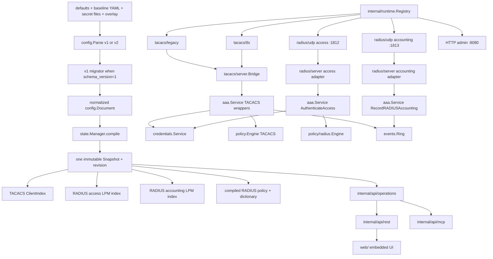
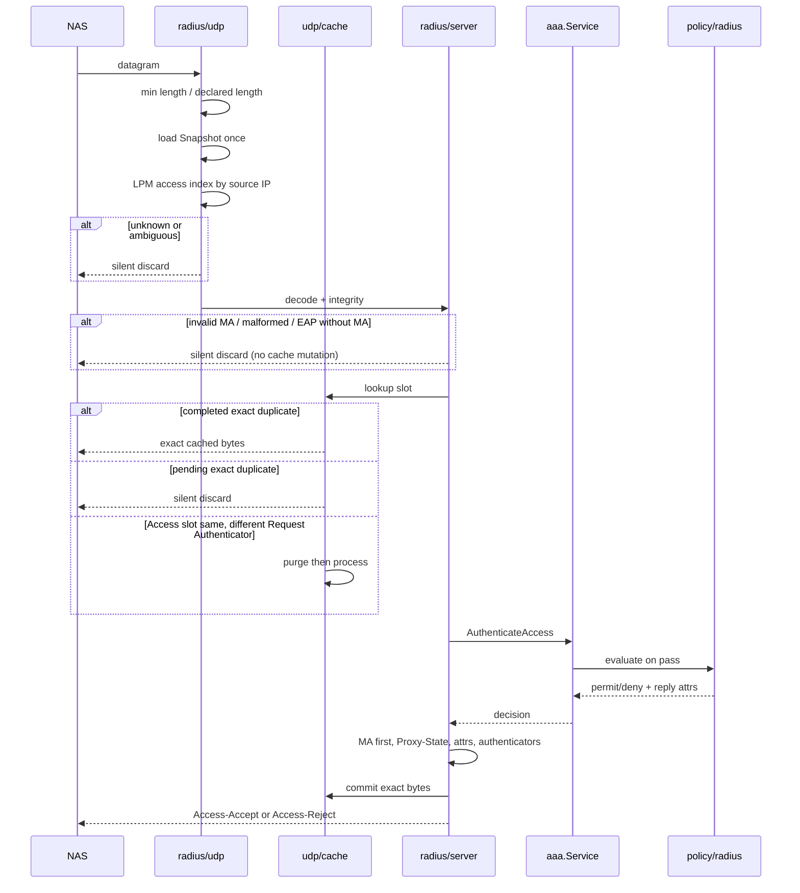

# TacLab RADIUS Authentication — Implementation Design

| Field | Value |
|---|---|
| Document title | TacLab RADIUS Authentication Implementation Design |
| Author | design-doc-writer (Grok) |
| Date | 2026-08-14 |
| Status | Implementation source of truth |
| In-repo path | [docs/designs/radius-authentication.md](https://github.com/hilather/go-lab-tacacs-mcp/blob/main/docs/designs/radius-authentication.md) |
| Product | TacLab — TACACS+ and RADIUS AAA lab appliance |
| Binary | `taclabd` (unchanged) |
| Repository | https://github.com/hilather/go-lab-tacacs-mcp |
| Go module | `github.com/hilather/go-lab-tacacs-mcp` (unchanged) |
| Image | `ghcr.io/hilather/go-lab-tacacs-mcp` (unchanged) |
| Source pin | `3322c26bd78969498e6fa0cd6e4b30902d5c8a94` |
| Architecture pack | External (not in this repository); pinned by the source-pin hash above |
| Binding ADRs | [0013](https://github.com/hilather/go-lab-tacacs-mcp/blob/main/docs/decisions/0013-add-radius-to-existing-taclab-process.md)–[0018](https://github.com/hilather/go-lab-tacacs-mcp/blob/main/docs/decisions/0018-preserve-product-and-module-names-for-first-radius-release.md) |
| Conformance contract | [docs/RADIUS_CONFORMANCE.md](https://github.com/hilather/go-lab-tacacs-mcp/blob/main/docs/RADIUS_CONFORMANCE.md) |
| Normative MVP RFCs | RFC 2865, RFC 2866, RFC 2869 (MA / interim / gigawords / Event-Timestamp), RFC 3579 (MA/EAP-Message validation only), RFC 5080 |
| Precedence | [docs/CANONICAL_DESIGN.md](https://github.com/hilather/go-lab-tacacs-mcp/blob/main/docs/CANONICAL_DESIGN.md) and [AGENTS.md](https://github.com/hilather/go-lab-tacacs-mcp/blob/main/AGENTS.md) win on existing TacLab behavior. Pack ADRs 0013–0018 win on RADIUS-specific overrides. This document freezes implementable names and seams. |

This document is the implementation source of truth for the first RADIUS release. It synthesizes the architecture pack with the repository as it exists at `3322c26`. An engineer should be able to implement from this document without re-deriving the architecture.

---

## Overview

TacLab is already a single Go process (`cmd/taclabd`) with an immutable compiled snapshot (`internal/state`), a memory-only overlay, one credential service (`internal/credentials`), one event ring (`internal/events`), one operation registry (`api/operations.yaml` + `internal/api/operations`), REST/MCP adapters, and an embedded React UI. Those control-plane capabilities are the expensive part of an AAA lab. RADIUS should reuse them.

The current AAA/policy/config surface is TACACS-shaped despite being documented as protocol-independent. `internal/aaa/types.go` carries TACACS actions, session keys, and accounting flag bytes. `domain.Transport` is only `legacy`/`tls`. `config.Listeners` has three named sockets. `cmd/taclabd/serve.go` requires at least one TACACS listener and wires two fixed listener variables. Adding RADIUS fields onto those types would make the leakage permanent.

The design therefore does three things:

1. Keep one process, one snapshot, one operation registry, one UI, and the existing product/module/binary names (ADR 0013, ADR 0018).
2. Add `internal/radius` as a peer of `internal/tacacs`. Wire types never leave that tree.
3. Introduce additive protocol-neutral contracts (`Protocol`, `ListenerRole`, `Carrier`, `RequestContext`, shared verification/effect/accounting) behind TACACS compatibility wrappers, plus config schema version 2 with a deterministic in-memory v1 migrator (ADR 0014, ADR 0017).

The first advertised RADIUS release is a bounded UDP access/accounting profile for controlled lab networks: PAP and CHAP, Access-Accept/Reject, Accounting Start/Stop/Interim/On/Off, Message-Authenticator required by default, exact retransmission replay, and semantic accounting idempotency. EAP termination, CoA/Disconnect, RadSec/DTLS, RADIUS/1.1, proxying, MS-CHAP, custom dictionary files, Access-Challenge, and persistent accounting are deferred.

---

## Background & Motivation

### Current state (verified at `3322c26`)

External surfaces today (`docs/ARCHITECTURE.md`, `cmd/taclabd/serve.go`):

| Listener | Package | Default container bind | Host map |
|---|---|---|---|
| Legacy TACACS+ | `internal/tacacs/legacy` | `0.0.0.0:4949` | `49/tcp` |
| Secure TACACS+ | `internal/tacacs/tls` | `0.0.0.0:4300` | `300/tcp` |
| HTTP admin (REST/UI/MCP) | `internal/api/rest`, `internal/api/mcp` | `0.0.0.0:8080` | `8080/tcp` |

Request path today:

```text
baseline YAML + secret files
        |
  config.Parse / Validate
        |
  state.Manager compile + atomic Snapshot
        |
  tacacs/legacy or tacacs/tls
        |
  tacacs/server.Bridge
        |
  aaa.Service (Begin/Continue/Authorize/RecordAccounting)
        |
  credentials.Service + policy.Engine + events.Ring
```

Strengths to preserve:

- Atomic snapshot publication (`internal/state/manager.go`, `compile.go`). Invalid compile leaves the previous snapshot.
- Overlay is memory-only complete-object replacement with typed patches (`docs/CANONICAL_DESIGN.md` C2).
- Operation registry is the only admin API (`api/operations.yaml`). REST and MCP never call each other.
- Import-boundary tests already exist (`internal/aaa/imports_test.go` forbids `net/http`, `internal/api`, `internal/tacacs`).
- Secret holders cannot serialize (`internal/credentials/secret.go`).
- Independent TACACS testclient codec (`internal/tacacs/testclient`) is the evidence model RADIUS must copy.
- Conformance is machine-readable (`testdata/conformance/rfc8907.yaml`, `rfc9887.yaml`) and generated (`docs/generated/conformance.md`).

Pain points RADIUS cannot live with:

| Location | Coupling | Why it blocks RADIUS |
|---|---|---|
| `internal/domain/enums.go` `Transport` | Only `legacy` / `tls` | UDP access vs accounting is not a TACACS listener kind. |
| `internal/domain/avpair.go` | TACACS `=` / `*` separators | Cannot represent binary RADIUS attributes or VSAs. |
| `internal/aaa/types.go` | `ConnKey`, `SessionID`, `AuthenAction`, `AcctFlag*` | RADIUS is a datagram transaction, not a TACACS conversation. |
| `internal/policy/types.go` | `AuthorDecision` / `AuthorStatus` / `AVPairs` | RADIUS replies are Access-Accept/Reject plus typed attributes. |
| `internal/config/types.go` `Listeners` | Three named sockets | No access/accounting UDP binds, budgets, or MA policy. |
| `internal/config/types.go` `Client` | One `legacy` secret + TACACS authz/acct blocks | RADIUS needs a distinct secret purpose and role-specific endpoints. |
| `internal/config/match.go` | One `ClientIndex`; `Match(transport, ip, cert)` filters TACACS `legacy`/`tls` | RADIUS access and accounting need separate LPM indexes; do not overload this matcher. |
| `cmd/taclabd/serve.go` | `legacyOn && secureOn` required; fixed `*legacy.Listener` / `*tacacstls.Listener` | RADIUS-only labs are illegal; adding two more variables repeats the composition-root debt. |
| `internal/api/operations/status.go` | Hard-codes three listener IDs | Status cannot describe RADIUS without a generic inventory. |
| `docs/CANONICAL_DESIGN.md` Goals | “RADIUS” is a 1.0 non-goal | Must be removed in the same change that lands ADRs 0013–0018. |

### Why not a second repository

A second `go-lab-radius-mcp` would duplicate snapshot/overlay, credentials, events, REST/MCP parity, UI, Compose, canaries, and release gates, then immediately raise the question of which process owns users and revisions. The pack’s executive assessment is correct: that is a distributed control plane, not a RADIUS implementation.

### Why not a TACACS translation layer

RADIUS Access-Accept reply attributes, UDP retransmission, Accounting-Request authenticators, and Acct-Delay-Time identity changes are not TACACS statuses or sessions. Mapping RADIUS through `BeginAuthentication` / `domain.AVPairs` would produce incorrect protocol behavior.

---

## Goals & Non-Goals

### Goals (first advertised RADIUS release)

- One `taclabd` process serves TACACS+ (legacy + TLS) and RADIUS/UDP access + accounting from one snapshot and one revision.
- Existing `schema_version: 1` files load unchanged and compile to the same TACACS effective state.
- New RADIUS configuration requires `schema_version: 2` and a deterministic v1→v2 in-memory migrator.
- Independent RADIUS codec, dictionary, authenticators, User-Password hiding, and Message-Authenticator.
- PAP and CHAP via existing `credentials.Service.VerifyASCIIOrPAP` / `VerifyCHAP`.
- RADIUS access policy dialect with default-deny, deterministic traces, and packet-role-legal reply attributes.
- Accounting Start, Stop, Interim-Update, Accounting-On, Accounting-Off into the existing event ring.
- Exact-response retransmission cache plus a semantic accounting idempotency journal that tolerates Acct-Delay-Time changes.
- REST/MCP parity for every new or changed administrative capability.
- UI status, client, auth-test, policy-explain, and event views become protocol-aware without breaking TACACS pages.
- Combined Compose lab with UDP 1812/1813, distinct RADIUS secret files, and TACACS regression smoke.
- Machine-readable RADIUS conformance registries under the existing `tools/registry` / `make check-registries` gate.

### Non-goals (require a later ADR)

- EAP method termination or pass-through (validate/reject EAP-Message + MA only).
- Access-Challenge as an advertised feature (types may exist; no provider ships).
- CoA / Disconnect (RFC 5176).
- RADIUS/TCP, RadSec/TLS, DTLS, RADIUS/1.1.
- Proxying, realm routing, load-balancing.
- Persistent accounting storage.
- Custom/operator dictionary files and unbounded vendor dictionaries.
- RADIUS MS-CHAPv1/v2 (existing TACACS credential support is not RADIUS VSA evidence).
- Product/module/binary/image rename.
- Second daemon, second snapshot, or second operation registry.
- Implementing MCP by calling REST, or REST by calling MCP.

---

## Key Decisions

These decisions are binding for implementation. Rationale is short; details follow in later sections.

| ID | Decision | Rationale |
|---|---|---|
| KD-01 | Expand this repository and `taclabd`. Do not create `go-lab-radius-mcp`. | Pack ADR 0013. Control plane is the expensive shared asset. |
| KD-02 | Keep product name TacLab, module `github.com/hilather/go-lab-tacacs-mcp`, binary `taclabd`, image `ghcr.io/hilather/go-lab-tacacs-mcp`. | Pack ADR 0018. Rename is a separate migration, not a RADIUS prerequisite. |
| KD-03 | New code lives in `internal/radius/{codec,attribute,crypto,server,udp,testclient}` as a peer of `internal/tacacs`. | Matches existing TACACS layout (`codec`/`server`/`legacy`/`testclient`). Rejects pack `docs/16` extra `packet/`/`transport/udp/`/`access/` packages as over-fragmentation. |
| KD-04 | Do **not** put `radius_udp` on `domain.Transport`. Keep `Transport` as TACACS `legacy`/`tls`. Add `domain.Protocol`, `domain.ListenerRole`, `domain.Carrier`. | `ParseTransport` and `ClientMatch.Transports` are public TACACS values. Extending `Valid()` would let RADIUS leak into TACACS match YAML. |
| KD-05 | Neutral AAA contracts are additive. Keep `AuthenticationStart` / `BeginAuthentication` as TACACS wrappers. RADIUS uses `AuthenticateAccess` / `RecordRADIUSAccounting` on the same `aaa.Service`. | Pack ADR 0014 + current `tacacs/server.Bridge`. Big-bang AAA rewrite is the highest TACACS regression risk. |
| KD-06 | `domain.AVPair` stays TACACS-only. RADIUS attributes are `internal/radius/attribute`. | Pack ADR 0015. AVPair separators cannot represent binary TLVs. |
| KD-07 | Config schema v2 with deterministic v1 migrator. Source files are never rewritten. | Pack ADR 0017 and `docs/CANONICAL_DESIGN.md` §Migration. |
| KD-08 | Freeze v2 listener YAML as **named nested blocks** (`listeners.tacacs.legacy`, `listeners.radius.access`), not a listener list. Normalized `config.Listeners` stays named structs plus two new RADIUS fields. | Current `rawListeners` / `serve.go` / `status.go` are named. The pack `examples/config-radius-schema-v2.md` list form is more invasive than `docs/06`. |
| KD-09 | Freeze v2 client YAML as shared `match.source_cidrs` plus `endpoints[]`. Internal `config.Client` keeps existing TACACS fields as a compatibility projection. | Lets TACACS compile keep using `Client.Authentication` / `Legacy` while RADIUS reads endpoints. |
| KD-10 | In-tree RADIUS codec is the default. Spike (`RAD-CODEC-001`) must still run; third-party types may not escape `internal/radius/codec`. Independent `testclient` codec is mandatory evidence. | Same policy as ADR 0007 for TACACS. |
| KD-11 | UDP only, controlled-network profile. `require_message_authenticator: true` and `limit_proxy_state: true` default on new RADIUS endpoints. Weaker mode is per-endpoint, warned, tested. | Pack ADR 0016, BlastRADIUS, draft-ietf-radext-deprecating-radius. |
| KD-12 | Access-Challenge, EAP, MS-CHAP, CoA, RadSec, custom dictionaries are deferred. EAP-Message without valid MA is discarded. | Pack Q-002/Q-004/Q-006/Q-011 defaults. |
| KD-13 | Do not split `internal/policy` into `core`/`tacacs` in the first PRs. Keep current files as the TACACS dialect; add `internal/policy/radius`. `AuthMethod` and `Effect` live in `internal/domain`. `policy/radius` must not import `aaa`. | Pack itself allows this. Splitting policy while TACACS goldens exist is unnecessary risk. `internal/policy/imports_test.go` already forbids `internal/aaa`. |
| KD-14 | New RADIUS admin operations (`radius.access.test`, `radius.policy.evaluate`, `radius.attributes.list`). Do not reinterpret `authentication.test` or `policy.evaluate`. | Those ops are TACACS-shaped (`EvaluatePolicyRequest` uses `cmd` / `PolicyTraceAV`). Pack docs/08 prefers explicit ops as lower risk. |
| KD-15 | Composition-root listener registry in `internal/runtime`. Readiness becomes “snapshot + every required listener + at least one AAA listener”, with optional `server.admin_only`. | Current `serve.go` cannot absorb two more fixed variables cleanly. |
| KD-16 | Built-in dictionary only. IETF MVP attributes are named. Vendor-Specific framing and raw unknown/VSA preservation are mandatory. Named `Cisco-AVPair` decoding is **not** in MVP. It is a later release after independent Cisco IOL vectors; do not add named Cisco decoding in MVP or without those vectors. | Pack Q-004/Q-005. Status: decided by user 2026-08-14. **Superseded for remaining work by [ADR 0027](https://github.com/hilather/go-lab-tacacs-mcp/blob/main/docs/decisions/0027-named-cisco-avpair-independent-fixtures.md):** named `Cisco-AVPair` uses independent fixtures; IOL skip is not PASS. |
| KD-17 | Retransmission cache key is endpoint + role + source addr/port + receiving socket + code + identifier + request authenticator + declared-packet digest. Access TTL clamped to 5–30s. | Pack Q-007 default; RFC 5080. |
| KD-18 | Accounting uses two layers: exact-response cache **and** a bounded semantic journal that excludes Acct-Delay-Time. Ambiguous identity is a documented fail-open-to-record exception, sampled and journal-capped so it cannot evict the shared event ring unbounded. | RFC 2866 §4.1; pack RAD-TM-15; AGENTS.md 2.8 fail-closed default. |
| KD-19 | `config.export` never emits v2 YAML for a v1 source without an explicit convert flag. v1 sources export as v1. Operators must pass the explicit convert flag to get v2 YAML. Do not auto-upgrade or silently reshape a v1 export. | Status: decided by user 2026-08-14. The flag is the existing `normalize=true` on export (API §1.1); default remains false. |

---

## Proposed Design

### 1. Target topology



### 2. Package and file map

#### 2.1 New packages (freeze)

```text
internal/radius/
  doc.go
  codec/
    code.go              # Code constants (Access-Request=1, ...)
    packet.go            # Packet{Code, Identifier, Authenticator, Attributes}
    decode.go            # one datagram, 20..4096 both roles
    encode.go
    errors.go            # typed silent-discard vs reject reasons
    bounds.go            # max attributes, max value bytes
    fuzz_test.go
    bench_test.go
  attribute/
    raw.go               # Raw{Type uint8, Value []byte}
    set.go               # ordered, duplicate-preserving RawSet
    key.go               # Key{Vendor, Code, Space}
    value.go             # typed Value
    definition.go        # name, kind, packet roles, sensitivity
    dictionary.go        # immutable built-in view
    standard.go          # IETF MVP attributes
    vendor.go            # VSA framing; optional Cisco-AVPair
    decode.go / encode.go
    sensitivity.go
  crypto/
    doc.go               # MD5/HMAC-MD5 used only because RADIUS/UDP requires it
    response.go          # Response Authenticator
    accounting.go        # Accounting-Request Authenticator
    user_password.go     # hide / unhide + wipe
    message_authenticator.go
    compare.go           # constant-time
  server/
    access.go            # packet -> aaa.AuthenticateAccess -> reply
    accounting.go        # packet -> aaa.RecordRADIUSAccounting -> reply
    reply.go             # MA first, then Proxy-State, then policy attrs
    discard.go           # reason taxonomy
    integrity.go         # MA / accounting authenticator / role legality
  udp/
    listener.go          # PacketConn per role
    worker.go            # bounded pool + queue
    cache.go             # exact-response retransmission cache
    journal.go           # semantic accounting idempotency
    limits.go
    lifecycle.go         # runtime.ManagedListener impl
  testclient/
    codec/               # independent encode/decode (no production import)
    access.go
    accounting.go
    vectors_test.go

internal/runtime/
  listener.go            # ManagedListener + Descriptor + Status
  registry.go            # start/ready/drain/close
  status.go

internal/policy/radius/
  types.go
  compile.go
  evaluate.go
  goldens/
```

`internal/radius/testclient` must not import `internal/radius/codec`, `internal/radius/crypto`, or `internal/radius/server`. This copies `internal/tacacs/testclient` (ARCHITECTURE §4.10.1). Shared loopback is never sole conformance evidence.

#### 2.2 Existing packages to extend (not replace)

| Path | Change | Constraint |
|---|---|---|
| `internal/domain/enums.go` | Keep `Transport`. Add new files for Protocol/Role/Carrier. | `ParseTransport` still accepts only `legacy`/`tls`. |
| `internal/domain/avpair.go` | Untouched. | No RADIUS reuse. |
| `internal/aaa/types.go` | Keep TACACS types. Add files listed below. | `Bridge` keeps compiling against existing methods. |
| `internal/aaa/service.go` | Same struct; add RADIUS methods and policy-engine cache keyed by revision. | No second Service. |
| `internal/aaa/imports_test.go` | Also forbid `internal/radius/codec`, `internal/radius/udp`. | AAA must not see packets or sockets. |
| `internal/config/raw.go` | Split `rawFile` by schema version (`rawFileV1` stays; add `rawFileV2`). | Unknown fields still fail via `inspectNode`. |
| `internal/config/types.go` | Add RADIUS listener/endpoint/policy types. Bump accepted versions. | `SchemaVersion` constant becomes `SchemaVersionV1 = 1`; add `SchemaVersionV2 = 2`. |
| `internal/config/parse.go` | Branch on `schema_version` before `inspectNode` type. | Mixed v1/v2 keys fail with a stable path. |
| `internal/config/match.go` | Keep TACACS `ClientIndex`. Add `RADIUSIndex` compiled per role. | Ambiguity remains a compile error. |
| `internal/state/snapshot.go` | Add RADIUS indexes, dictionary version, compiled RADIUS policies. | One Snapshot, one Revision. |
| `internal/state/compile.go` | Compile RADIUS views after `config.Validate` + secret evaluation. | Failure does not publish. |
| `cmd/taclabd/serve.go` | Build `runtime.Registry` instead of two TACACS variables. | Shutdown/readiness become data-driven. |
| `internal/api/operations/*` | Additive client/status fields + three new ops. | Same-change `api/operations.yaml` + generate. |
| `internal/events/ring.go` | Additive protocol/role/code/reason fields on `Event`. | SchemaVersion stays 1; omitted fields keep TACACS JSON stable. |
| `internal/observability/series.go` | New RADIUS series + label allowlists. | No username/IP/client_id on RADIUS series. |
| `internal/credentials/secret.go` | `PurposeRADIUSSharedSecret`, `RADIUSSharedSecret` type. | Same redaction/serialization bans. |
| `web/src/pages/*` | Protocol-aware clients/status/events + RADIUS test/explain pages. | Generated `web/src/generated/api.ts` only. |
| `deployments/compose/*`, `tools/labgen` | UDP ports + RADIUS secrets. | Do not bake secrets into images. |
| `testdata/conformance/` | `rfc2865.yaml`, `rfc2866.yaml`, `rfc2869.yaml`, `rfc3579.yaml`, `rfc5080.yaml`, `project-radius.yaml`. | Pack IDs (`R65-`/`R66-`/`R69-`/`R79-`/`R80-`/`PRJ-`). PR 1 teaches `tools/registry` to load them. |
| `docs/*`, `AGENTS.md` | Remove RADIUS from non-goals; add RADIUS contracts. | Same-change as behavior. |

#### 2.3 Pack vs repo package-layout resolution

| Pack source | Proposal | This design |
|---|---|---|
| `docs/03-TARGET-ARCHITECTURE.md` | `codec`, `attribute`, `crypto`, `server`, `udp`, `testclient` | **Adopt.** Matches TACACS peers. |
| `docs/16-PACKAGE-AND-FILE-CHANGE-MAP.md` | Extra `packet/`, `dictionary/`, `access/`, `accounting/`, `transport/udp/`, `retransmit/` | **Reject as top-level packages.** Those concerns live inside `codec`, `attribute`, `server`, and `udp`. |
| `examples/package-layout.md` | `codec` + `udp/cache.go` + `server` | **Adopt.** |

`internal/runtime` is new and composition-only. Protocol packages implement `runtime.ManagedListener`; they do not import `cmd/taclabd`.

#### 2.4 Mandatory dependency direction

```text
cmd/taclabd -> runtime, config, state, aaa, api/*, tacacs/*, radius/udp, observability
radius/udp  -> radius/server, runtime, state (snapshot pointer only), observability
radius/server -> aaa, radius/codec, radius/attribute, radius/crypto
aaa -> credentials, policy, policy/radius, state, events, domain, config (normalized types)
policy/radius -> domain + radius/attribute typed definitions only
radius/codec -> stdlib + radius/attribute raw types only
radius/crypto -> stdlib + secret holders
```

This is a **compilable** Go import graph. `aaa` may import `policy/radius`. `policy/radius` must not import `aaa`. Shared enums (`AuthMethod`, `Effect`, `AuthOutcome`) live in `internal/domain` so both sides compile.

Forbidden (enforced by AST import tests; `internal/policy/imports_test.go` already bans `internal/aaa`):

```text
aaa            -/-> tacacs, radius/codec, radius/udp, net/http, api
policy         -/-> aaa, radius/codec, radius/udp, radius/server, api, tacacs
policy/radius  -/-> aaa, radius/codec Packet, radius/server, radius/udp
radius/codec   -/-> config, state, aaa, api, events, observability
radius/udp     -/-> credentials decisions, policy evaluation
tacacs/*       -/-> radius/*
radius/*       -/-> tacacs/*
rest           -/-> mcp  and  mcp -/-> rest
```

### 3. Domain taxonomy

New file `internal/domain/protocol.go` (illustrative, names frozen):

```go
type Protocol string
const (
    ProtocolTACACS Protocol = "tacacs"
    ProtocolRADIUS Protocol = "radius"
    ProtocolHTTP   Protocol = "http" // admin listener only
)

type ListenerRole string
const (
    RoleAuthentication       ListenerRole = "authentication"
    RoleAuthorization        ListenerRole = "authorization"
    RoleAccounting           ListenerRole = "accounting"
    RoleAccess               ListenerRole = "access"
    RoleAdmin                ListenerRole = "admin"
    RoleAAA                  ListenerRole = "aaa" // TACACS combined auth+author+acct socket
    RoleDynamicAuthorization ListenerRole = "dynamic_authorization" // reserved, not MVP
)

type Carrier string
const (
    CarrierTACACSLegacyTCP Carrier = "tacacs_legacy_tcp"
    CarrierTACACSTLS       Carrier = "tacacs_tls"
    CarrierRADIUSUDP       Carrier = "radius_udp"
    CarrierHTTPTCP         Carrier = "http_tcp"
    CarrierRADIUSTLS       Carrier = "radius_tls" // reserved
)
```

`domain.Transport` in `internal/domain/enums.go` is **unchanged**:

```go
const (
    TransportLegacy Transport = "legacy"
    TransportTLS    Transport = "tls"
)
```

Mapping used by status/events:

| Surface | `protocol` | `transport` (status field) | `carrier` | `role` |
|---|---|---|---|---|
| Legacy TACACS | `tacacs` | `legacy` (`domain.TransportLegacy`) | `tacacs_legacy_tcp` | `aaa` (`RoleAAA`) |
| Secure TACACS | `tacacs` | `tls` (`domain.TransportTLS`) | `tacacs_tls` | `aaa` |
| RADIUS access | `radius` | `udp` (new status string only; **not** a `domain.Transport` value) | `radius_udp` | `access` |
| RADIUS accounting | `radius` | `udp` (same) | `radius_udp` | `accounting` |
| HTTP | `http` | `http` (`operations.TransportHTTP`, **not** `domain.Transport`) | `http_tcp` | `admin` |

`runtime.Descriptor` carries `Roles []ListenerRole`. A TACACS listener has `Roles: []ListenerRole{RoleAAA}` (one socket, three TACACS families). RADIUS access and accounting are separate descriptors with a single role each. Do not invent a multi-role TACACS UDP listener.

v2 YAML `transport` values are **scoped by protocol** and frozen as:

| v2 `protocol` | v2 `transport` | Internal `Carrier` |
|---|---|---|
| `tacacs` | `tcp` | `tacacs_legacy_tcp` |
| `tacacs` | `tls` | `tacacs_tls` |
| `radius` | `udp` | `radius_udp` |

v1 `match.transports: [legacy]` migrates to `protocol: tacacs, transport: tcp`.

`RequestContext` lives in `internal/domain/context.go`:

```go
type RequestContext struct {
    Protocol         Protocol
    Carrier          Carrier
    ListenerRole     ListenerRole
    ListenerID       string
    ClientID         string
    EndpointID       string
    Peer             netip.AddrPort
    SnapshotRevision Revision
    CorrelationID    string
    ReceivedAt       time.Time
}
```

Rules:

- Adapter fills this after source-client resolution.
- `CorrelationID` is opaque (ULID/UUIDv4 from injectable entropy). It is not the RADIUS Identifier or authenticator.
- Usernames, NAS-Identifier, IPs, and attribute values never become metric labels.

Shared enums used by both `aaa` and `policy/radius` live in `internal/domain/aaa_neutral.go` (name frozen):

```go
type AuthMethod string
const (
    AuthMethodPassword AuthMethod = "password"
    AuthMethodCHAP     AuthMethod = "chap"
    // mschapv1/v2 reserved; not MVP
)

type Effect string
const (
    EffectPermit Effect = "permit"
    EffectDeny   Effect = "deny"
    EffectError  Effect = "error"
)

type AuthOutcome string
const (
    AuthPass      AuthOutcome = "pass"
    AuthReject    AuthOutcome = "reject"
    AuthChallenge AuthOutcome = "challenge" // reserved
    AuthError     AuthOutcome = "error"
)
```

These are not TACACS `AuthenType` / `AuthorDecision`. Aliases in `aaa` (`type AuthMethod = domain.AuthMethod`) are allowed; new definitions in `policy/radius` are not.

**PAP / password mapping (frozen):**

| Surface | Token | Internal value |
|---|---|---|
| RADIUS wire / config YAML / REST / MCP / UI | `pap` | `domain.AuthMethodPassword` (`"password"`) |
| Policy YAML `method` | `password` (canonical) or `pap` (alias) | same |
| CHAP everywhere | `chap` | `domain.AuthMethodCHAP` (`"chap"`) |

Normalize at the config/API edge: `pap` → `AuthMethodPassword`. Policy compile accepts `pap` as an alias and stores `password`. A typo like `passwd` fails with path `radius_policies.<id>.rules.<id>.match.method` and message that names the allowed tokens (`password`, `pap`, `chap`). Never expose `"password"` as a RADIUS wire method name.

### 4. Neutral AAA contracts vs TACACS wrappers

#### 4.1 What stays TACACS-owned

Keep in `internal/aaa/types.go` and existing methods (`auth.go`, `author.go`, `account.go`):

- `AuthenticationStart` / `Continue` / `Abort` / `AuthenticationStep`
- `AuthorizationRequest` / `AuthorizationDecision` / `PolicyTrace` (TACACS AV encoding)
- `AccountingRecord.Flags byte` and `ValidAcctFlags`
- `Service.BeginAuthentication`, `ContinueAuthentication`, `AbortAuthentication`, `Authorize`, `ExplainAuthorization`, `RecordAccounting`

`internal/tacacs/server.Bridge` continues to call those methods. `RAD-DOM-007` is an **adapter-internal** migration: Bridge may start using the shared verifier internally, but its exported Handler signatures (`handler.go`) stay TACACS codec types.

#### 4.2 New shared types (`internal/aaa/authn.go`)

Wrappers over `domain` types. `policy/radius` imports `domain` only.

```go
type AuthenticationEvidence struct {
    Method    domain.AuthMethod
    Password  credentials.Password // wipe after Verify; SecretBytes does not exist
    Challenge []byte
    Response  []byte
    MethodID  byte
}

type AuthenticationAttempt struct {
    Context  domain.RequestContext
    UserID   string
    Evidence AuthenticationEvidence
}

type AuthenticationDecision struct {
    Outcome    domain.AuthOutcome
    ReasonCode string // closed set
    UserID     string // canonical UsernameCasePreserved or empty
}
```

`aaa.Service.VerifyCredentials(ctx, AuthenticationAttempt) AuthenticationDecision` is the shared facade over `credentials.Service`. TACACS one-shot PAP/CHAP paths (`aaa/auth.go` `oneShotPAP` / `oneShotCHAP`) should call it after `RAD-DOM-004` without changing wire status mapping.

Closed `ReasonCode` values (metrics-safe):

`ok`, `unknown_user`, `bad_credentials`, `user_disabled`, `method_not_allowed`, `credential_missing`, `restriction_client`, `restriction_time`, `unsupported_method`, `internal`.

Never distinguish unknown user vs bad password on the wire. Both map to Access-Reject / TACACS FAIL.

#### 4.3 New RADIUS access service

```go
// internal/aaa/radius_access.go
type RadiusAccessAttempt struct {
    Context           domain.RequestContext
    UserID            string
    Evidence          AuthenticationEvidence
    RequestAttributes radiusattr.TypedSet // application-safe; no hidden User-Password
}

type RadiusAccessDecision struct {
    Outcome         RadiusAccessOutcome // accept | reject | error
    ReasonCode      string
    ReplyAttributes radiusattr.TypedSet
    Trace           RadiusPolicyTrace
}

func (s *Service) AuthenticateAccess(ctx context.Context, in RadiusAccessAttempt) (RadiusAccessDecision, error)
```

Pipeline inside `AuthenticateAccess` (no UDP, no packets):

1. Load the snapshot already bound in `Context.SnapshotRevision` (do not call `s.snapshot()` again if revision is set; if missing, load current once).
2. Resolve user (UsernameCasePreserved). Apply `UserRestrictions` (client IDs, valid_after/before) using the existing TACACS restriction fields — users are shared identities.
3. Verify credentials via `VerifyCredentials`.
4. On pass, evaluate `policy/radius` with user/groups/client/typed attributes. The policy request uses `domain.AuthMethod`, not an `aaa` type.
5. Permit → accept + compiled reply attributes. Deny / no match → reject. Evaluator error → `internal_error` (fail closed, never accept).

`radius/server` maps outcomes using the frozen table in §5.7. There is **no** Access-Error packet and **no** Error-Cause attribute in MVP (RFC 5176 is deferred). After a request has passed client resolution and integrity, Access always gets Access-Accept or Access-Reject.

#### 4.4 New RADIUS accounting service

```go
type AccountingKind string
const (
    AccountingStart   AccountingKind = "start"
    AccountingStop    AccountingKind = "stop"
    AccountingInterim AccountingKind = "interim_update"
    AccountingOn      AccountingKind = "accounting_on"
    AccountingOff     AccountingKind = "accounting_off"
)

type RADIUSAccountingRecord struct {
    Context        domain.RequestContext
    Kind           AccountingKind
    UserID         string
    SessionID      string // Acct-Session-Id text, not TACACS uint32
    StartedAt      *time.Time
    SessionTime    time.Duration
    InputOctets    uint64 // includes gigaword fold
    OutputOctets   uint64
    TerminateCause string // closed enum string or empty
    SafeAttributes []SafeAttributeSummary
    IdempotencyKey string // computed by server after validation
}

func (s *Service) RecordRADIUSAccounting(ctx context.Context, rec RADIUSAccountingRecord) (AccountingResult, error)
```

`AccountingResult` (`OK`, `EventID`) is reused. SUCCESS on the wire is returned only after `events.Ring.Accept` assigns an ID — same rule as `aaa.RecordAccounting` today.

Do **not** stuff RADIUS records through `AccountingRecord.Flags`. That type stays TACACS.

#### 4.5 Policy dialects

`internal/policy` remains the TACACS engine (`Compile`, `Request`, `Result`, golden traces under `testdata/policies/goldens`).

`internal/policy/radius` (imports `domain` + `radius/attribute` only):

```go
type Request struct {
    UserID     string
    ClientID   string
    EndpointID string
    Method     domain.AuthMethod
    Groups     []string // effective group IDs, already ordered
    Attributes radiusattr.TypedSet
}

type Result struct {
    Effect          domain.Effect
    ReplyAttributes radiusattr.TypedSet
    Trace           Trace
}
```

**Evaluation order** ([ADR 0029](https://github.com/hilather/go-lab-tacacs-mcp/blob/main/docs/decisions/0029-user-group-radius-policy-attachment.md); v2 only):

1. User `radius_policy_id` (source `user_policy:<id>`), if set.
2. Each group in `effectiveGroups` that sets `radius_policy_id` (source `group_policy:<id>`).
3. Client endpoint `access_policy_id` rules, declared order (`client_policy:<id>`).
4. Global `radius_policies` named by `fallback_radius_policy_id` (optional; default empty).
5. Default deny.

`effectiveGroups` **must** match `policy.Engine.effectiveGroups` in `internal/policy/compile.go` for **enabled** users: user `group_ids` in listed order, then client `default_group_ids` not already present, then sort by ascending group `priority` then group `id`. Equal priorities are **legal**. Do **not** add a compile reject for equal group priority. Client-match ties remain `CLIENT_MATCH_AMBIGUOUS` (C1); that rule does not apply to groups. v1 `User` / `Group` stay TACACS-shaped and reject `radius_policy_id`.

Disabled users fail credentials before `Evaluate` on the Access-Request path (`reject_bad_credentials`). TACACS never calls `effectiveGroups` for them. Diagnostics (`radius.policy.evaluate`) still skip user policy and user `group_ids` but keep client `default_group_ids`. `groups_any` uses that same compiled membership when the user is in the engine.

First matching rule wins. Traces include source (`user_policy:<id>`, `group_policy:<id>`, `client_policy:<id>`, `fallback`), rule id, matched, reason. Secrets and sensitive attribute values never appear in traces.

**Match dialect (frozen for client + fallback policies):**

| Match key | YAML | Operators | Notes |
|---|---|---|---|
| Group membership | `groups_any` | list of group IDs | Matches if the request’s effective group set intersects. Empty/omitted = no group constraint. |
| Authenticated method | `method` | `equals` | Canonical `password` or `chap`. `pap` is an accepted alias for `password` (see §3 mapping table). |
| Typed request attribute | `attributes[]` | `equals`, `present`, `absent` | `name` (IETF dictionary name) or `vendor`+`code`. Value parsed by dictionary kind. |

Rules:

- Unknown match attribute name/code at compile → `CONFIG_YAML_INVALID` (fail closed).
- `equals` on a `single` attribute uses the first instance; extra instances do not change the match (cardinality of **auth evidence** is enforced before policy; see §5.7).
- NAS-IP-Address / NAS-Identifier **may** be match keys after source-IP secret selection. They are untrusted NAS claims, not the match key for the secret.
- No regex/glob in MVP.
- `enabled: false` on a rule (default true) skips it.
- Unknown keys on a rule fail compile.

**Reply profiles:**

- A permit rule may list `reply_profiles: [id, …]`.
- Profiles concatenate in listed order; duplicate attribute names follow dictionary cardinality (`single` last-wins at compile with a warning is **not** allowed — compile error if two `single` attrs of the same key appear across the concatenated list).
- Every reply attribute is checked at compile for Access-Accept packet-role legality. Illegal role → snapshot not published.
- Deny rules may include only attributes legal in Access-Reject (`Reply-Message` only in MVP).
- Raw VSA in a reply profile: `{ vendor: <uint32>, code: <uint8>, value_hex: "..." }` with a built-in “known raw VSA” path. Named `Cisco-AVPair` is not accepted in MVP.

### 5. RADIUS protocol design

#### 5.1 Packet codec

`internal/radius/codec.Packet`:

```go
type Packet struct {
    Code          Code
    Identifier    uint8
    Authenticator [16]byte
    Attributes    attribute.RawSet
}
```

Decoder rules (RFC 2865 §3, RFC 2866 §3, RFC 5080):

- One datagram. Never stitch.
- Need at least 20 bytes. Declared length must be ≥ 20 and ≤ 4096 for **both** access and accounting (RFC 2865 §3 and RFC 2866 §3). Declared length > datagram → silent discard. Trailing bytes beyond declared length are padding and ignored. A tighter lab cap is configurable (`max_packet_bytes`) and defaults to 4096; it is not an RFC maximum of 4095.
- Attribute walk: every Length ≥ 2 and within remaining declared payload. Overflow → discard.
- Bound attribute count and total value bytes (config; default 256 attrs / 4096 value bytes).
- Preserve order, duplicates, unknown types, unknown VSA payloads.
- Invalid codes for the listener role → silent discard.

Encoder rules:

- Canonical Length.
- Fail before write if result exceeds role maximum.
- `radius/server/reply.go` owns attribute order: Message-Authenticator first on **every Access and Accounting response**, then unmodified Proxy-State in order, then validated policy/accounting attributes.

Codes in MVP: Access-Request (1), Access-Accept (2), Access-Reject (3), Accounting-Request (4), Accounting-Response (5). Access-Challenge (11) is advertised for opted-in EAP Identity/MD5.

#### 5.2 Attribute model

Three representations, never mixed:

1. **Raw** (`attribute.Raw`) — wire TLV.
2. **Typed** (`attribute.Typed`) — dictionary-applied Key + Value.
3. **Policy/config** — name/code/vendor + scalar; no secret-bearing values.

Dictionary is an immutable compiled view stored on the Snapshot (`DictionaryVersion` string, e.g. `builtin-mvp-1`). Unknown attributes remain raw and may be summarized as `{type, vendor, length, sensitivity: unknown}`.

MVP dictionary (IETF unless noted):

| Name | Code | Notes |
|---|---:|---|
| User-Name | 1 | text |
| User-Password | 2 | secret; never leave crypto |
| CHAP-Password | 3 | 17 bytes typical |
| NAS-IP-Address | 4 | IPv4; policy input only |
| NAS-Port | 5 | |
| Service-Type | 6 | |
| Framed-Protocol | 7 | |
| Framed-IP-Address | 8 | reply |
| Filter-Id | 11 | reply |
| Framed-MTU | 12 | |
| Reply-Message | 18 | reject/accept |
| State | 24 | reserved; not emitted in MVP |
| Class | 25 | |
| Vendor-Specific | 26 | framing required |
| Session-Timeout | 27 | reply |
| Idle-Timeout | 28 | reply |
| Called-Station-Id | 30 | restricted |
| Calling-Station-Id | 31 | restricted |
| NAS-Identifier | 32 | policy input only |
| Proxy-State | 33 | copy unmodified |
| Acct-Status-Type | 40 | |
| Acct-Delay-Time | 41 | excluded from semantic journal key |
| Acct-Input-Octets | 42 | |
| Acct-Output-Octets | 43 | |
| Acct-Session-Id | 44 | |
| Acct-Authentic | 45 | |
| Acct-Session-Time | 46 | |
| Acct-Input-Packets | 47 | |
| Acct-Output-Packets | 48 | |
| Acct-Terminate-Cause | 49 | |
| CHAP-Challenge | 60 | |
| NAS-Port-Type | 61 | |
| Acct-Interim-Interval | 85 | RFC 2869 |
| NAS-IPv6-Address | 95 | RFC 3162; include for dual-stack NAS |
| Event-Timestamp | 55 | RFC 2869 |
| Acct-Input-Gigawords | 52 | RFC 2869 |
| Acct-Output-Gigawords | 53 | RFC 2869 |
| Message-Authenticator | 80 | Validated on Access always; validated on Accounting when present. Not a named policy match key. |

Vendor-Specific (26) framing is required. Unknown VSAs are preserved raw. Named `Cisco-AVPair` (vendor 9) decoding is **not** in MVP. Reply profiles may emit a raw VSA via `{vendor, code, value_hex}` only. A later PR may add the named Cisco entry after independent IOL vectors.

Cardinality: dictionary entries declare `single` vs `multi`. `User-Name`, `User-Password`, `CHAP-Password`, and Message-Authenticator are `single`. `Proxy-State` is `multi`. Conflicting extras are handled by the §5.7 table (reject for auth evidence; discard for conflicting MA). Tests in `RAD-POL-004` lock the matrix.

#### 5.3 Crypto (`internal/radius/crypto`)

Narrow functions only. Comment + ADR 0016: MD5/HMAC-MD5 exist solely because RADIUS/UDP requires them. Do not add a general MD5 helper to `internal/credentials` or `internal/domain`.

| Function | Role |
|---|---|
| `ResponseAuthenticator(secret, code, id, length, reqAuth, attrs)` | Access and Accounting responses |
| `AccountingRequestAuthenticator(secret, packetWithoutAuth)` | Server validates before side effects |
| `HideUserPassword` / `UnhideUserPassword` | PAP; wipe plaintext |
| `MessageAuthenticator` / `ValidateMessageAuthenticator` | HMAC-MD5; zero the MA value during compute |
| `Equal` | `crypto/subtle` |

Access-Request Authenticator is a **nonce**. The server does not treat it as a MAC. Accounting-Request Authenticator **is** validated.

Every present Message-Authenticator (Access **or** Accounting) is validated. Duplicate/conflicting MA → discard. EAP-Message requires valid MA even if `require_message_authenticator` is false.

Access-Accept, Access-Reject, Access-Challenge (if ever enabled), **and Accounting-Response** always insert Message-Authenticator as the first attribute, then compute the Response Authenticator. Not configurable. Inbound Accounting-Request MA remains validate-if-present (do not *require* it in MVP). Independent testclient and Q-010 `radclient` fixtures **must** validate the response MA.

#### 5.3.1 Message-Authenticator and `limit_proxy_state` algorithm

Two layers exist. **The endpoint is authoritative.** The listener field is only the default copied onto an endpoint that omits the field at normalize time.

| Listener `message_authenticator` | Endpoint omits flags | Endpoint `require_message_authenticator` | Effective require |
|---|---|---|---|
| `required` (access default) | inherit `true` | `true` / `false` | endpoint value |
| `allow_missing` | inherit `false` | `true` / `false` | endpoint value |

`limit_proxy_state` defaults `true` on new RADIUS endpoints. Listener YAML may set `limit_proxy_state` as the inherit default; endpoint wins.

Algorithm for **Access-Request** after source-IP endpoint selection and decode, **before** credential or policy work and **before** any cache mutation:

1. If more than one Message-Authenticator is present → silent discard (`discard_invalid_message_authenticator`).
2. If Message-Authenticator is present → HMAC-MD5 validate (attribute zeroed during compute). Invalid → silent discard (`discard_invalid_message_authenticator`). Never read/insert/purge the retransmission cache.
3. If EAP-Message is present and MA is missing or invalid → silent discard (`discard_eap_without_ma`). Not configurable.
4. If effective `require_message_authenticator` is true and MA is missing → silent discard (`discard_missing_message_authenticator`).
5. If effective `require_message_authenticator` is false, emit the compatibility warning (validate/status/UI). Then if `limit_proxy_state` is true and Proxy-State is present and MA is missing or invalid → silent discard (`discard_proxy_state_without_ma`).
6. Otherwise continue to cache lookup / authentication.

Algorithm for **Accounting-Request** after endpoint selection, decode, and Accounting-Request Authenticator validation:

1. Message-Authenticator is **not** prohibited. Do **not** discard solely because the attribute exists (FreeRADIUS 3.2.5+ `radclient` sends it after BlastRADIUS).
2. If MA is present → validate it. Invalid → silent discard (`discard_invalid_message_authenticator`) before side effects. Do not apply Access `require_message_authenticator` or `limit_proxy_state` to inbound accounting in MVP.
3. Optional later per-endpoint *require* inbound accounting MA is out of MVP (no YAML field).
4. Accounting-Response still **always** inserts MA first (same construction as Access responses). BlastRADIUS-era `radclient` (FreeRADIUS 3.2.5+, `require_message_authenticator` default) rejects a response without a valid MA.

`require_message_authenticator: false` (or inherited `allow_missing`) produces: config validation warning, `Status.Warnings` entry, UI “insecure RADIUS compatibility” badge, operator-docs note. There is no global off switch.

#### 5.4 Access-Request pipeline (runtime + server)



PAP:

- Exactly one usable User-Name and one User-Password.
- Unhide with endpoint secret + Request Authenticator.
- `VerifyASCIIOrPAP`.
- Wipe unhidden bytes.

CHAP:

- Validate CHAP-Password.
- Challenge = CHAP-Challenge if present, else Request Authenticator (RFC 2865).
- `VerifyCHAP`.
- Reject if challenge secret not configured (`Capabilities.Challenge == false`) without user enumeration on the wire.

Unsupported / multiple conflicting auth methods → Access-Reject (`reject_unsupported_method`).

NAS-IP-Address / NAS-Identifier are **not** used to select the secret. Source IP vs compiled index selects the endpoint first (RAD-TM-14).

#### 5.5 Accounting pipeline

1. Role-specific accounting index.
2. Decode; validate Accounting-Request Authenticator. Invalid → silent discard, no side effects.
3. If Message-Authenticator is present, validate it (see §5.3.1). Invalid → silent discard. **Do not discard a valid MA** just because the packet is Accounting-Request.
4. Exact cache for byte-identical retries.
5. Map Acct-Status-Type. Unknown or not on the endpoint `accept_status_types` allowlist → silent discard, no event (`discard_unknown_acct_status`).
6. Semantic journal key (below). Hit → new valid Accounting-Response for **this** Identifier/Request Authenticator; no second event.
7. `RecordRADIUSAccounting` → ring Accept → EventID. If the ring rejects the record, send **no** Accounting-Response (AGENTS.md: success only after sink accept).
8. Build Accounting-Response: Message-Authenticator first, then Response Authenticator; cache exact bytes for the exact packet fingerprint.

Semantic journal key (frozen):

```text
endpoint_id || src_ip || src_port || acct_session_id || acct_status_type
  || nas_ip_or_nas_id || event_fingerprint
```

`event_fingerprint` excludes Acct-Delay-Time, Identifier, Request Authenticator, and whole-packet digest.

Interim-Update fingerprint **includes** Event-Timestamp (if present), Acct-Session-Time, input/output octets+gigawords, input/output packets.

**Ambiguous identity** (no Acct-Session-Id **and** no NAS-IP/NAS-Identifier): documented exception to fail-closed (CANONICAL_DESIGN + AGENTS.md 2.8). Record the event only if the per-listener sample budget allows (`ambiguous_accounting_per_minute`, default 60); otherwise increment `taclab_protocol_discards_total{reason="ambiguous_identity"}` and still send Accounting-Response so the NAS does not retry-storm, but do not append a second ring record. This is fail-open-to-ack, not fail-open-to-fill-the-shared-ring.

Semantic journal caps (frozen defaults): `journal_entries` 20000, `journal_bytes` 8 MiB, TTL same as accounting `retransmission_ttl` (default 60s, max 300s). Saturation: treat as journal miss (may record a new event) and increment `taclab_radius_journal_saturations_total` — do not block Accounting-Response. Operators who need stricter dedupe raise the cap.

#### 5.6 Retransmission cache

Implemented in `internal/radius/udp/cache.go`.

Primary slot: `endpoint_id + role + src_ip + src_port + listener_id + code + identifier`.

Exact fingerprint: `request_authenticator || sha256(declared_packet_bytes)`.

States: `pending`, `completed`. Completed stores exact response bytes, safe outcome, originating revision, expiry. Pending stores only coordination metadata (wait group / cond). No passwords, no secrets, no decrypted attributes.

Access TTL: configurable, validated in `[5s, 30s]`, default `15s`. Accounting TTL default `60s`, max `300s`.

Capacity: config `retransmission_cache_entries` (default access 10000, accounting 20000) and `retransmission_cache_bytes` (default access 4 MiB, accounting 8 MiB). Saturation: refuse new pending entries and increment `taclab_radius_cache_saturations_total`; new unique requests are dropped (`drop_overload`), not processed without cache protection.

Invalid Access MA never reads/inserts/purges the cache.

Compatibility-mode Access without MA **does** participate (documented spoofing risk). Default config disables that mode.

#### 5.7 Condition → wire action → cache (frozen)

There is no Access-Error / Access-Reject-with-Error packet. After integrity + known client, Access replies Accept, Reject, or Challenge. Access-Challenge is issued for opted-in EAP Identity/MD5 behind the in-memory state gate ([ADR 0021](https://github.com/hilather/go-lab-tacacs-mcp/blob/main/docs/decisions/0021-radius-access-challenge-state-gate.md), [ADR 0022](https://github.com/hilather/go-lab-tacacs-mcp/blob/main/docs/decisions/0022-radius-eap-identity-md5.md)). Challenge-failure reasons must not collapse to `reject_bad_credentials`.

| Condition | `reason_code` | Wire | Cache |
|---|---|---|---|
| Unknown source / no RADIUS endpoint | `discard_unknown_client` | none | no |
| Ambiguous source (compile would have failed; runtime defensive) | `discard_ambiguous_client` | none | no |
| Datagram shorter than 20 or declared length | `discard_malformed_header` | none | no |
| Declared length > datagram, > 4096, or > `max_packet_bytes` | `discard_invalid_length` | none | no |
| Code not valid for this listener role | `discard_invalid_code` | none | no |
| Invalid Accounting-Request Authenticator | `discard_invalid_accounting_request_authenticator` | none | no |
| MA present and HMAC invalid, or more than one MA | `discard_invalid_message_authenticator` | none | no |
| Access: EAP-Message without valid MA | `discard_eap_without_ma` | none | no |
| Access: MA required and missing | `discard_missing_message_authenticator` | none | no |
| Access: `limit_proxy_state` and Proxy-State without valid MA | `discard_proxy_state_without_ma` | none | no |
| Queue/cache/governor saturation | `drop_overload` | none | no |
| Missing User-Name, or more than one User-Name | `reject_missing_username` | Access-Reject | yes after complete |
| More than one User-Password, or PAP+CHAP both present | `reject_conflicting_auth` | Access-Reject | yes |
| CHAP-Password length ≠ 17 | `reject_chap_password_length` | Access-Reject | yes |
| Method not allowed / no usable evidence | `reject_unsupported_method` | Access-Reject | yes |
| User unknown, disabled, or password/CHAP mismatch | `reject_bad_credentials` | Access-Reject | yes |
| Successful PAP/CHAP verify + `must_change_login` | `reject_password_change_required` | Access-Reject | yes |
| Continuation State unknown | `reject_invalid_state` | Access-Reject | yes |
| Continuation expired | `reject_challenge_expired` | Access-Reject | yes |
| Bind / endpoint mismatch | `reject_challenge_binding` | Access-Reject | yes |
| Store saturated at issue | `reject_challenge_capacity` | Access-Reject | yes |
| Challenge issued | `challenge` | Access-Challenge | yes |
| Unimplemented EAP type | `reject_unsupported_eap_method` | Access-Reject + EAP-Failure | yes |
| EAP payload over bound | `reject_eap_too_long` | Access-Reject + EAP-Failure | yes |
| Successful EAP-MD5 + `must_change_login` | `reject_password_change_required` | Access-Reject + generic EAP-Failure | yes |
| Policy deny or no matching rule | `reject_policy` | Access-Reject | yes |
| Policy permit | `ok` | Access-Accept | yes |
| Access evaluator/internal panic after integrity | `internal_error` | Access-Reject | yes (do not re-run KDF on retry) |
| Acct-Status-Type missing, unknown, or not allowlisted | `discard_unknown_acct_status` | none | no |
| Accounting ring rejects the record | `internal_error` | **none** (no Accounting-Response) | no |
| Accounting accepted | `ok` | Accounting-Response | yes (exact bytes) |
| Accounting semantic-journal hit | `ok` | new Accounting-Response for this ID/RA | exact cache as usual |

`client_reject_invalid_response_authenticator` is testclient-only (never a server reason).

CHAP-Password is rejected when `len != 17` (1-octet id + 16-octet response). CHAP-Challenge, when present, is used as the challenge; otherwise the Request Authenticator is used.

### 6. Runtime listeners and lifecycle

#### 6.1 `internal/runtime`

```go
type Descriptor struct {
    ID        string
    Protocol  domain.Protocol
    Carrier   domain.Carrier
    Roles     []domain.ListenerRole // TACACS: {RoleAAA}; RADIUS: {RoleAccess} or {RoleAccounting}
    Bind      string
    Required  bool
}

type Status struct {
    Descriptor
    Enabled       bool
    Ready         bool
    Inflight      int
    QueueDepth    int
    LastErrorCode string // bounded, no peer/user
}

type ManagedListener interface {
    Descriptor() Descriptor
    Start(context.Context) error
    Ready() bool
    Drain(context.Context) error
    Close() error
    Status() Status
}
```

`Registry` validates unique IDs and bind conflicts (same proto/addr/port), starts in deterministic ID order, sizes `errc` to `len(listeners)+obs+http`, and drains in reverse.

Wrap existing TACACS listeners with a thin adapter in `internal/tacacs/legacy` / `tls` (or `cmd/taclabd` adapters) that delegates to current `Serve`/`Shutdown`. Do not rewrite the TACACS connection engine.

#### 6.2 UDP receive/worker

Per enabled role:

- One `net.ListenPacket("udp", bind)`.
- Buffer pool of `max_packet_bytes` (default 4096 for both roles).
- Receive loop: read, copy into owned buffer, enqueue.
- Queue full → drop + metric. Never block the read loop unboundedly.
- Fixed worker count (`workers`). Separate access and accounting pools.
- Each work item: deadline from config (default 5s), snapshot load, process, wipe buffer.
- Panic at work-item boundary is logged as `internal_error` and is a release-blocking defect (same philosophy as TACACS).
- No goroutine per datagram.

Defaults (frozen):

| Knob | Access | Accounting |
|---|---:|---:|
| `bind` | `0.0.0.0:1812` | `0.0.0.0:1813` |
| `enabled` | `false` | `false` |
| `required` | `false` | `false` |
| `max_packet_bytes` | 4096 | 4096 |
| `queue_capacity` | 2048 | 2048 |
| `workers` | 32 | 16 |
| `worker_deadline` | 5s | 5s |
| `retransmission_cache_entries` | 10000 | 20000 |
| `retransmission_cache_bytes` | 4 MiB | 8 MiB |
| `retransmission_ttl` | 15s (clamp 5–30s) | 60s (max 300s) |
| `journal_entries` | n/a | 20000 |
| `journal_bytes` | n/a | 8 MiB |
| `per_source_rate` | 100/s | 100/s |
| `per_source_burst` | 200 | 200 |
| `ambiguous_accounting_per_minute` | n/a | 60 |
| `message_authenticator` | `required` (inherit default only) | n/a (validate if present) |
| `limit_proxy_state` | `true` (inherit default only) | n/a |

#### 6.3 Readiness (behavior change)

Today (`serve.go` `ready` closure and startup check): snapshot present and at least one TACACS listener enabled.

New rule:

1. Effective snapshot is present.
2. Every `required: true` listener started.
3. At least one AAA protocol listener is Ready (TACACS legacy, TACACS TLS, RADIUS access, or RADIUS accounting), **unless** `server.admin_only: true`.
4. HTTP readiness is independent (admin may be down while protocol listeners serve, matching current optional HTTP).
5. A later fatal listener error follows existing `startup_failure_mode` / process cancel behavior.

`server.admin_only` is new, default `false`. It is the only way to start without an AAA listener.

RADIUS-only labs are therefore legal: disable both TACACS listeners, enable RADIUS access, `required: true`.

#### 6.4 Shutdown order

1. Mark not-ready.
2. Stop UDP receive loops (close PacketConn).
3. Drain RADIUS queues to `server.shutdown_grace`.
4. Drain TACACS listeners (`legacy.Listener.Shutdown` / TLS equivalent).
5. HTTP/MCP shutdown (`http.Server.Shutdown` already registered to close MCP).
6. Observability shutdown.
7. Wipe listener-owned secret buffers.

Preserve current TACACS drain tests; add combined-load tests (`RAD-RUN-008`).

### 7. Combined lab

`deployments/compose/compose.yaml` today maps TCP 4949/4300/8080. Add:

```yaml
    ports:
      - target: 1812
        published: ${TACLAB_RADIUS_ACCESS_PORT:-1812}
        protocol: udp
      - target: 1813
        published: ${TACLAB_RADIUS_ACCT_PORT:-1813}
        protocol: udp
    secrets:
      - lab_switches_radius_secret
```

Unlike TACACS 49/300, 1812/1813 are unprivileged; container binds the same numbers (no 11812 high-port dance unless an operator overrides).

`tools/labgen` generates `lab_switches_radius_secret` (≥ 32 characters recommended; policy minimum stays 16 to match TACACS `legacy_shared_secrets` unless `security.radius_shared_secrets` raises it). Distinct from `lab_switches_tacacs_secret`. Cross-purpose reuse emits a warning via existing process-local HMAC compare (`config.EvaluateSecrets`) without exporting a fingerprint.

Reference v2 example: `configs/lab.example.v2.yaml` (new). `configs/lab.example.yaml` stays v1.

AGENTS.md remote guidance today says “Keep ports 49 and 300 off the public internet.” Extend to 1812/1813.

---

## API / Interface Changes

### 1. Operation registry (`api/operations.yaml`)

#### 1.1 Extend existing operations (backward compatible JSON)

| Operation | Change |
|---|---|
| `system.status.get` | `ListenerStatus` gains `protocol`, `carrier`, `roles` (`[]string`), `ready`, `required`, `inflight`, `queue_depth`, `last_error_code`. Existing `id`/`enabled`/`bind`/`transport` remain. Live counts come from `Deps.Runtime`, not the snapshot-only skeleton in `types.go` today. Append RADIUS listeners after the three current ones when configured. |
| `system.build.get` | Keep `tacacs_conformance`. Add `protocols` map (`tacacs` / `radius` → standards + `conformance_status`). Do not claim RADIUS PASS until mandatory rows have evidence. |
| `clients.*` | Additive `protocols.radius` sanitized block and optional `endpoints` on create/update. Existing TACACS fields unchanged. |
| `config.effective.get` / `export` / `validate` / `reload` | Understand v1 and v2. Export labels `source_schema_version` and `effective_schema_version`. v1 export remains v1-shaped unless `normalize=true` is an explicit new flag (default false). |
| `events.list` / `events.subscribe` | Optional filters `protocol`, `listener_role`, `packet_code`, `outcome`. Existing category filters still work. |

`ListenerStatus.transport` for RADIUS listeners: use `udp` in the new field set; do **not** change TACACS `legacy`/`tls` strings.

#### 1.2 New operations (all `PARITY_REQUIRED`)

| ID | REST | MCP | Scopes | Purpose |
|---|---|---|---|---|
| `radius.access.test` | `POST /api/v1/radius/access:test` | `taclab.radius.access.test` | `policy:test` | Simulate access without UDP |
| `radius.policy.evaluate` | `POST /api/v1/radius/policy:evaluate` | `taclab.radius.policy.evaluate` | `policy:test` | Explain RADIUS policy |
| `radius.attributes.list` | `GET /api/v1/radius/attributes` | `taclab.radius.attributes.list` + resource `taclab://radius/attributes` | `state:read` | Safe dictionary metadata |

Do **not** overload `authentication.test` or `policy.evaluate`. UI Auth Test page (`web/src/pages/AuthTestPage.tsx`) stays TACACS; add `RadiusAuthTestPage` at `/radius-auth-test`. Explain page stays TACACS; add `/radius-explain`.

#### 1.3 Request/response shapes (frozen enough to implement)

`radius.access.test` request:

```json
{
  "client_id": "lab-switches",
  "user_id": "lab-admin",
  "method": { "type": "pap", "password": "write-only" },
  "request_attributes": [
    { "name": "Service-Type", "value": "Login-User" }
  ],
  "explain": true
}
```

`method.type` is `pap`, `chap`, `mschapv1`, `mschapv2`, or `eap` (RADIUS names). `pap` maps to `domain.AuthMethodPassword` (§3). Policy evaluate requests use the same tokens. CHAP, MS-CHAP, and EAP-MD5 methods are tagged unions: `{ "type": "chap"|"mschapv1"|"mschapv2"|"eap", "id": 1, "challenge": "<base64>", "response": "<base64>" }`. EAP without challenge/response is Identity start and returns `access_challenge`. Password, challenge, and response fields are write-only; handler wipes like `handleAuthenticationTest`. Raw State, EAP-Message, and MS-CHAP secret VSAs are never returned; Challenge replies set `state_present: true` only.

Response:

```json
{
  "outcome": "access_accept",
  "reason_code": "ok",
  "reply_attributes": [
    { "vendor": 0, "code": 27, "name": "Session-Timeout", "value": "600" }
  ],
  "trace": { "evaluator": "radius_access", "steps": [] }
}
```

Challenge example (`method.type=eap`, no challenge/response):

```json
{
  "outcome": "access_challenge",
  "reason_code": "challenge",
  "state_present": true,
  "reply_attributes": []
}
```

Envelope still carries `revision` via `operations.Result`.

`radius.attributes.list` returns only name/code/vendor/value_kind/`allowed_in`/sensitivity. No secret values.

Client view additive block (existing top-level TACACS fields remain):

```json
{
  "id": "lab-switches",
  "shared_secret_configured": true,
  "protocols": {
    "tacacs": { "legacy_enabled": true, "tls_enabled": true, "shared_secret_configured": true },
    "radius": {
      "enabled": true,
      "roles": ["access", "accounting"],
      "shared_secret_configured": true,
      "secret_lifecycle": "current",
      "require_message_authenticator": true,
      "limit_proxy_state": true,
      "allowed_methods": ["pap", "chap"],
      "access_policy_id": "default-radius-access"
    }
  }
}
```

Create/update accept an optional `radius` object with `shared_secret` (`OptionalSecret`), flags, methods, `access_policy_id`, accounting allowlist. Omitted secret retains previous material (C2 apply algorithm). Explicit null while RADIUS remains enabled → `AUTH_METHOD_CREDENTIAL_MISSING` analog `RADIUS_SECRET_MISSING`.

#### 1.4 Same-change generation

Every public op change updates, in one PR:

- `api/operations.yaml`
- `internal/api/operations` types + handlers + catalog
- REST contract tests (`internal/api/rest`)
- MCP contract tests (`internal/api/mcp`)
- `internal/api/parity` equivalence tests
- `make generate` → OpenAPI, MCP schemas, `web/src/generated/api.ts`, `docs/generated/api-parity.md`

### 2. Handler wiring

`operations.Deps` at `3322c26` (`internal/api/operations/handlers.go`) is:

```go
type Deps struct {
    Build        BuildMeta
    State        *state.Manager
    Entropy      io.Reader
    Sessions     SessionService
    Usage        TokenUsage
    Events       *events.Ring
    LoadBaseline func() (*config.Document, error)
    Secrets      config.SecretLookup
    Creds        *credentials.Service
    AAA          *aaa.Service          // new; required for radius.* diagnostics
    Runtime      runtime.StatusProvider // new; live listener ready/inflight/queue
}
```

`StatusProvider` is a narrow interface (`Listeners() []runtime.Status`) implemented by `runtime.Registry`. `handleStatus` merges snapshot listener config with live `Runtime` stats. Do not invent a second listener inventory.

Today `authentication.test` talks to `credentials.Service` directly (`authtest.go`). RADIUS tests must call `aaa.Service.AuthenticateAccess` so policy and restrictions match the wire path. Prefer routing TACACS `authentication.test` through the same verifier later; not required for RADIUS MVP.

`cmd/taclabd/serve.go` `startHTTP` currently constructs a **second** `credentials.Service` with `credentials.NewMemory()` for the registry. That is existing debt. RADIUS diagnostics must use the same snapshot-backed store as the protocol path (`aaa.New` already builds this via `snapshotStore`). Pass the AAA service into `operations.Deps` rather than inventing a third verifier.

---

## Data Model Changes

### 1. Config schema versions

`internal/config/types.go` today:

```go
const SchemaVersion = 1
```

Replace with:

```go
const (
    SchemaVersionV1 = 1
    SchemaVersionV2 = 2
)
```

`Document.SchemaVersion` records the **source** version. Compilation always produces the same normalized structs.

Parse algorithm (`parse.go`):

1. Size/UTF-8/single-document checks (unchanged).
2. Peek `schema_version` with a tiny raw struct that allows only that key plus a generic node — or decode into `yaml.Node` and read the field before `inspectNode`.
3. `schema_version` missing/unsupported → fatal (`CONFIG_YAML_INVALID`).
4. v1: `inspectNode` against `rawFileV1` (current `rawFile`). Normalize. Run existing `Validate` rules. `migrateV1ToNormalized`.
5. v2: `inspectNode` against `rawFileV2`. Normalize. `ValidateV2`.
6. Mixed keys (v2 `listeners.radius` inside a v1 document, or v1 `listeners.legacy_tacacs` inside a v2 document) → fail with path and remediation (“use schema_version: 2” / “remove listeners.radius”).

Never write the operator file. `runtime.reset` still drops overlay only.

### 2. Frozen v2 YAML (Q-009 resolution)

Named listeners, not a list:

```yaml
schema_version: 2

server:
  instance_id: taclab-01
  shutdown_grace: 15s
  startup_failure_mode: fail_closed
  admin_only: false          # new; default false; only way to start with no AAA listener
  log_level: info

security:
  legacy_shared_secrets: { ... }   # unchanged
  radius_shared_secrets:           # new; same shape; defaults copy legacy policy
    minimum_length_characters: 16
    minimum_character_classes: 3
    reject_known_weak_values: true
    warn_on_reuse: true
    default_rotation_interval: 90d
    rotation_warning_before: 14d

listeners:
  tacacs:
    legacy: { enabled: true, bind: 0.0.0.0:4949, advertised_port: 49, ... }
    tls:    { enabled: true, bind: 0.0.0.0:4300, advertised_port: 300, tls: { ... } }
  radius:
    access:
      enabled: true
      required: true
      bind: 0.0.0.0:1812
      transport: udp
      max_packet_bytes: 4096
      queue_capacity: 2048
      workers: 32
      worker_deadline: 5s
      retransmission_cache_entries: 10000
      retransmission_cache_bytes: 4MiB
      retransmission_ttl: 15s
      per_source_rate: 100
      per_source_burst: 200
      message_authenticator: required   # inherit default only; endpoint wins
      limit_proxy_state: true           # inherit default only; endpoint wins
    accounting:
      enabled: true
      required: false
      bind: 0.0.0.0:1813
      transport: udp
      max_packet_bytes: 4096
      queue_capacity: 2048
      workers: 16
      worker_deadline: 5s
      retransmission_cache_entries: 20000
      retransmission_cache_bytes: 8MiB
      retransmission_ttl: 60s
      journal_entries: 20000
      journal_bytes: 8MiB
      per_source_rate: 100
      per_source_burst: 200
      ambiguous_accounting_per_minute: 60
  http: { enabled: true, bind: 0.0.0.0:8080, ... }

clients:
  - id: lab-switches
    enabled: true
    priority: 100
    match:
      source_cidrs: [192.0.2.0/24]
      # v2 clients do not use match.transports; transports live on endpoints
      mode: address_and_certificate
    endpoints:
      - id: tacacs-legacy
        protocol: tacacs
        transport: tcp
        roles: [authentication, authorization, accounting]
        tacacs:
          shared_secret: { file: /run/secrets/lab_switches_tacacs_secret }
          allowed_methods: [ascii, pap, chap, mschapv1, mschapv2, enable, ascii_chpass]
          default_service: login
          default_group_ids: [lab-admins]
          accounting: { enabled: true, accept_start: true, accept_stop: true, accept_watchdog: true }
      - id: tacacs-tls
        protocol: tacacs
        transport: tls
        roles: [authentication, authorization, accounting]
        tacacs:
          # no shared_secret
          allowed_methods: [ascii, pap, chap, enable]
      - id: radius-udp
        protocol: radius
        transport: udp
        roles: [access, accounting]
        radius:
          shared_secret: { file: /run/secrets/lab_switches_radius_secret }
          require_message_authenticator: true
          limit_proxy_state: true
          allowed_authentication_methods: [pap, chap]
          access_policy_id: default-radius-access
          accounting:
            accept_status_types: [start, stop, interim_update, accounting_on, accounting_off]

radius_reply_profiles:
  - id: lab-accept
    attributes:
      - name: Session-Timeout
        value: "600"

radius_policies:
  - id: default-radius-access
    rules:
      - id: permit-lab-admins
        match:
          groups_any: [lab-admins]
        effect: permit
        reply_profiles: [lab-accept]
      - id: deny-rest
        effect: deny

fallback_radius_policy_id: ""   # optional
```

Users/groups/credentials/events/observability/API blocks are unchanged from v1. There is **no** `users[].radius_policy_id` or `groups[].radius_rules` in MVP (see §4.5).

### 3. Normalized Go types

Extend `config.Listeners`:

```go
type Listeners struct {
    LegacyTACACS     TACACSListener
    SecureTACACS     SecureTACACSListener
    HTTP             HTTPListener
    RadiusAccess     RADIUSListener
    RadiusAccounting RADIUSListener
}

type RADIUSListener struct {
    Enabled                      bool
    Required                     bool
    Bind                         string
    Transport                    string // "udp" only in MVP
    MaxPacketBytes               int
    QueueCapacity                int
    Workers                      int
    WorkerDeadline               time.Duration
    RetransmissionCacheEntries   int
    RetransmissionCacheBytes     int
    RetransmissionTTL            time.Duration
    JournalEntries               int           // accounting only
    JournalBytes                 int           // accounting only
    PerSourceRate                float64
    PerSourceBurst               int
    AmbiguousAccountingPerMinute int           // accounting only
    MessageAuthenticator         string        // access inherit default: required | allow_missing
    LimitProxyState              bool          // access inherit default
}
```

Extend `config.Client` additively:

```go
type Client struct {
    // TACACS fields remain as a *deterministic projection* of Endpoints (see §6).
    Endpoints []ClientEndpoint
}

type ClientEndpoint struct {
    ID        string
    Protocol  domain.Protocol
    Transport string // tcp | tls | udp
    Roles     []domain.ListenerRole
    TACACS    *TACACSEndpoint
    RADIUS    *RADIUSEndpoint
}

type RADIUSEndpoint struct {
    SharedSecret                   SecretRef // PurposeRADIUSSharedSecret
    SharedSecretLifecycle          SecretLifecycleMeta
    RequireMessageAuthenticator    bool
    LimitProxyState                bool
    AllowedAuthenticationMethods   []string // pap, chap
    AccessPolicyID                 string
    AcceptStatusTypes              []string
}
```

Exactly one of `TACACS` / `RADIUS` is set and matches `Protocol`. Roles must be legal for that protocol. A client may have at most one RADIUS UDP endpoint in MVP (access and accounting share the secret; they compile into two indexes). Multiple TACACS endpoints (tcp + tls) are required for v1 parity.

`config.Server` gains `AdminOnly bool` (YAML `admin_only`, default false).

`config.Security` gains `RADIUSSharedSecrets SharedSecretPolicy`.

New top-level document fields: `RADIUSPolicies []RADIUSPolicy`, `RADIUSReplyProfiles []RADIUSReplyProfile`, `FallbackRADIUSPolicyID string`.

### 4. v1 → normalized mapping

| v1 | Normalized |
|---|---|
| `listeners.legacy_tacacs` | `Listeners.LegacyTACACS` (unchanged) + v2 path `listeners.tacacs.legacy` |
| `listeners.secure_tacacs` | `Listeners.SecureTACACS` |
| `listeners.http` | `Listeners.HTTP` |
| RADIUS listeners | disabled defaults |
| `clients[].match.transports` | one TACACS endpoint per transport |
| `clients[].legacy.shared_secret` | TACACS tcp endpoint secret; also remains on `Client.Legacy` |
| `clients[].authentication/authorization/accounting` | copied onto every TACACS endpoint **and** left on `Client` |
| users/groups | unchanged |

Golden tests required (`internal/config` testdata):

- Every current fixture under `internal/config/testdata` still parses as v1 with byte-stable normalized TACACS fields (ignore new zero RADIUS structs).
- Pairwise v1 vs hand-written v2 TACACS-equivalent snapshots compare equal after stripping `SchemaVersion`.
- Mixed document fails.
- v2 unknown field fails.
- v1 unknown field still fails.

### 5. Snapshot compilation

`state.Snapshot` gains unexported fields:

```go
radiusAccessIndex  *config.RADIUSIndex
radiusAcctIndex    *config.RADIUSIndex
radiusPolicies     *policyradius.Engine
radiusDictionary   attribute.Dictionary
radiusDictVersion  string
```

Accessors return copies / immutable views. `CompileClientIndex` remains for TACACS. New `CompileRADIUSIndex(clients, role)`:

- Enabled clients with a RADIUS endpoint that includes that role.
- Source CIDR LPM, IPv4 and IPv6.
- Longest prefix, then lowest `Client.Priority`, then compile error `CLIENT_MATCH_AMBIGUOUS` (no lex-ID tie-break — C1).
- Access and accounting indexes are independent: a client may be access-only.
- Certificate match modes do not apply to UDP. Compile **rejects** `match.mode: certificate_only` unless the client has at least one TACACS TLS endpoint (`protocol: tacacs`, `transport: tls`). A RADIUS-only client must use address match (`address_and_certificate` or omit mode; CIDRs are required).

`EvaluateSecrets` gains RADIUS secret purpose, lifecycle counts (may share `LifecycleCounts` with a `purpose` dimension in diagnostics, not in Prometheus client-ID labels), and reuse warning across TACACS/RADIUS secrets.

UDP handlers never call `config.Load` or `ReadSecret` per packet. They borrow snapshot secret handles already resolved at compile, or a lookup closure captured at listener start that reads by `SecretRef` from the bound snapshot — same pattern as `legacy.Listener` + `config.SecretLookup`.

### 6. Overlay / CRUD

`Endpoints` is the **canonical** client protocol model after normalize. Legacy TACACS fields on `config.Client` (`Match.Transports`, `Legacy`, `Authentication`, `Authorization`, `Accounting`) are a deterministic projection of TACACS endpoints, rebuilt at the end of normalize/migrate. Compile fails if a caller (or a test) constructs a `Client` where projection ≠ endpoints (`CLIENT_ENDPOINT_PROJECTION_MISMATCH`).

REST/MCP `protocols.radius` and leftover TACACS top-level fields are **views** of `Endpoints`. Overlay apply:

1. Start from the current effective client.
2. If the patch includes `endpoints`, replace the endpoint slice (typed optional: omitted = keep).
3. If the patch includes the flattened `radius` object or legacy TACACS fields **without** `endpoints`, apply those fields onto the canonical endpoints, then rebuild the projection.
4. A patch that sends both `endpoints` and flattened TACACS/RADIUS fields that disagree → `invalid_argument`.
5. Omitted RADIUS secret → retain.
6. Null secret while a RADIUS endpoint remains enabled → `RADIUS_SECRET_MISSING`.
7. Validate + compile the complete candidate (including the projection check).
8. Publish atomically.

Optimistic concurrency unchanged (`expected_revision`).

### 7. Users remain shared

`config.User` is not renamed. Login/challenge/enable materials serve both protocols. RADIUS PAP uses login verifier; RADIUS CHAP uses challenge secret. `restrictions.client_ids` apply to RADIUS client IDs. No second user directory. No user/group RADIUS rule fields in MVP.

---

## Alternatives Considered

### A1. Second repository / sidecar process

**Rejected.** Duplicates snapshot, overlay, credentials, registry, UI, Compose, and release gates. Two revisions cannot stay atomic. Pack ADR 0013.

### A2. Implement RADIUS inside `internal/tacacs`

**Rejected.** UDP datagrams, authenticators, and attributes are not TACACS packets. Would permanently confuse conformance matrices and import graphs.

### A3. Reuse `domain.AVPair` / `policy.Result` for RADIUS

**Rejected.** Loses binary safety, vendor/code identity, and packet-role legality. Pack ADR 0015.

### A4. Additive v1-only config (`listeners.radius_*` on schema 1)

**Considered.** Smaller loader change. Rejected because `docs/CANONICAL_DESIGN.md` already requires a migrator for the next version, and cramming endpoint profiles into TACACS client blocks freezes compatibility debt into the public schema. Pack ADR 0017.

### A5. v2 as a list of generic listeners (`examples/config-radius-schema-v2.md`)

**Rejected for MVP.** Current code, tests, status, and labgen all use named blocks. A generic list requires IDs, uniqueness, defaulting, and a larger serve.go rewrite. Named nested blocks (`docs/06`) map 1:1 onto extended `config.Listeners`.

### A6. Replace `domain.Transport` with a unified enum including `radius_udp`

**Rejected.** `ParseTransport` / `match.transports` are live v1 API. Adding values would accept illegal TACACS match YAML. Separate `Carrier` avoids that.

### A7. Third-party RADIUS library as the public model

**Rejected as default.** May be wrapped inside `codec` only if the spike proves bounds, raw preservation, independent MA tests, and no type leakage. Independent testclient still required. Prefer in-tree (ADR 0007 precedent).

### A8. Overload `authentication.test` / `policy.evaluate` with a protocol tag

**Rejected.** Request types are TACACS (`cmd`, `PolicyTraceAV`, TACACS methods including `ascii`/`enable`). Tagged unions on those ops risk breaking generated TS and existing UI. Explicit `radius.*` operations are cheaper.

### A9. Split `internal/policy` into `core` + `tacacs` immediately

**Deferred.** Correct long-term, high merge conflict with TACACS goldens. Add `policy/radius` first; extract `core` only when sharing is proven.

### A10. Product rename in the same release

**Rejected.** Pack ADR 0018. Documentation must say “TACACS+ and RADIUS AAA lab” so naming is honest without a module move.

---

## Security & Privacy Considerations

Threat rows from the pack are adopted. Implementation mapping:

| ID | Threat | Severity | Mitigation in this design | Evidence |
|---|---|---|---|---|
| RAD-TM-01 | Allocation bomb | High | 20..4096 both roles, checked attr walk, fuzz | codec negatives + fuzz corpus |
| RAD-TM-02 | Unknown client spoof | High | LPM before secret/credential work; silent discard | index + listener tests |
| RAD-TM-03 | UDP amplification | High | Known source only; MA default; no reply to integrity fail; rate limits | spoof + size tests |
| RAD-TM-04 | Authenticator confusion | High | Access RA is nonce; acct RA validated; independent client checks responses | published vectors |
| RAD-TM-05 | Secret leakage/reuse | Critical | `PurposeRADIUSSharedSecret`, canaries, lifecycle, cross-purpose warn | canary matrix |
| RAD-TM-06 | User-Password leak | Critical | typed buffers, wipe, never log/event/API | unique canary |
| RAD-TM-07 | MA / Proxy-State bypass | Critical | validate every present MA (Access and Accounting-Request); default require on Access-Request; `limit_proxy_state`; MA first on **every Access and Accounting response** | tamper vectors + radclient acct-with-MA (request and response) |
| RAD-TM-08 | Duplicate KDF / acct | High | pending/completed cache + semantic journal | concurrent retry tests |
| RAD-TM-09 | Cache poisoning | High | slot+fingerprint; invalid MA does not mutate | collision/purge tests |
| RAD-TM-10 | Challenge State | High | N/A for advertised MVP; gate in ADR if added | — |
| RAD-TM-11 | Exhaustion | High | hard caps, overload drop | saturation/leak/race |
| RAD-TM-12 | VSA parser confusion | High | nested length checks, raw preserve | VSA corpus/fuzz |
| RAD-TM-13 | Duplicate attr bypass | High | dictionary cardinality | matrix tests |
| RAD-TM-14 | Trust NAS attrs early | High | source IP selects secret | spoofed NAS tests |
| RAD-TM-15 | Acct spoof / false dedupe | High | authenticator first; conservative journal | delay-time + interim tests |
| RAD-TM-16 | Sensitive attr export | Critical | sensitivity metadata + canaries | REST/MCP/UI/event scans |
| RAD-TM-17 | Metric cardinality | Medium | closed enums; no client_id on RADIUS series | allowlist tests |
| RAD-TM-18 | Reload vs cache | Medium | cache stores exact bytes + originating revision | retry-across-reload |
| RAD-TM-19 | Cross-protocol secret mix | High | distinct purposes; no implicit TACACS secret for RADIUS | negative config tests |
| RAD-TM-20 | UDP mistaken for secure | High | warnings in validate/status/UI/docs | doc + UI tests |

### Shared secrets

- New purpose `radius_shared_secret` in `internal/credentials`.
- New holder type `credentials.RADIUSSharedSecret` (cannot assign to `SharedSecret`).
- File refs only by default (`AllowEnvironmentSecrets` still false).
- Minimum length/complexity from `security.radius_shared_secrets` (defaults copy legacy policy: 16 chars / 3 classes / reject known weak / warn reuse).
- Support ≥ 32-character secrets (RFC 8907-style guidance already in the repo).
- `cmd/taclabd/serve.go` `secretLookup` must add a `case credentials.RADIUSSharedSecret` or RADIUS listeners cannot start — this is a required serve.go edit, not optional.

### Rate / resource layers

1. Socket buffers.
2. Global datagram governor (extend `internal/observability` governor if present; otherwise UDP-local counters feeding the same Recorder).
3. Per-role queue.
4. Per-source-prefix token bucket after match (config; default e.g. 100/s burst 200).
5. Existing credential KDF worker limit (`credentials.Options.KDFWorkers`, default 2).
6. Cache and journal caps.
7. Event sampling for repeated malformed traffic (aggregate only).

### Redaction

Always secret: RADIUS shared secret, User-Password (plain and hidden), Tunnel-Password if added later, CHAP response, MA value, challenge State, existing TACACS secrets, API tokens, TLS keys.

Restricted (events:sensitive or summary only; never metric labels): User-Name, Calling/Called-Station-Id, NAS-IP/NAS-Identifier, Acct-Session-Id, Class, vendor values.

Canary tests (`internal/observability/canary*.go` pattern) must include a unique RADIUS secret and a unique PAP password and scan logs, errors, events, REST, MCP, UI payloads, traces, exports, generated docs, panic text.

### UDP posture

`message_authenticator: allow_missing` produces:

- config validation warning
- `Status.Warnings` entry
- UI badge “insecure RADIUS compatibility”
- operator docs

`deployment_profile: controlled_network` is implicit for UDP and stated in `docs/OPERATOR.md` / `docs/THREAT_MODEL.md`. RadSec is the documented follow-on (Q-011), not an implied property of this release.

---

## Observability

### Events

Extend `events.Event` additively (`internal/events/ring.go`):

```go
Protocol      string `json:"protocol,omitempty"`
Carrier       string `json:"carrier,omitempty"`
ListenerRole  string `json:"listener_role,omitempty"`
ListenerID    string `json:"listener_id,omitempty"`
PacketCode    string `json:"packet_code,omitempty"`
Outcome       string `json:"outcome,omitempty"`
ReasonCode    string `json:"reason_code,omitempty"`
EndpointID    string `json:"endpoint_id,omitempty"`
AcctSessionID string `json:"acct_session_id,omitempty"` // RADIUS Acct-Session-Id text; events:sensitive
```

Do **not** stuff RADIUS `Acct-Session-Id` into existing `Event.SessionID uint32`. TACACS keeps using `SessionID`. RADIUS accounting stores the string in `AcctSessionID` and may also put a redacted `EventAV{Name: "Acct-Session-Id", Value: "<redacted>"}` for list views without `events:sensitive`.

Existing TACACS events keep omitting new fields (JSON stable). RADIUS access completion uses `CategoryAuthen` + `Type: radius.access`. Prefer:

- `Category: authen`, `Type: radius.access`, `Outcome: access_accept|access_reject`
- `Category: acct`, `Type: start|stop|interim_update|accounting_on|accounting_off` (protocol field distinguishes)
- `Category: security` for discard/integrity

Extend `events.Query` (today: `AfterID`, `Limit`, `Categories` only):

```go
type Query struct {
    AfterID      uint64
    Limit        int
    Categories   []string
    Protocol     string // optional; tacacs | radius
    ListenerRole string
    PacketCode   string
    Outcome      string
}
```

There is **no** filter-by-`acct_session_id` in MVP (cardinality / redaction). `events.list` ANDs the new fields with `categories`. Cursor pagination unchanged.

Attribute summaries stored as `EventAV{Name, Separator: "", Value: "<redacted>"}` plus optional count in `Name` (`User-Password#1`) — or a dedicated `AttributeSummary` type. Do not store hidden User-Password bytes.

### Metrics

Add series in `internal/observability/series.go` with **closed** allowlists. Do **not** put `LabelClientID` on RADIUS series (TACACS connection series already allow it with a cap; RADIUS UDP must not).

| Series | Labels |
|---|---|
| `taclab_protocol_requests_total` | `protocol`, `transport` (carrier short name), `role`, `code`, `outcome` |
| `taclab_protocol_discards_total` | `protocol`, `transport`, `role`, `reason` |
| `taclab_protocol_request_duration_seconds` | same as requests |
| `taclab_radius_queue_depth` | `role` |
| `taclab_radius_inflight` | `role` |
| `taclab_radius_retransmission_total` | `role`, `result` (`hit_completed`, `hit_pending`, `miss`, `purge`) |
| `taclab_radius_cache_entries` | `role` |
| `taclab_radius_cache_saturations_total` | `role` |
| `taclab_radius_journal_saturations_total` | `role=accounting` |
| `taclab_radius_authenticator_failures_total` | `role`, `type` (`message_authenticator`, `accounting_request`, `response` for testclient) |

Forbidden keys: extend `forbiddenLabelKeys` with `nas_identifier`, `calling_station_id`, `acct_session_id`, `state`, `authenticator`.

Existing TACACS series (`taclab_authen_total`, etc.) stay TACACS-only so historical dashboards do not mix UDP outcomes into connection-oriented counters.

### Logging / tracing

Structured logs: reason codes + correlation ID + listener id. No decrypted attributes. Debug packet logging off by default; if added later it must refuse secret-classified attrs. Tracing uses the same allowlist. Pprof remains off by default.

### Status / UI

`system.status.get` listener inventory drives `DashboardPage`. Show protocol/role badges and ready/degraded/disabled. Surface UDP security warning when any endpoint has `require_message_authenticator: false`.

---

## Test / Conformance / Benchmark Plan

### Conformance registries

Add registries that **`make check-registries` actually loads**. Today (`tools/registry/root.go`) only `rfc8907.yaml` and `rfc9887.yaml` are wired; `conformanceIDRe` is `T(?:89|98)-[A-Z]+-\d+`; `validConformanceStatuses` has no `DEFERRED_BY_ADR` / `NOT_APPLICABLE`; `generate.go` titles the file “Generated TACACS+ conformance inventory.”

PR 1 **must** change the tool **before or in the same commit** as the YAML. **Keep pack skeleton IDs verbatim** (`conformance/RADIUS-CONFORMANCE-MATRIX-SKELETON.md`). Do not invent `R3579-*` or `R5080-*` IDs.

1. `root.go`: explicit list (not glob-only) of:
   - `testdata/conformance/rfc8907.yaml` (`rfc: "8907"`, prefix `T89-`)
   - `testdata/conformance/rfc9887.yaml` (`rfc: "9887"`, prefix `T98-`)
   - `testdata/conformance/rfc2865.yaml` (`rfc: "2865"`, prefix `R65-`)
   - `testdata/conformance/rfc2866.yaml` (`rfc: "2866"`, prefix `R66-`)
   - `testdata/conformance/rfc2869.yaml` (`rfc: "2869"`, prefix `R69-`)
   - `testdata/conformance/rfc3579.yaml` (`rfc: "3579"`, prefix `R79-`)
   - `testdata/conformance/rfc5080.yaml` (`rfc: "5080"`, prefix `R80-`)
   - `testdata/conformance/project-radius.yaml` (`rfc: "PROJECT"`, prefix `PRJ-`)
2. Replace `conformanceIDRe` with:
   `T(?:89|98)-[A-Z]+-\d+|R(?:65|66|69|79|80)-[A-Z]+-\d+|PRJ-[A-Z]+-\d+`
   `validateConformance` prefix-must-match-file using the table above (generalize the current `T89-`/`T98-` hard-code). `validateConformanceIDUniqueness` walks every table.
3. **Keep existing statuses.** Pack label mapping:
   - pack `DEFERRED_BY_ADR` → `DEFERRED_MAY` with **required** `evidence: [adr:docs/decisions/0016-radius-udp-security-retransmission-and-scope.md]` (or the ADR that actually defers that row). `statusRequiresEvidence` already demands this; the `adr:` path must exist in the same PR. **Do not add a `deferred_adr` YAML field.**
   - pack `NOT_APPLICABLE` → `N/A_RFC_DEPRECATED` only when the RFC deprecates the behavior; otherwise `DEFERRED_MAY` with `adr:` evidence.
   - `NOT_STARTED` rows have empty `evidence` (existing rule).
4. `generate.go`: title becomes “Generated TACACS+ and RADIUS conformance inventory”; walk every listed file; emit `docs/generated/conformance.md`.
5. `docs/RADIUS_CONFORMANCE.md`: human contract parallel to `docs/TACACS_CONFORMANCE.md`. It must cite every RADIUS/`PRJ-` row ID so contract coverage can see them.
6. `ValidateRoot`: load every file in the list; fail if any is missing. `ExtractConformanceIDs` uses the new regex. `checkConformanceContractCoverage` is called with IDs extracted from **both** `docs/TACACS_CONFORMANCE.md` and `docs/RADIUS_CONFORMANCE.md` against all loaded tables. `checkEvidenceIDs` walks the new tables too. `ConformanceDocPath` stays the TACACS doc; add `RadiusConformanceDocPath = "docs/RADIUS_CONFORMANCE.md"`.

**Pack IDs are the registry IDs.** Invented names used in earlier drafts remap as follows and must not appear as row IDs:

| Do not use | Land as | Notes |
|---|---|---|
| `R3579-MA-001` / `R3579-EAP-001` | `R79-MA-001` | RFC 3579 MA validate/calculate. EAP *termination* stays a deferred-table note, not a new ID, until an EAP ADR. |
| `R5080-IMP-001` (and other `R5080-*`) | `R80-DUP-001` | RFC 5080 duplicate/retransmission. Extra 5080 bullets become additional `R80-*` rows (`R80-IMP-002` …) if needed, never `R5080-`. |
| `R66-MA-001` / `R69-ACCT-001` | `R79-MA-001` + `R66-RESP-001` | Inbound accounting MA validate-if-present and Accounting-Response MA-first are evidence on those pack rows. Optional extra `R69-MA-001` (RFC 2869 §5.14) may live in `rfc2869.yaml` if the 2869 table is populated; it is not a substitute for `R79-MA-001`. |

Frozen pack skeleton IDs that **must** appear in the YAML on day one (status `NOT_STARTED`, empty evidence): `R65-PKT-001`, `R65-PKT-002`, `R65-ATTR-001`, `R65-ATTR-002`, `R65-VSA-001`, `R65-PROXY-001`, `R65-RAUTH-001`, `R65-PAP-001`, `R65-CHAP-001`, `R79-MA-001`, `R65-ACCESS-001`…`004`, `R66-PKT-001`, `R66-RESP-001`, `R66-STAT-001`, `R80-DUP-001`, and every `PRJ-SEC-001`, `PRJ-SEC-002`, `PRJ-POL-001`, `PRJ-ERR-001`, `PRJ-ACCT-001`, `PRJ-ACCT-002`, `PRJ-RUN-001`, `PRJ-RUN-002`, `PRJ-CFG-001`, `PRJ-TAC-001`, `PRJ-PAR-001`.

`R65-ACCESS-004` (Access-Challenge) lands as `DEFERRED_MAY` with `evidence: [adr:docs/decisions/0016-radius-udp-security-retransmission-and-scope.md]` in the same PR as that ADR. Other MVP rows stay `NOT_STARTED` until their implementation PR attaches test evidence.

`system.build.get` RADIUS status is `partial` until every MVP=Yes pack row is `PASS` or `DEFERRED_MAY`/`N/A_RFC_DEPRECATED` with valid evidence.

### Test layers (must exist before advertising)

1. **Codec unit/golden** — header, padding, max/min, attr order/duplicates, VSA, authenticators, User-Password vectors, MA tamper, Proxy-State order. Fixtures under `testdata/protocol/radius/` (independent of production encoder where possible).
2. **Independent testclient** — `internal/radius/testclient` encodes/decodes with its own codec; talks to a live UDP listener in integration tests.
3. **Fuzz** — `FuzzRadiusPacketDecode`, `FuzzRadiusAttributeDecode`, `FuzzRadiusVSA`, `FuzzUserPasswordUnhide`, `FuzzMessageAuthenticator`. Seed corpus for every fixed parser defect. `go test ./internal/radius/... -run Fuzz -fuzztime=0` in CI.
4. **Index/state** — IPv4/IPv6 LPM, role separation, ambiguity, unknown discard, reload during datagram, secret rotation, v1 goldens unchanged.
5. **UDP runtime** — real `PacketConn`, queue saturation, separate budgets, drain, identifier collision, cache expiry, no goroutine leak (`GOMAXPROCS` + `testing.T` leak helpers like `internal/tacacs/server/leak_test.go`).
6. **Access/policy** — PAP/CHAP pass/fail, unknown user, missing challenge secret, default deny, precedence, reply legality, explain determinism.
7. **Accounting** — five status types, invalid RA, valid inbound MA accepted + invalid inbound MA discarded, **response MA present and valid**, exact retry one event, delay-time retry one event + new response, legitimate interim not collapsed, unknown status discarded.
8. **Admin parity** — REST/MCP/direct for new ops; secret omission; generated TS.
9. **UI** — secret-field clear, protocol badges, keyboard/accessibility on new pages, Playwright smoke.
10. **Canaries** — unique RADIUS secret + PAP password.
11. **Lab** — Compose combined + RADIUS-only + TACACS-only; reload/reset/restart.

External interop (release-required, Q-010): at least one mature client (recommend FreeRADIUS 3.2.5+ `radclient` / `radtest`) sending PAP/CHAP/acct **with Message-Authenticator**, and validating TacLab’s Access and Accounting **responses** include a valid MA. One external server validates `internal/radius/testclient`. Record versions in `docs/INTEROP.md`. Cisco IOL remains optional (`make cisco-lab` skip without `TACLAB_IOL_IMAGE` is not RADIUS PASS). Do **not** tell Q-010 peers to disable response-MA checking.

### Benchmarks

Add under `internal/radius/...` and record in `benchmarks/budgets.yaml`:

`BenchmarkRadiusHeaderDecode`, `BenchmarkRadiusPacketDecode_8Attrs`, `BenchmarkRadiusPacketDecode_64Attrs`, `BenchmarkRadiusPacketEncode`, `BenchmarkRadiusResponseAuthenticator`, `BenchmarkRadiusAccountingAuthenticator`, `BenchmarkRadiusUserPasswordUnhide`, `BenchmarkRadiusMessageAuthenticator`, `BenchmarkRadiusClientLookup_IPv4`, `BenchmarkRadiusClientLookup_IPv6`, `BenchmarkRadiusPolicyEvaluate`, `BenchmarkRadiusRetransmissionCacheHit`, `BenchmarkRadiusAccessPAP_NoKDF`, `BenchmarkRadiusAccountingRequest`, `BenchmarkRadiusUDPDispatch_Parallel`.

Password KDF remains in `internal/credentials` benches and must not be weakened. Existing regression thresholds apply (10% latency, 15% allocs).

### Import/race/docs gates

Every RADIUS PR that touches shared packages reruns representative TACACS tests (`go test ./internal/tacacs/... ./internal/aaa/... ./internal/policy/...`). Shared-seam PRs run `go test -race ./...`. Docs/generated stay in the same change (`make check-registries`, `make docs-check`).

---

## Rollout Plan

### Compatibility

- Existing v1 deployments: binary upgrade only. No YAML edits. RADIUS listeners stay disabled.
- New RADIUS: write v2 YAML, add secret files, enable listeners.
- Rollback: keep the v1 file; old binaries cannot parse v2. Document this as the rollback path. Do not auto-convert files on disk.
- Overlay is discarded on restart (unchanged).

### Feature advertisement

Do not set `system.build.get` RADIUS `conformance_status` to `pass` and do not market “complete RADIUS” until MVP rows are evidenced. Disabled listeners + compiling v2 config may land earlier behind `enabled: false` without advertising.

### Flags / gates

No compile-time build tag. Runtime enablement is YAML. Optional `server.admin_only` is the only new process-wide flag-like field.

### Operator warnings

Validate emits warnings for `allow_missing` MA, UDP enabled, and cross-protocol secret reuse. UI and `Status.Warnings` show them.

---

## Open Questions

Pack questions with this document’s recommended default. Implementation must not silently pick the other option.

| ID | Question | Pack default | This design’s default | Gate |
|---|---|---|---|---|
| Q-001 | In-tree vs third-party codec | Spike first | **In-tree default**; wrap only if spike beats in-tree on bounds/MA/raw preservation without type leakage | Before RAD-CODEC-002 |
| Q-002 | Access-Challenge in first release | No unless complete | **No.** Types may exist; do not advertise | R3 scope review |
| Q-003 | MA compatibility modes | `required` default; weaker per-endpoint | **Adopt.** Only `required` and `allow_missing`. No global off switch | RAD-SEC-002 |
| Q-004 | Custom dictionary files | Built-in first | **Built-in only** | Dictionary freeze |
| Q-005 | Which VSAs | Raw framing required; named only if verified | **Raw VSA framing only in MVP.** Named `Cisco-AVPair` is a later PR gated on independent Cisco IOL vectors. Status: decided by user 2026-08-14 | Dictionary freeze |
| Q-006 | MS-CHAP in MVP | Defer | **Defer** | later ADR |
| Q-007 | Cache key/TTL/capacity | endpoint+role+src+code+id+RA+digest; 5–30s Access | **Adopt** (see §5.6) | RAD-RUN-005 |
| Q-008 | Challenge state vs token | Bounded server-side record | **N/A until Q-002 reopened**; then server-side record | before challenge |
| Q-009 | Exact v2 YAML names | freeze after review | **Frozen in §Data Model** (named listeners + endpoints) | RAD-CFG-001 (this doc) |
| Q-010 | External interop peers | ≥1 tool + in-tree client | **FreeRADIUS 3.2.5+ `radclient`/`radtest` + in-tree testclient**. Accounting **sends** MA and **requires** a valid MA on Accounting-Response. Versions recorded. | RAD-QUAL-004 |
| Q-011 | Next secure transport | re-evaluate; not a TLS wrapper | **RadSec/RFC 6614 as follow-on ADR; not MVP** | post-MVP |
| Q-012 | Does `config.export` emit v2 for a v1 source without an explicit flag? | reserved; default no | **Never.** v1 sources export as v1. Operators must pass an explicit convert flag (`normalize=true`, API §1.1) to get v2 YAML. Status: decided by user 2026-08-14 | export / RAD-CFG |

Per-source rate-limit defaults are frozen in §6.2 (`100/s`, burst `200`). Accounting MA policy is frozen in §5.3.1 (validate-if-present). User/group RADIUS rule attachment is deferred (§4.5).

---

## Risks

| Risk | Severity | Mitigation |
|---|---|---|
| Shared AAA refactor breaks TACACS ASCII/CHPASS | High | Wrappers first; TACACS conformance is a merge gate on every shared PR |
| v2 loader regresses unknown-field fail-closed | High | Keep `inspectNode`; separate raw types; goldens |
| serve.go readiness change breaks lab-test | Medium | Default TACACS still enabled; extend `cmd/taclabd/serve_test.go` matrix |
| UDP cache races | High | Race tests; pending/completed protocol; no MA-fail mutation |
| Secret lookup forgets new purpose | High | Compile-time switch exhaustiveness + serve test with RADIUS secret file |
| Advertising RADIUS before evidence | Medium | build status `partial`; AGENTS.md complete-badge rule |
| Pack/docs drift vs this freeze | Medium | This document wins on names; pack tasks keep IDs |
| Ambiguous accounting fills the shared `events.Ring` and evicts TACACS evidence | Medium | Journal + `ambiguous_accounting_per_minute` sample; aggregate metric; document the fail-open-to-ack exception in CANONICAL_DESIGN |
| `aaa` ↔ `policy/radius` import cycle | High | `AuthMethod`/`Effect` in `domain`; import tests already forbid `policy` → `aaa` |

---

## Implementation sequencing (epics → this design)

Map pack epics onto repo work. Task IDs stay stable (`docs/TASKS.md` should gain a RADIUS section linking `RAD-*`).

| Wave | Pack epic | What lands | Advertised? |
|---|---|---|---|
| 0 | EPIC-00 | ADRs 0013–0018 in `docs/decisions/`, CANONICAL_DESIGN non-goal update, conformance skeletons, import-guard tests, naming ADR 0018 | No |
| 1 | EPIC-01, EPIC-02 | Domain taxonomy, AAA facades, v1/v2 loader, RADIUS config compile, snapshot indexes | No (listeners disabled) |
| 2 | EPIC-03, EPIC-04, EPIC-06 compiler | Codec+dictionary+crypto, UDP stub pipeline, policy compiler, listener registry | No |
| 3 | EPIC-05, EPIC-06 eval, EPIC-07 | PAP/CHAP, policy evaluate, accounting journal | Internal only until admin/lab |
| 4 | EPIC-08, EPIC-09 | Ops/UI/Compose/canaries/metrics | Yes as “partial RADIUS lab” |
| 5 | EPIC-10, EPIC-11 | Interop, benches, docs, changelog | Yes when rows PASS |

---

## References

### Repository (current)

- `AGENTS.md`
- `docs/CANONICAL_DESIGN.md` (wins on existing TacLab behavior)
- `docs/ARCHITECTURE.md`
- `docs/API_PARITY.md`
- `docs/CONFIGURATION.md`
- `docs/TACACS_CONFORMANCE.md`
- `docs/TESTING_AND_BENCHMARKS.md`
- `docs/THREAT_MODEL.md`
- `docs/TASKS.md`
- `docs/decisions/0001-all-in-one-dual-listener-lab.md`
- `docs/decisions/0007-codec-approach.md`
- `api/operations.yaml`
- `internal/aaa`, `internal/config`, `internal/state`, `internal/policy`, `internal/tacacs/*`, `cmd/taclabd/serve.go`

### Architecture pack

- External pack (not vendored). Source pin `3322c26bd78969498e6fa0cd6e4b30902d5c8a94`.
- Pack docs 00–16, ADRs 0013–0018, tasks/epics, examples, conformance skeletons

### Type errata vs `3322c26`

| Design name | Live type | Rule |
|---|---|---|
| `credentials.Password` | `internal/credentials/secret.go` `type Password struct` | Use this for PAP material. `SecretBytes` does not exist. |
| `operations.TransportHTTP` | `internal/api/operations/types.go` | HTTP status `transport` string. Not `domain.Transport`. |
| `domain.Transport` | `legacy`, `tls` only | Unchanged. RADIUS uses `Carrier` + status string `udp`. |
| `config.ClientIndex.Match(transport, ip, cert)` | one index, transport filter | Keep for TACACS. Add separate `RADIUSIndex` per role. |
| `runtime.Descriptor.Roles` | new | Slice. TACACS = `{RoleAAA}`. Do not overload a singular `Role` with three TACACS families. |
| `operations.Deps` | `Build`, `State`, `Entropy`, `Sessions`, `Usage`, `Events`, `LoadBaseline`, `Secrets`, `Creds` | Add `AAA` and `Runtime` only. Do not drop existing fields. |
| `events.Event.SessionID` | `uint32` | TACACS only. RADIUS session id is `AcctSessionID string`. |

### Standards

- RFC 2865, RFC 2866, RFC 2869, RFC 3579 (MA/EAP-Message only), RFC 5080, RFC 6929/RFC 8044 as model constraints
- draft-ietf-radext-deprecating-radius (non-normative secure-forward profile)
- FreeRADIUS BlastRADIUS advisory (implementation background)

---

## PR Plan

Each PR is independently reviewable and mergeable. Later PRs may sit behind `enabled: false`. No PR advertises RADIUS completeness. Every PR that touches shared TACACS seams includes TACACS regression tests.

### PR 1 — Governance, ADRs, registry-tool generalization, conformance skeleton

- **Title:** `docs: adopt RADIUS ADRs 0013–0018 and generalize conformance registries`
- **Depends on:** none
- **Files:** `docs/decisions/0013-*.md` … `0018-*.md`; `docs/CANONICAL_DESIGN.md` (remove RADIUS from non-goals; state multi-protocol + v2 migrator; document accounting ambiguous-identity fail-open-to-ack exception); `docs/ARCHITECTURE.md`; `docs/TASKS.md`; `AGENTS.md`; `docs/RADIUS_CONFORMANCE.md` (must cite every pack RADIUS/`PRJ-` ID); `tools/registry/root.go`, `validate.go`, `conformance.go`, `generate.go`, `evidence.go`, `registry_test.go`; `testdata/conformance/rfc2865.yaml`, `rfc2866.yaml`, `rfc2869.yaml`, `rfc3579.yaml`, `rfc5080.yaml`, `project-radius.yaml`; `docs/generated/conformance.md`
- **Description:** Land binding decisions **and** make `make check-registries` enumerate pack IDs. Grammar `T(?:89|98)-[A-Z]+-\d+|R(?:65|66|69|79|80)-[A-Z]+-\d+|PRJ-[A-Z]+-\d+`. File prefixes: rfc3579 → `R79-`, rfc5080 → `R80-`, project-radius → `PRJ-`. `ValidateRoot` / `ExtractConformanceIDs` / `checkConformanceContractCoverage` / `checkEvidenceIDs` cover `docs/RADIUS_CONFORMANCE.md` plus the new tables. `DEFERRED_MAY` uses `evidence: [adr:docs/decisions/0016-….md]` (path exists in this PR). No `deferred_adr` field. No `R3579-*` / `R5080-*` row IDs. No production listener behavior. Source pin recorded as current HEAD (`3322c26`).

### PR 2 — Import-boundary tests for the future RADIUS tree

- **Title:** `test: forbid radius/tacacs/aaa import cycles`
- **Depends on:** PR 1
- **Files:** extend `internal/aaa/imports_test.go` (also forbid `internal/radius/codec`, `internal/radius/udp`); extend existing `internal/policy/imports_test.go` (already bans `aaa`; add `radius/codec` / `radius/udp`); placeholder `internal/radius/doc.go` + `internal/policy/radius/imports_test.go` + `codec/imports_test.go`
- **Description:** Empty `internal/radius` / `internal/policy/radius` packages so later PRs fail CI if they import illegally (`policy/radius` must not import `aaa`). No listeners.

### PR 3 — Domain taxonomy without breaking Transport

- **Title:** `feat(domain): add Protocol, ListenerRole, and Carrier`
- **Depends on:** PR 2
- **Files:** `internal/domain/protocol.go`, `internal/domain/aaa_neutral.go` (`AuthMethod`, `Effect`, `AuthOutcome`), `internal/domain/context.go` (`RequestContext`); `internal/domain/enums.go` **unchanged** `Transport`
- **Description:** New types + parse helpers. `RoleAAA` for TACACS sockets. `AuthMethodPassword` string is `"password"`; config/API `pap` maps at the edge (see §3). No config YAML change.

### PR 4 — Neutral AAA verification facade + TACACS wrappers

- **Title:** `feat(aaa): shared credential verification behind TACACS methods`
- **Depends on:** PR 3
- **Files:** `internal/aaa/authn.go`, wire TACACS `oneShotPAP`/`oneShotCHAP` through `VerifyCredentials`; tests proving identical statuses; `internal/aaa/imports_test.go` already green
- **Description:** Behavior-preserving refactor. RADIUS methods not public yet (or stub returning error).

### PR 5 — Neutral accounting event + RADIUS record type (no UDP)

- **Title:** `feat(aaa): RADIUS accounting record type and ring mapping`
- **Depends on:** PR 4
- **Files:** `internal/aaa/radius_accounting.go` (or `accounting_radius.go`); `internal/events/ring.go` additive fields including `AcctSessionID string` and `Query` protocol/role/code/outcome filters; TACACS `RecordAccounting` / `SessionID uint32` unchanged
- **Description:** Unit tests write a RADIUS record into the ring and assert redaction. Do not stuff Acct-Session-Id into `uint32`. No listener.

### PR 6 — Config v2 loader + v1 migrator (RADIUS disabled defaults)

- **Title:** `feat(config): schema v2 with deterministic v1 migration`
- **Depends on:** PR 3
- **Files:** `internal/config/raw.go` split; `parse.go`; `normalize.go`; `validate.go`; `defaults.go`; `types.go`; `internal/config/testdata/*` goldens; `docs/CONFIGURATION.md`
- **Description:** All current v1 fixtures pass. v2 TACACS-equivalent goldens. RADIUS listener structs exist, default `enabled: false`, including `admin_only`, journal/cache-bytes/rate-limit fields. **No `serve.go` edit.** If the v1 golden matrix makes review painful, split into PR 6a (v1/v2 parser+migrator, TACACS-only types) and PR 6b (RADIUS-disabled listener structs). Still requires TACACS at process start until PR 15.

### PR 7 — Client endpoints, RADIUS secret purpose, match indexes

- **Title:** `feat(config): RADIUS endpoints, secret purpose, and role indexes`
- **Depends on:** PR 6
- **Files:** `internal/credentials/secret.go` + ReadSecret mapping; `internal/config/secrets.go` / `secretpolicy.go`; `internal/config/match_radius.go`; `validate.go` (`certificate_only` reject unless TACACS TLS endpoint exists; projection invariant)
- **Description:** Compile-time indexes + secret policy. **Do not edit `serve.go`.** Ambiguity tests for access vs accounting. Tests resolve secrets via `config.ReadSecret` / `EvaluateSecrets`, not the composition root.

### PR 8 — Snapshot compilation of RADIUS views

- **Title:** `feat(state): compile RADIUS indexes and dictionary placeholder`
- **Depends on:** PR 7
- **Files:** `internal/state/snapshot.go`, `compile.go`, tests for reload-fail-keeps-old, overlay patch retaining omitted RADIUS secrets
- **Description:** Snapshot carries empty dictionary + indexes. TACACS snapshots bitwise-equivalent for v1 labs.

### PR 9 — RADIUS policy schema + compiler (no wire)

- **Title:** `feat(policy): RADIUS access policy dialect compiler`
- **Depends on:** PR 8
- **Files:** `internal/policy/radius/*`; config types for `radius_policies` / reply profiles; goldens; TACACS `internal/policy` untouched except import tests
- **Description:** Client + fallback policies only. Match dialect frozen in §4.5 (`groups_any`, `method`, typed `equals`/`present`/`absent`). No user/group RADIUS fields. Default deny. Import tests prove `policy/radius` does not import `aaa`.

### PR 10 — In-tree codec + raw attributes

- **Title:** `feat(radius): bounded packet and attribute codec`
- **Depends on:** PR 2 (codec spike note in PR description; default in-tree)
- **Files:** `internal/radius/codec/*`, `internal/radius/attribute/*` (minus full dictionary names if needed), `testdata/protocol/radius/*`, fuzz seeds, benches
- **Description:** Encode/decode goldens. No crypto yet beyond framing.

### PR 11 — Authenticators, User-Password, Message-Authenticator

- **Title:** `feat(radius): authenticators and Message-Authenticator`
- **Depends on:** PR 10
- **Files:** `internal/radius/crypto/*`, independent vectors, canary that unhidden password never appears in errors
- **Description:** Constant-time compare. Access RA treated as nonce.

### PR 12 — Built-in dictionary + packet-role legality

- **Title:** `feat(radius): MVP dictionary and attribute role checks`
- **Depends on:** PR 10, PR 11
- **Files:** `internal/radius/attribute/standard.go`, `dictionary.go`, sensitivity metadata; hook into snapshot dictionary view (PR 8)
- **Description:** Unknown attrs preserved. Accounting-Request: MA allowed and validated when present. Accounting-Response and Access responses: MA is required as the first attribute. Named Cisco-AVPair is not added in MVP ([ADR 0027](https://github.com/hilather/go-lab-tacacs-mcp/blob/main/docs/decisions/0027-named-cisco-avpair-independent-fixtures.md) ships it later).

### PR 13 — Independent RADIUS testclient codec

- **Title:** `feat(radius): independent testclient codec`
- **Depends on:** PR 11
- **Files:** `internal/radius/testclient/**`; import tests forbidding production codec
- **Description:** Cross-check vectors against production codec in tests that compare bytes, not types.

### PR 14 — Listener lifecycle registry (TACACS-only wiring)

- **Title:** `refactor(cmd): generic listener registry for taclabd`
- **Depends on:** PR 3, PR 7
- **Files:** `internal/runtime/*`; `cmd/taclabd/serve.go`; `cmd/taclabd/serve_test.go`; TACACS adapters; `secretLookup` `case credentials.RADIUSSharedSecret`; `operations.Deps.Runtime` field (may be unused by status until PR 19)
- **Description:** **Only `serve.go` rewrite in the DAG** until PR 15. Behavior-preserving: still requires at least one TACACS listener. Adds the RADIUS secret-purpose case so later UDP work does not touch `secretLookup` again. HTTP/status still list three listeners until PR 19.

### PR 15 — UDP access/accounting listeners with stub handler

- **Title:** `feat(radius): bounded UDP listeners and retransmission cache`
- **Depends on:** PR 8, PR 11, PR 14
- **Files:** `internal/radius/udp/*`; `internal/radius/server` stub; `cmd/taclabd/serve.go` **register-only** (append RADIUS listeners to the registry from PR 14; do not restyle the composition root); readiness rule (`admin_only` + at least one AAA listener)
- **Description:** Integration tests on real UDP. Unknown-client discard uses the compiled `RADIUSIndex` from PR 8 (`CompileRADIUSIndex`), not a test-only map. Cache hit/pending/purge. RADIUS may be enabled in tests; default example YAML still off. If review size is too large, split 15a (PacketConn + workers) / 15b (cache+journal stubs) / 15c (readiness).

### PR 16 — Access integrity + PAP/CHAP orchestration

- **Title:** `feat(radius): Access-Request PAP and CHAP`
- **Depends on:** PR 4, PR 12, PR 15, PR 8
- **Files:** `internal/aaa/radius_access.go`; `internal/radius/server/access.go`, `integrity.go`, `reply.go`
- **Description:** **Not user-visible and not advertised.** Discard/integrity + PAP/CHAP evidence extraction + Access-Reject paths only (unknown user, bad password, CHAP length, conflicting auth, default-deny). No Access-Accept until PR 17. No permit-all test hook. Independent testclient proves reject/discard. Pack INTEGRATION-ORDER unknown-discard → reject → PAP accept is PR 15/16 → PR 17.

### PR 17 — RADIUS policy evaluation on the access path

- **Title:** `feat(radius): Access-Accept/Reject from compiled policy`
- **Depends on:** PR 9, PR 16
- **Files:** `internal/aaa/radius_access.go` evaluate step; `internal/policy/radius/evaluate.go`; reply attribute legality
- **Description:** Permit → Access-Accept with profile attrs; deny → Access-Reject. Golden traces. TACACS policy goldens unchanged.

### PR 18 — RADIUS accounting path + semantic journal

- **Title:** `feat(radius): accounting requests, journal, and responses`
- **Depends on:** PR 5, PR 8, PR 12, PR 15
- **Files:** `internal/radius/server/accounting.go`; `internal/radius/udp/journal.go`; `aaa.RecordRADIUSAccounting`
- **Description:** Five status types; inbound MA validate-if-present; Accounting-Response inserts MA first; exact retry; delay-time retry; interim not collapsed. Unknown-client discard uses the PR 8 accounting index.

### PR 19 — Status/build/events additive fields

- **Title:** `feat(api): protocol-aware status, build, and event filters`
- **Depends on:** PR 14, PR 15
- **Files:** `api/operations.yaml`; `internal/api/operations/status.go`, `build.go`, `events.go`, `types.go`, `handlers.go` (`Deps.Runtime`); REST/MCP/parity tests; generate
- **Description:** `handleStatus` reads live `ready`/`inflight`/`queue_depth` from `Deps.Runtime` (`runtime.StatusProvider`). Existing clients ignore new JSON fields. RADIUS listeners appear when configured.

### PR 20 — Client CRUD RADIUS block + effective/export v2

- **Title:** `feat(api): client RADIUS endpoints and v2 config views`
- **Depends on:** PR 7, PR 8, PR 19
- **Files:** `internal/api/operations/clients.go`, `views.go`, `resource_types.go`, `config_types.go`, `configops.go`; generate; docs/API_PARITY.md
- **Description:** Additive schemas. `Endpoints` canonical; flattened `protocols.radius` is a view. v1 export default unchanged. Split 20a (client view/CRUD) / 20b (export/effective v2 labels) if review requires.

### PR 21 — `radius.access.test`, `radius.policy.evaluate`, `radius.attributes.list`

- **Title:** `feat(api): RADIUS diagnostic operations`
- **Depends on:** PR 17, PR 12, PR 20
- **Files:** new handlers; `api/operations.yaml`; parity tests; generate; `cmd/taclabd` pass `AAA` into `Deps`
- **Description:** PARITY_REQUIRED. Wipes passwords. Uses same `AuthenticateAccess` as UDP.

### PR 22 — UI protocol surfaces

- **Title:** `feat(ui): RADIUS listener, client, test, explain, and events`
- **Depends on:** PR 21
- **Files:** `web/src/pages/DashboardPage.tsx`, `ClientsPage.tsx`, new `RadiusAuthTestPage.tsx`, `RadiusExplainPage.tsx`, `EventsPage.tsx`, `App.tsx`, e2e
- **Description:** Generated client only. Secret inputs cleared. UDP warning badge. Split 22a (status/client badges) / 22b (RADIUS test+explain pages) / 22c (event filters) if review requires.

### PR 23 — Observability series, governors, canaries, threat model

- **Title:** `feat(obs): RADIUS metrics, canaries, and threat model`
- **Depends on:** PR 16, PR 18
- **Files:** `internal/observability/series.go`, canary tests, `docs/THREAT_MODEL.md`, `docs/TESTING_AND_BENCHMARKS.md`
- **Description:** Closed labels. Unique secret canaries.

### PR 24 — Compose / labgen / lab-test

- **Title:** `feat(lab): RADIUS UDP ports, secrets, and combined smoke`
- **Depends on:** PR 18, PR 21
- **Files:** `deployments/compose/compose.yaml`, `tools/labgen`, `tools/labtest`, `configs/lab.example.v2.yaml`, `docs/LAB_DEPLOYMENT.md`, `docs/BASELINE.md`, `docs/QUICKSTART.md`
- **Description:** Combined + RADIUS-only + TACACS-only readiness. No secrets in images.

### PR 25 — Conformance evidence, fuzz corpus, benches, interop matrix

- **Title:** `test(radius): conformance evidence, benches, and interop`
- **Depends on:** PR 17, PR 18, PR 13, PR 24
- **Files:** fill `testdata/conformance/rfc*.yaml` evidence; `docs/INTEROP.md`; `benchmarks/budgets.yaml`; `docs/generated/*`
- **Description:** Flip rows to PASS only with executable evidence. External `radclient` captured.

### PR 26 — Operator/docs/changelog closeout

- **Title:** `docs: RADIUS operator guide, migration, and changelog`
- **Depends on:** PR 25
- **Files:** `docs/OPERATOR.md`, `docs/CONFIGURATION.md`, `docs/CANONICAL_DESIGN.md` residual limits, `CHANGELOG.md` `[Unreleased]`, `docs/RADIUS_CONFORMANCE.md` (new, parallel to TACACS), `README.md`
- **Description:** Honest limitations: lab appliance, memory-only overlay/accounting, UDP controlled-network only, deferred EAP/CoA/RadSec/MS-CHAP/challenge. No release tag in this PR.

Parallel after PR 2 (interfaces frozen): PR 3+6, PR 10–13, PR 9. **`serve.go` serialize:** PR 14 (rewrite + `secretLookup`) → PR 15 (register RADIUS + readiness only). PR 7 does not touch `serve.go`. PRs that edit `api/operations.yaml` serialize (19 → 20 → 21).

---

*End of design. Implementation starts at PR 1. Pack task IDs (`RAD-GOV-001` … `RAD-REL-007`) remain the backlog keys; this PR plan is the merge DAG.*
