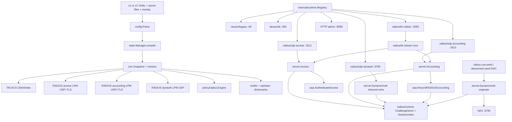
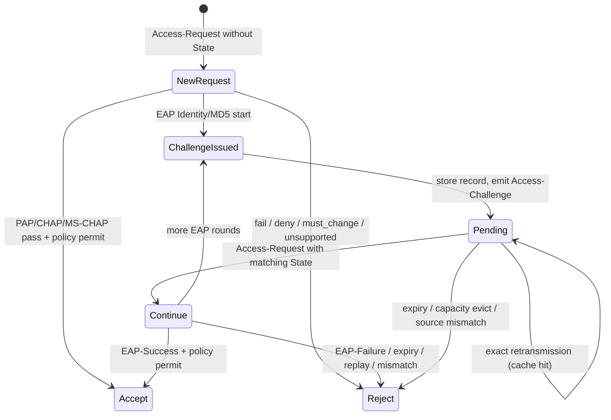
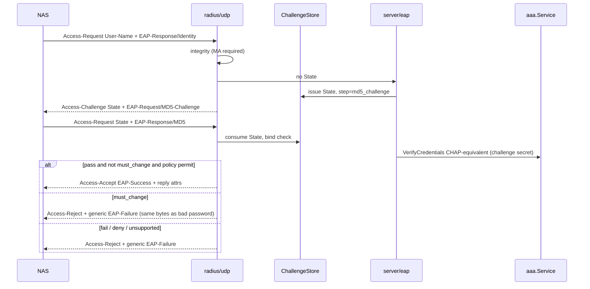
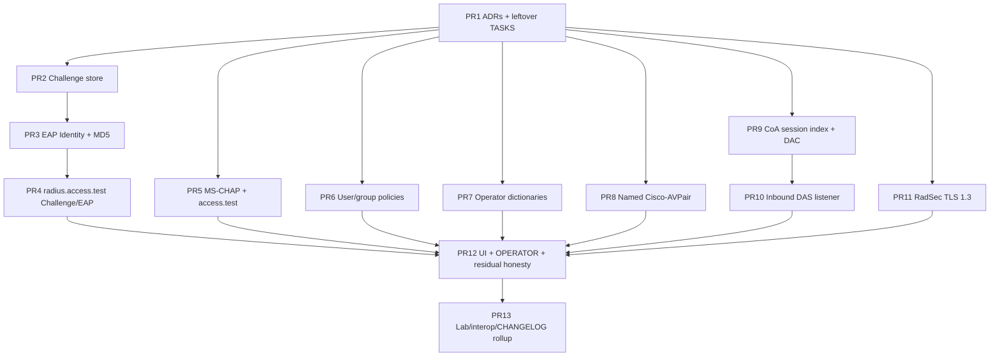

# TacLab Remaining RADIUS Work — In-Memory Lab Profile

| Field | Value |
|---|---|
| Document title | TacLab Remaining RADIUS Work (In-Memory Lab Profile) |
| Author | design-doc-writer (Grok) |
| Date | 2026-08-16 |
| Status | Accepted |
| Intended in-repo path | [docs/designs/radius-remaining-work.md](https://github.com/hilather/go-lab-tacacs-mcp/blob/main/docs/designs/radius-remaining-work.md) |
| Product | TacLab — TACACS+ and RADIUS AAA lab appliance |
| Binary | `taclabd` (unchanged) |
| Repository | https://github.com/hilather/go-lab-tacacs-mcp |
| Go module | `github.com/hilather/go-lab-tacacs-mcp` (unchanged) |
| Image | `ghcr.io/hilather/go-lab-tacacs-mcp` (unchanged) |
| Shipped pin | TacLab `v1.2.0` / `main` |
| Prior design | [docs/designs/radius-authentication.md](https://github.com/hilather/go-lab-tacacs-mcp/blob/main/docs/designs/radius-authentication.md) (MVP source of truth; this document does not reopen it) |
| Binding ADRs (shipped) | [0013](https://github.com/hilather/go-lab-tacacs-mcp/blob/main/docs/decisions/0013-add-radius-to-existing-taclab-process.md)–[0019](https://github.com/hilather/go-lab-tacacs-mcp/blob/main/docs/decisions/0019-force-password-change.md) |
| Binding ADRs (this program) | 0020–0029 (land before the matching implementation PRs) |
| Conformance contract | [docs/RADIUS_CONFORMANCE.md](https://github.com/hilather/go-lab-tacacs-mcp/blob/main/docs/RADIUS_CONFORMANCE.md) |
| Precedence | [docs/CANONICAL_DESIGN.md](https://github.com/hilather/go-lab-tacacs-mcp/blob/main/docs/CANONICAL_DESIGN.md) and [AGENTS.md](https://github.com/hilather/go-lab-tacacs-mcp/blob/main/AGENTS.md) win on existing TacLab behavior. This document wins on remaining RADIUS extension names, seams, and sequencing. |

An engineer should be able to implement from this document without re-deriving the architecture or reopening the in-memory / persist decision.

---

## Overview

TacLab `v1.2.0` already ships a bounded RADIUS/UDP lab profile: PAP/CHAP Access-Accept/Reject on UDP 1812, Start/Stop/Interim/On/Off accounting on UDP 1813 into the in-memory ring, Message-Authenticator and Response Authenticator, Proxy-State order, a retransmission cache, a semantic accounting journal, client `access_policy_id` + fallback + default deny, and REST/MCP `radius.access.test` / `radius.policy.evaluate` / `radius.attributes.list`. `system.build.get` RADIUS `conformance_status` is **`partial`**. That is intentional.

The operator asked to implement **the rest of the RADIUS backlog** after `v1.2.0` and made one binding product decision: **leave storage in-memory**. Do not implement persistent accounting (`RAD-EXT-009`). Restart / `runtime.reset` still wipe overlay, challenge store, CoA session index, retransmission cache, journal, and event ring.

This document is the implementation source of truth for that program. It covers Access-Challenge, lab-viable EAP termination, RADIUS MS-CHAP VSAs, CoA/Disconnect, a RadSec/TLS 1.3 first slice, operator dictionaries, named `Cisco-AVPair`, user/group RADIUS rules, leftover `RAD-*` range disposition, and an explicit deferral of proxying, DTLS, RADIUS/1.1, tunneled EAP, and disk accounting. Implementation proceeds as a PR DAG after the ADRs are accepted.

---

## Background & Motivation

### Current shipped state (verified against the tree)

External surfaces today (`docs/OPERATOR.md` §1, `cmd/taclabd/serve.go`, `internal/runtime/listener.go`):

| Listener | Package | Default container bind | Host map | Default |
|---|---|---|---|---|
| Legacy TACACS+ | `internal/tacacs/legacy` | `0.0.0.0:4949` | `49/tcp` | on (v1) |
| Secure TACACS+ | `internal/tacacs/tls` | `0.0.0.0:4300` | `300/tcp` | on (v1) |
| RADIUS access | `internal/radius/udp` | `0.0.0.0:1812` | `1812/udp` | **off** unless v2 enables it |
| RADIUS accounting | `internal/radius/udp` | `0.0.0.0:1813` | `1813/udp` | **off** unless v2 enables it |
| HTTP admin | `internal/api/rest`, `internal/api/mcp` | `0.0.0.0:8080` | `8080/tcp` | on |

RADIUS request path today:

```text
UDP datagram
  -> radius/udp.Listener.process          # source IP -> Snapshot.MatchRADIUS
  -> server.CheckIntegrity                # MA / limit_proxy_state / EAP-without-MA
  -> udp.Cache                            # exact retransmission
  -> server.Access / server.Accounting
  -> aaa.Service.AuthenticateAccess
       |  VerifyCredentials (PAP/CHAP/EAP-MD5)
       |  must_change_login -> Access-Reject reject_password_change_required
       |  policy/radius.Engine (client policy, fallback, default deny)
  -> SignResponse                         # MA first, Proxy-State, Response Authenticator
```

What already exists and must be reused, not forked:

| Asset | Path | Constraint |
|---|---|---|
| Independent testclient | `internal/radius/testclient` | Must not import production `codec` / `crypto` / `server`. Shared-codec loopback is never sole evidence. |
| Codec codes | `internal/radius/codec/code.go` | `CodeAccessChallenge = 11` is advertised for EAP Identity/MD5. |
| Attribute types | `internal/radius/attribute/types.go` | `TypeState = 24`, `TypeEAPMessage = 79` exist; EAP-Message is in `mvpDefinitions()`. |
| Dictionary | `internal/radius/attribute/standard.go` | Built-in IETF MVP includes EAP-Message. Named Cisco-AVPair absent. |
| VSA framing | `internal/radius/attribute/vendor.go` | Vendor-id + raw payload. No nested vendor-type dictionary. |
| Access pipeline | `internal/radius/server/access.go` | EAP Identity + MD5 terminate when `eap` is opted in. Other EAP types fail closed. |
| Integrity | `internal/radius/server/integrity.go` | EAP-Message without valid MA is discarded (`discard_eap_without_ma`). |
| AAA access | `internal/aaa/radius_access.go` | `RadiusAccessOutcome` is accept/reject/challenge/error. Challenge is issued by the EAP adapter, not PAP/CHAP. |
| VerifyCredentials | `internal/aaa/authn.go` | Password, CHAP, RADIUS MS-CHAPv1/v2 (RFC 2548 VSAs; opt-in), and EAP-MD5 (CHAP-equivalent). |
| Policy engine | `internal/policy/radius/evaluate.go` | User `radius_policy_id`, then `effectiveGroups`, then client `access_policy_id`, then `fallback_radius_policy_id`, then default deny. |
| Config v2 | `internal/config/raw_v2.go`, `types.go` | Named listeners. At most one RADIUS UDP endpoint and one RADIUS TLS endpoint per client. v2 `users[]` / `groups[]` accept `radius_policy_id`. |
| Runtime IDs | `internal/runtime/listener.go` | `IDRADIUSAccess`, `IDRADIUSAccounting` only. |
| Domain taxonomy | `internal/domain/protocol.go` | `RoleDynamicAuthorization` and `CarrierRADIUSTLS` are reserved. |
| Must-change | ADR 0019 + `PRJ-UL-001` | RADIUS is Access-Reject, no extra attrs, no Challenge. |
| Build status | `internal/api/operations/build.go` | RADIUS `ConformanceStatusPartial` is hard-coded. Tests lock it (`handlers_test.go`). |

MVP MUST rows in `docs/RADIUS_CONFORMANCE.md` are `PASS`, including `R65-ACCESS-004`. Tunneled EAP (`PRJ-EAP-003`) stays `DEFERRED_MAY`.

### Pain points this program exists to close

| Gap | Why it matters | Backlog ID |
|---|---|---|
| No Access-Challenge provider | Blocks interactive change and any EAP method. `R65-ACCESS-004` stays deferred. | `RAD-EXT-001` |
| EAP-Message is integrity-only | NAS 802.1X / wired EAP against TacLab always Rejects. | `RAD-EXT-002` |
| RADIUS MS-CHAP absent | TACACS `credentials/mschap.go` is not RADIUS VSA evidence (RFC 2548). | `RAD-EXT-003` |
| No CoA / Disconnect | Operators cannot tear down a live NAS session from REST/MCP. | `RAD-EXT-004` |
| UDP only | Cleartext, MD5-era, source-IP secret selection. | `RAD-EXT-005` |
| Built-in dictionary only | Labs cannot name vendor attributes without a code change. | `RAD-EXT-006` |
| Raw VSA only for Cisco | Reply profiles cannot say `Cisco-AVPair = shell:priv-lvl=15`. | `RAD-EXT-007` |
| Client policy only | Users and groups cannot attach RADIUS rules. | `RAD-EXT-010` |
| Leftover `RAD-*` ranges | TASKS §22.3 still shows unchecked ranges that were largely shipped as MVP. | leftover audit |

### Why not persist accounting in this program

The operator decided **in-memory only**. `RAD-EXT-009` is cancelled for this program (ADR 0020). Restart / `runtime.reset` remain the restore path. A later ADR may add an opt-in disk sink; this DAG must not grow one.

---

## Goals & Non-Goals

### Goals (this program)

- Land Access-Challenge behind a complete state gate (endpoint binding, expiry, replay, capacity, independent testclient).
- Terminate lab-viable EAP methods (Identity + EAP-MD5) on that gate. Fail closed for every other EAP type.
- Accept RADIUS MS-CHAPv1/v2 via Microsoft VSAs with independent RADIUS wire vectors.
- Originate CoA/Disconnect (RFC 5176) from REST/MCP against an in-memory session index; optionally receive CoA on a separate listener role.
- Add a RadSec first slice: RADIUS/TLS 1.3 over TCP 2083. Do not claim DTLS or RADIUS/1.1.
- Load operator dictionary files with fail-closed trust, size, and sensitivity rules.
- Name `Cisco-AVPair` (vendor 9, vendor-type 1) with independent fixtures. IOL interop is skip-when-absent, never a fake PASS.
- Attach RADIUS policies to users and groups on schema v2. Evaluation order is frozen below.
- Disposition leftover `RAD-DOM-*` / `RAD-CFG-*` / `RAD-ACCESS-*` / `RAD-POL-*` / `RAD-SEC-*` / `RAD-RUN-*` / `RAD-ACCT-*` / `RAD-CODEC-*` ranges: close shipped work, supersede the rest into `RAD-EXT-*`.
- Keep REST/MCP parity, secret redaction, determinism, and the application-service rule.
- Keep `system.build.get` RADIUS `conformance_status` = **`partial`**. Do not ship a complete-RADIUS badge.

### Non-goals (explicit)

| Item | Disposition | Why |
|---|---|---|
| Persistent accounting (`RAD-EXT-009`) | **Cancelled for this program** (ADR 0020) | Operator decision. Memory ring/journal only. |
| Multi-replica / HA / shared session store | Out | Overlay, cache, journal, challenge store, and CoA index are process memory. |
| RADIUS proxying / realm routing (`RAD-EXT-008`) | **Deferred** (ADR 0028) | Lab appliance is not a relay. Open-relay risk. See §Proposed Design §8. |
| EAP pass-through to an external EAP server | Deferred with proxying | That is a second hop. |
| PEAP / EAP-TLS / EAP-TTLS / EAP-FAST / TEAP | Deferred (ADR 0022 Revisit) | Certificate-tunneled methods are a separate PKI + TLS-in-EAP program. |
| Microsoft Password-Expired VSA / Challenge-based RADIUS password change | Deferred (ADR 0019 still binds) | `must_change_login` stays Access-Reject. |
| DTLS (RFC 7360) and RADIUS/1.1 | Deferred (ADR 0025 Revisit) | Too large for one slice; not a thin TLS wrap. |
| RADIUS/TCP without TLS (RFC 6613 cleartext) | Not offered | Adds a cleartext stream with no security win over UDP. |
| Schema v3 / silent rewrite of v1 files | Out | Additive v2 keys only (ADR 0017). |
| Product / module / binary / image rename | Out | ADR 0018. |
| Implementing MCP via REST or REST via MCP | Out | AGENTS.md 2.2 / 2.3. |
| Claiming complete RADIUS | Out | Residuals listed in §When `conformance_status` may leave `partial`. |

---

## Key Decisions

These decisions are binding for implementation. Rationale is short; details follow.

| ID | Decision | Rationale |
|---|---|---|
| KD-R01 | Storage stays process memory. `RAD-EXT-009` is cancelled for this program. Restart / `runtime.reset` wipe overlay, challenge store, CoA session index, cache, journal, and ring. | Operator decision. Matches `docs/CANONICAL_DESIGN.md` residual table. |
| KD-R02 | Stay on **schema v2**. New keys are additive. v1 files stay valid and TACACS-equivalent. Source files are never rewritten. `config.export` `normalize=true` behavior is unchanged. | ADR 0017. A v3 bump is not justified. |
| KD-R03 | `must_change_login` remains Access-Reject `reject_password_change_required` with **no** Access-Challenge, no Microsoft Password-Expired VSA, and no `MS-CHAP-Error`. PAP/CHAP/MS-CHAP Rejects carry **no extra attributes** (`PRJ-UL-001`). EAP must-change is the same reason and **also** carries a **generic EAP-Failure** (RFC 3579 conversation teardown), identical to a bad-password EAP Reject — not an interactive change and not a password-correct oracle. | ADR 0019 decision 10. EAP-Failure is protocol termination (ADR 0022), not a reopen of 0019 Q3. |
| KD-R04 | Access-Challenge is a real provider behind a complete in-memory state gate. Types already exist (`codec.CodeAccessChallenge`, `domain.AuthChallenge`, dictionary `State`). No Challenge is advertised until the gate tests are green. | ADR 0016 Revisit. Prerequisite for EAP. |
| KD-R05 | EAP **termination** is Identity (type 1) + EAP-MD5 (type 4) only. Unknown/unimplemented types emit EAP-Failure + Access-Reject. No PEAP/TLS/TTLS. No pass-through. | Lab-viable without a tunneled-TLS stack. Fail closed. |
| KD-R06 | RADIUS MS-CHAP uses RFC 2548 Microsoft VSAs (vendor 311). `credentials.VerifyMSCHAPv1/v2` may be called internally. Evidence is independent RADIUS wire vectors under `testdata/protocol/radius/mschap/`. TACACS START `data` is not RADIUS evidence. | `RAD-EXT-003` and ADR 0015 spirit. |
| KD-R07 | TacLab is primarily a **DAC** (originates CoA/Disconnect **to the NAS**). That is the only path that affects a device. An optional inbound **DAS** listener (`listeners.radius.dynamic_authorization`, default off, UDP 3799) is a **lab fixture / RFC 5176 echo**: it mutates only the in-memory session index and never forwards to a NAS. | RFC 5176 DAS is typically the NAS. TacLab is not a NAS. |
| KD-R08 | Secure-transport first slice is **RadSec: RADIUS/TLS 1.3 on TCP 2083**. DTLS and RADIUS/1.1 are deferred with ADR Revisit, not silent claims. Cleartext RADIUS/TCP is not offered. | ADR 0016 Q-011. Not a thin TLS wrap of the UDP socket. |
| KD-R09 | Operator dictionaries are **TacLab YAML documents**, add-only, local files, size-capped, fail-closed. They cannot redefine built-in IETF attributes or downgrade secret sensitivity. FreeRADIUS `$INCLUDE` language is not accepted. | Trust + reload + sensitivity require a closed format. |
| KD-R10 | Named `Cisco-AVPair` (vendor 9, vendor-type 1) is implemented with independent `testclient` fixtures. ADR 0027 **supersedes** ADR 0015 decision 4 and its “after independent Cisco IOL vectors” Revisit. `make cisco-lab` IOL remains optional `interop:`; a skip is not Cisco PASS and not RADIUS PASS. | Option (a) of the product request. ADR 0015’s IOL gate blocked named decode indefinitely because this repo does not vendor IOL. |
| KD-R11 | RADIUS proxying / realm routing stays **out**. ADR 0028 is `DEFERRED_MAY`. No static next-hop, no realm strip, no open relay. | Single-replica lab + fail-closed unknown-client discard conflicts with being a relay. |
| KD-R12 | User/group RADIUS attachment is schema **v2 only**: `users[].radius_policy_id`, `groups[].radius_policy_id`. v1 `rawUser` / `rawGroup` reject those keys. Evaluation order is user → groups (`effectiveGroups`) → client → fallback → default deny. | ADR 0014 Revisit. v1 stays TACACS-shaped. |
| KD-R13 | `system.build.get` RADIUS `conformance_status` stays **`partial`** for this entire program, even after every in-scope EXT row is PASS or `DEFERRED_MAY`. | Persistent accounting cancelled; DTLS/1.1/PEAP/proxy deferred; lab appliance residuals remain. AGENTS.md 2.7. |
| KD-R14 | Do not invent `R3579-EAP-*` or `R5080-*` IDs. New rows use pack prefixes (`R65-`, `R79-`, `R80-`, `PRJ-`) or existing IDs. `R65-ACCESS-004` stays `DEFERRED_MAY` through PR 2 (ADR 0021 in `evidence:`). PR 3 adds independent testclient wire Challenge/EAP evidence and flips the row to `PASS`. | `docs/RADIUS_CONFORMANCE.md` §2. ADR 0016: do not advertise until the provider and testclient evidence exist. |
| KD-R15 | New admin capabilities are `PARITY_REQUIRED`. New scope `radius:dynamic` for CoA/Disconnect originate. Diagnostics stay `policy:test`. Dictionary metadata stays `state:read`. | AGENTS.md 2.3. CoA is not overlay mutation and not a policy test. |
| KD-R16 | A client may have **at most one RADIUS endpoint per carrier**: one `radius/udp` and, when RadSec lands, one `radius/tls`. Access/accounting indexes and `radiusEndpoint` selection are **per (role, carrier)**. Dynauth (inbound DAS **and** DAC originate) is UDP-only: always the client’s **UDP** RADIUS endpoint secret and that endpoint’s `coa_destination` / `nas_coa_port`. A TLS Accounting-Start does **not** select the TLS secret for CoA. No UDP RADIUS endpoint → DAC send is rejected (`invalid_argument` / `RADIUS_SECRET_MISSING`). Today’s first-match `radiusEndpoint()` / `CompileRADIUSIndex` helpers are replaced in PR 11 (and prepared in PR 2 for `Request.Carrier`). | The tree assumes a single RADIUS UDP endpoint (`internal/config/endpoints.go` `radiusCount > 1` reject, `match_radius.go`). CoA is a UDP datagram to the NAS; the NAS verifies with the UDP secret. |
| KD-R17 | Leftover unchecked MVP ranges in TASKS §22.3 are **closed or superseded** in PR 1. They are not a second implementation backlog. | Avoids double-tracking. See §Leftover range disposition. |
| KD-R18 | ADRs 0020–0029 land as documentation **before** the matching behavior PRs. Implementation PRs cite the ADR in the conformance `evidence:` list. | AGENTS.md §8. Same pattern as RAD-GOV-003. |
| KD-R19 | Challenge State, MS-CHAP material, User-Password, EAP-MD5 challenge/response, CoA authenticators, and dictionary-marked secrets never appear in logs, events, traces, metrics, REST/MCP, or UI. | AGENTS.md 2.9. Extends RAD-TM-06 / RAD-TM-10 / RAD-TM-16. |
| KD-R20 | Injectable clock and entropy everywhere: challenge expiry, CoA session TTL, RadSec tickets (reuse ADR 0005), tests. | AGENTS.md 2.10. |
| KD-R21 | Compile default for omitted/empty `allowed_authentication_methods` on an access role stays **`[pap, chap]`** (`normalizeRADIUSEndpoint` today). `eap`, `mschapv1`, and `mschapv2` are **opt-in**. Runtime `methodAllowed` empty-slice = allow-all is defensive only and must not be reachable after compile. | Expanding the default would silently enable MS-CHAP/EAP on every existing v2 client that omitted the list. |
| KD-R22 | `ChallengeStore` and `SessionIndex` live in carrier-neutral `internal/radius/runtime` from the PR that first creates them. Bind is a tagged union (`udp_ip` \| `tls_cert`). Listeners hold a pointer created in `cmd/taclabd/serve.go`. Do not put shared tables under `udp/` (that would force `radius/tls` to import `udp`). | Import layering. PR 2 must not ship a UDP-only store that PR 11 retrofits. |
| KD-R23 | Accounting-On and Accounting-Off for a given UDP `EndpointID` + peer IP (and NAS-IP/NAS-Identifier when present) **delete** matching session-index rows. On/Off are not durable keys. | RFC 2866 Accounting-On means the NAS session table is gone (reboot). Leaving rows for 24h sends Disconnect at a dead or reused peer. |
| KD-R24 | DAC handle-based send requires a session row (Accounting-Start + Acct-Session-Id). PR 9 also ships **explicit-attribute originate** (`client_id` + destination + User-Name/Acct-Session-Id) so access-only labs can still kick a NAS. **Both paths** use the client’s **UDP** RADIUS endpoint: secret, `coa_destination`, and `nas_coa_port`. `SessionRecord.EndpointID` is identity/index only (which access/acct listener accepted Start); it is **not** the CoA secret key. Optional `coa_destination` on the UDP endpoint overrides `record.Peer`+`nas_coa_port`. No UDP RADIUS endpoint → reject handle send (`invalid_argument` / `RADIUS_SECRET_MISSING`); explicit path has the same reject. | Accounting peer ≠ CoA listen address; Access-Accept alone never inserts a row; TLS and UDP secrets may differ after PR 11. |
| KD-R25 | Scope `radius:dynamic` is added to the closed set (`tools/registry/operations.go` `knownScopes`, OpenAPI/MCP token enum, `tokens.create` validation, BASELINE/OPERATOR/README lists) in PR 9. The example bootstrap `lab-admin` token does **not** receive it unless the lab recipe adds it. Existing tokens keep working and are denied CoA (fail closed). `sessions.list` stays `state:read`; raw `acct_session_id` requires `events:sensitive`. | Scopes are an exact-match registry. CoA is not overlay write and not a policy test. |
| KD-R26 | Operator dictionaries **reserve** vendor IDs `0` (IETF), `9` (Cisco), and `311` (Microsoft) and names `Cisco-AVPair` / `MS-CHAP-*` **before** those builtins ship. Collision is a compile error. `ParseVendorTLVs` lands in whichever of PR 5 / PR 8 merges first. | Avoids a PR 7/5/8 race where an operator file claims 9 or 311. |
| KD-R27 | CoA/Disconnect originate requests **omit** `expected_revision`. Do not accept-and-ignore it. A present field is `invalid_argument` (unknown JSON / unexpected field — same reject-unknown rule as other mutations). | Every other mutating TacLab op uses the field as snapshot CAS. Silent ignore is a foot-gun. |
| KD-R28 | Snapshot `DictionaryVersion` stays exactly `builtin-mvp-1` when no operator dictionary compiled. Append `+op:<sorted-ids>:<sha256>` only when at least one operator file is in the merge. | `internal/radius/attribute/dictionary_test.go` locks the MVP string. |

---

## Proposed Design

### 1. Target topology after this program



New process sockets are **off by default**, same as today’s RADIUS UDP listeners.

### 2. Package and file map (additive)

Do not create a second `internal/radius` tree. Extend the existing peer of `internal/tacacs`.

```text
internal/radius/
  codec/code.go              # add CoA/Disconnect codes 40–45
  attribute/standard.go      # EAP-Message, Error-Cause, Microsoft + Cisco named VSAs
  attribute/vendor.go        # nested vendor-type walk (still preserve unknown raw)
  attribute/dictionary.go    # merge builtin + compiled operator views
  runtime/                   # NEW: carrier-neutral process tables (KD-R22)
    challenge_store.go       # State table; bind udp_ip | tls_cert
    session_index.go         # accounting -> session records
    doc.go
  server/access.go           # Challenge / EAP / MS-CHAP dispatch
  server/challenge.go        # NEW: State issue/lookup/consume (uses runtime.ChallengeStore)
  server/eap.go              # NEW: EAP Identity + MD5
  server/mschap.go           # NEW: RFC 2548 extract / reply VSAs
  server/dynauth.go          # NEW: CoA/Disconnect encode/validate/reply
  udp/                       # PacketConn listener only; no shared tables
  tls/                       # NEW: RadSec listener (TCP + TLS 1.3)
    listener.go
    stream.go                # RFC 6613 length-prefixed framing
    lifecycle.go
  testclient/
    challenge.go             # NEW: independent Challenge/EAP/MS-CHAP/CoA
    dynauth.go
    tls/                     # NEW: independent RadSec client
```

`internal/radius/tls` must not import `internal/tacacs/tls` or `internal/radius/udp`. Shared TLS policy lives in `internal/config` (`SecureTLS`). Shared tables live in `internal/radius/runtime`. Import tests (`internal/radius/imports_test.go`) already forbid `internal/tacacs`; add `tls -/-> udp`.

`internal/runtime` gains:

```go
const (
    IDRADIUSAccess     = "radius_access"      // existing
    IDRADIUSAccounting = "radius_accounting"  // existing
    IDRADIUSDynAuth    = "radius_dynauth"     // new
    IDRADIUSRadSec     = "radius_radsec"      // new
)
```

### 3. RAD-EXT-001 — Access-Challenge state gate

#### 3.1 When Challenge is emitted

`aaa.Service.AuthenticateAccess` gains a third successful-path outcome that is **not** used for PAP/CHAP/MS-CHAP must-change:

```go
// internal/aaa/radius_access.go — additive
const RadiusAccessChallenge RadiusAccessOutcome = "challenge"

type RadiusAccessDecision struct {
    Outcome         RadiusAccessOutcome // accept | reject | challenge | error
    ReasonCode      string
    UserID          string
    ReplyAttributes attribute.RawSet // no MA; adapter inserts State + MA
    Challenge       *RadiusChallenge // nil unless Outcome == challenge
    Trace           policyradius.Trace
}

type RadiusChallenge struct {
    Method   domain.AuthMethod // eap (this program); reserved for later
    State    []byte            // server-issued; adapter stores, then echoes
    Prompt   attribute.RawSet  // EAP-Message and/or Reply-Message
    Expires  time.Time         // advisory; store is authoritative
}
```

`domain.AuthMethod` gains `AuthMethodEAP = "eap"` (stored token `eap`; no alias). `ParseAuthMethod` accepts `eap` after ADR 0022 lands. MS-CHAP tokens land in the MS-CHAP PR.

PAP, CHAP, and MS-CHAP one-shot success still go Accept or `reject_password_change_required`. They never return `challenge` in this program.

#### 3.2 State machine



#### 3.3 Challenge store (`internal/radius/runtime/challenge_store.go`)

In-memory, process-local, wiped on `runtime.reset` and process exit. Owned by a holder created in `cmd/taclabd/serve.go` and passed into **both** `radius/udp` and (later) `radius/tls` listeners. PR 2 ships the `tls_cert` bind kind even though no RadSec listener exists yet — tests inject a cert bind. Do not put this type under `udp/`.

| Knob | Default | Clamp |
|---|---|---|
| `listeners.radius.access.challenge_ttl` | `30s` | `[5s, 60s]` |
| `listeners.radius.access.challenge_entries` | `4096` | `[16, 65536]` |
| `listeners.radius.access.challenge_bytes` | `1MiB` | `[64KiB, 8MiB]` |

Record (no secrets, no User-Password, no EAP-MD5 response bytes):

```text
key            = SHA-256(endpoint_id || state_bytes)
endpoint_id    = compiled RADIUS endpoint id
client_id      = compiled client id
bind.kind      = udp_ip | tls_cert
bind.source_ip = netip.Addr          # Kind=udp_ip; not port (NAT retries)
bind.cert_fp   = SHA-256(peer cert DER)  # Kind=tls_cert
user_id        = UsernameCasePreserved or empty until Identity
method         = eap
eap_id         = last EAP Identifier
eap_type       = 1 | 4
step           = identity | md5_challenge | done
md5_challenge  = 16 bytes held only for the pending MD5 verify, wiped on consume
expires        = now + ttl
revision       = snapshot revision at issue
```

```go
// internal/radius/runtime/challenge_store.go
type BindKind uint8
const (
    BindUDPIP BindKind = iota
    BindTLSCert
)

type ChallengeBind struct {
    Kind     BindKind
    SourceIP netip.Addr // BindUDPIP
    CertFP   [32]byte   // BindTLSCert; SHA-256 of raw peer certificate
}
```

Rules:

1. **Issue.** Adapter generates 16 cryptographically random bytes (`io.Reader` from `operations.Deps.Entropy` / listener entropy). Lookup key is the hash above. Raw State is the attribute value. Bind kind is taken from `RequestContext.Carrier` (`radius_udp` → `udp_ip`, `radius_tls` → `tls_cert`).
2. **Bind.** Continuation must match `endpoint_id`, `client_id`, `bind.kind`, and the corresponding bind field. UDP: port may change, IP must not. TLS: TCP peer IP is **not** part of the bind (load-balancer NAT). Snapshot revision may change; the record stays valid until TTL so a reload does not strand an in-flight EAP (the next evaluate uses the **current** snapshot).
3. **Replay.** A State is single-use per step. Successful lookup **consumes** the record and, if another Challenge is issued, a **new** State is stored. Exact retransmission of the previous Access-Request is satisfied by the existing retransmission cache, not by replaying State.
4. **Forgery.** Unknown State on a packet that looks like a continuation (has State, or has EAP-Message after an Identity) → Access-Reject `reject_invalid_state`. Do not create a record from client-supplied State.
5. **Expiry.** Expired record is deleted. Continuation → Access-Reject `reject_challenge_expired`.
6. **Capacity.** If the store cannot insert, **do not** emit Challenge. Access-Reject `reject_challenge_capacity` (cached). Increment `taclab_radius_challenge_saturations_total`. Never evict an in-flight record to make room (fail closed).
7. **Reset.** `runtime.reset` and process exit wipe the store. Listener `Close` does **not** drop the shared store while the other carrier is still up.
8. **Sensitivity.** State is `SensitivitySecret` (already in `standard.go`). Never log, event, or metric-label the raw value.

`SignResponse` already allows Access-Challenge (`attribute.PacketAccessChallenge` is in the MA-first set). Challenge replies use the same MA-first + Proxy-State + Response Authenticator construction.

#### 3.4 Wire / cache table — additive amendment of MVP §5.7

This table **amends** [docs/designs/radius-authentication.md](https://github.com/hilather/go-lab-tacacs-mcp/blob/main/docs/designs/radius-authentication.md) §5.7. After integrity, Access is Accept, Reject, **or Challenge**. The implementing PR that first emits a code must update, in the **same** commit:

- `internal/radius/server/reasons.go` constants
- `wireAccessReason` in `internal/radius/server/access.go` (today the default branch remaps unknown codes to `reject_bad_credentials`)
- `TestReasonTableStable` (changing a value is a protocol/metrics contract break)
- `PRJ-ERR-001` evidence
- MVP design §5.7 text (“Access always gets Accept or Reject”)

| Condition | `reason_code` | Wire | Cache | First PR |
|---|---|---|---|---|
| Challenge issued | `challenge` | Access-Challenge | yes (exact bytes) | PR 3 (wire); PR 2 constant + allowlist only |
| Continuation State unknown | `reject_invalid_state` | Access-Reject | yes | PR 2 |
| Continuation expired | `reject_challenge_expired` | Access-Reject | yes | PR 2 |
| Bind / endpoint mismatch | `reject_challenge_binding` | Access-Reject | yes | PR 2 |
| Store saturated at issue | `reject_challenge_capacity` | Access-Reject | yes | PR 2 |
| EAP-Message + PAP/CHAP/MS-CHAP | `reject_conflicting_auth` | Access-Reject | yes | already exists |
| Unimplemented EAP type | `reject_unsupported_eap_method` | Access-Reject + EAP-Failure | yes | PR 3 |
| EAP payload over bound | `reject_eap_too_long` | Access-Reject + EAP-Failure | yes | PR 3 |
| Successful EAP-MD5 + must_change | `reject_password_change_required` | Access-Reject + generic EAP-Failure | yes | PR 3 |

`wireAccessReason` must pass every new code through unchanged (including `challenge`, which selects `codec.CodeAccessChallenge` rather than Reject). Do not let Challenge failures collapse to `reject_bad_credentials`.

Invalid MA still never reads/inserts/purges the retransmission cache (ADR 0016). Challenge-store lookup happens **after** integrity.

#### 3.5 `must_change_login` (frozen)

`AuthenticateAccess` keeps today’s order (`internal/aaa/radius_access.go`):

1. Verify credentials.
2. If `AuthPass` and `userMustChangeLogin` → `reject_password_change_required`. **Do not evaluate policy. Do not consult a Challenge provider.**
3. Else evaluate policy.

This applies to PAP, CHAP, MS-CHAP, and EAP-MD5 (after a successful EAP-MD5 verify). ADR 0019 is not reopened. Wire attributes:

| Method | Access-Reject extras |
|---|---|
| PAP / CHAP / MS-CHAP | **None** (`PRJ-UL-001` unchanged) |
| EAP-MD5 | **Generic EAP-Failure only** (RFC 3579 teardown). Same EAP-Failure Code/Type/payload as a bad-password or unknown-user EAP Reject. No Challenge, no State, no MS-CHAP-Error, no Password-Expired VSA. |

A test in PR 3 must show must-change vs bad-password EAP Rejects are **not** distinguishable by EAP type or payload (both Failure). Difference in `reason_code` is metrics/API-only, not on the RADIUS wire beyond the already-uniform Reject.

#### 3.6 Tests (must exist before advertising Challenge)

- Unit: issue / consume / replay / expiry / capacity / source-IP mismatch / endpoint mismatch.
- `AuthenticateAccess` still rejects must-change without Challenge.
- Independent `testclient` UDP: Challenge then continuation; forged State; expired State.
- Race: concurrent continuations of the same State → one winner, one `reject_invalid_state`.
- Fuzz seed: Access-Request with State + EAP-Message.
- Bench: `BenchmarkRadiusChallengeLookup`.
- `R65-ACCESS-004` stays `DEFERRED_MAY` in this PR. PR 3 adds live-listener testclient evidence and flips the row to `PASS` (ADR 0021 remains in `evidence:` as the design record).

### 4. RAD-EXT-002 — EAP termination (Identity + EAP-MD5)

#### 4.1 Method list (lab-honest)

| EAP type | Name | This program | Wire result for unimplemented |
|---|---|---|---|
| 1 | Identity | **Terminate** | — |
| 4 | MD5-Challenge | **Terminate** | — |
| 3 | NAK | Accept as peer method-reject; send Failure | — |
| 13 | EAP-TLS | Reject | EAP-Failure + Access-Reject `reject_unsupported_eap_method` |
| 21 / 25 / 43 | TTLS / PEAP / FAST | Reject | same |
| other | — | Reject | same |

Do not invent `R3579-EAP-*` IDs. Attach evidence to `R65-ACCESS-004`, `R79-MA-001` (already PASS for MA/EAP-without-MA), and new project rows:

| ID | Requirement | Status after impl |
|---|---|---|
| `PRJ-EAP-001` | EAP-Message requires valid MA (already true); Identity + MD5 terminate | PASS |
| `PRJ-EAP-002` | Unknown EAP type → EAP-Failure + Access-Reject; no Challenge leak | PASS |
| `PRJ-EAP-003` | PEAP/TLS/TTLS not implemented; documented deferred | `DEFERRED_MAY` + ADR 0022 |

#### 4.2 Packet rules (RFC 3579)

- One or more EAP-Message attributes concatenate in order to form the EAP packet. Bound total EAP payload to `limits.max_argument_bytes` default (or 1020 bytes — 4×253). Overflow → Access-Reject `reject_eap_too_long`.
- EAP-Message is `CardinalityMulti`, `SensitivityRestricted`, allowed on Access-Request/Challenge/Accept/Reject.
- Add EAP-Message to `mvpDefinitions()` in the EAP PR (it is a constant today but not a dictionary entry).
- Responses that carry EAP-Message **must** have Message-Authenticator first (already true for all Access responses).
- EAP Code: Request (1) server→peer, Response (2) peer→server, Success (3), Failure (4).

#### 4.3 Conversation



Identity rules:

- If the Access-Request has EAP-Message type Identity with a non-empty payload, that is the User-Name for lookup **unless** User-Name is also present; if both are present they must be equal after UsernameCasePreserved, else `reject_conflicting_auth`.
- If EAP-Identity is empty and User-Name is present, use User-Name and proceed to MD5-Challenge.
- If neither yields a user, Access-Challenge with EAP-Request/Identity (step=`identity`).

MD5-Challenge rules:

- Challenge is 16 random bytes stored on the record, wiped after verify.
- Response is EAP-MD5 (identifier, 16-octet hash). Verify with the same challenge secret as CHAP (`credentials.VerifyCHAP`) using the EAP Identifier as the CHAP id and the stored challenge. This is CHAP-in-EAP, not a new KDF.
- Missing challenge secret (`Capabilities.Challenge == false`) → Access-Reject `reject_unsupported_method` without user enumeration (same as CHAP today).
- Endpoint `allowed_authentication_methods` must **explicitly include** `eap`. Omitted/empty lists compile to `[pap, chap]` (KD-R21) and therefore reject EAP with `reject_unsupported_method` **before** issuing Challenge.

Fail-closed for unimplemented methods: do **not** issue Challenge, do **not** store State. Emit Access-Reject with generic EAP-Failure. Do not leak user existence via method-specific EAP types.

#### 4.4 Config

```yaml
# schema v2 client endpoint — eap is opt-in
radius:
  allowed_authentication_methods: [pap, chap, eap]
```

Compile rule (matches `normalizeRADIUSEndpoint` today, extended only for the closed token set):

| YAML `allowed_authentication_methods` | After compile (access role) |
|---|---|
| omitted or `[]` | `[pap, chap]` — **not** “all implemented” |
| `[pap, chap, eap]` | those three |
| `[pap, chap, mschapv1, mschapv2]` | those four |
| unknown token | `CONFIG_YAML_INVALID` |

`ParseRADIUSAuthMethods` / overlay writes accept the same closed set. Runtime `methodAllowed` treating a truly empty slice as allow-all remains a defensive fallback and must not be reachable after compile (add a test that compiled access endpoints never have a zero-length method list).

### 5. RAD-EXT-003 — RADIUS MS-CHAPv1 / v2

#### 5.1 VSA layout (RFC 2548, vendor 311)

Built-in named Microsoft attributes (not an operator dictionary):

| Name | Vendor-type | Length | Role |
|---|---:|---|---|
| `MS-CHAP-Challenge` | 11 | 8 (v1) or 16 (v2) | request |
| `MS-CHAP-Response` | 1 | 50: Ident(1) + Flags(1) + LM(24) + NT(24) | request v1 |
| `MS-CHAP2-Response` | 25 | 50: Ident(1) + Flags(1) + Peer-Challenge(16) + Reserved(8) + NT(24) | request v2 |
| `MS-CHAP2-Success` | 26 | 42: Ident(1) + “S=” + 40 hex | accept v2 |
| `MS-CHAP-Error` | 2 | text | **not emitted** in this program |

Nested VSA walk lands in `attribute.ParseVSA` / a new `ParseVendorTLVs`: vendor 311 payloads are type/length/value with 1-byte type + 1-byte length. Unknown Microsoft types stay raw. Malformed nested TLV → Access-Reject `reject_conflicting_auth` (do not guess).

Mapping onto existing crypto (`internal/credentials/mschap.go`). There is **no** `GenerateAuthenticatorResponse` / `MS-CHAP2-Success` helper today — PR 5 adds it. TACACS tests remain the only consumers of START `data` fixtures.

**MS-CHAPv1** — RADIUS `MS-CHAP-Response` is 50 bytes: `Ident(1) || Flags(1) || LM(24) || NT(24)`. Assemble the 49-octet `VerifyMSCHAPv1` buffer:

```text
out[0:24]  = radius[2:26]    # LM
out[24:48] = radius[26:50]   # NT
out[48]    = radius[1]       # Flags (NT preferred when != 0, same as TACACS)
# Ident = radius[0] is passed as id and is not mixed into the hash
# challenge = MS-CHAP-Challenge (exactly 8 bytes)
```

**MS-CHAPv2** — RADIUS `MS-CHAP2-Response` is 50 bytes: `Ident(1) || Flags(1) || Peer-Challenge(16) || Reserved(8) || NT(24)`. `VerifyMSCHAPv2` requires the TACACS 49-octet layout (`mschapv2WireOK`: reserved[16:24] zero, flags[48]==0):

```text
out[0:16]  = radius[2:18]    # Peer-Challenge
out[16:24] = radius[18:26]   # Reserved — must be 8 zero bytes or reject_conflicting_auth (malformed)
out[24:48] = radius[26:50]   # NT-response
out[48]    = 0x00            # TACACS flags; RADIUS Flags octet [1] is ignored for v2 verify
# Ident = radius[0] passed as id
# challenge = MS-CHAP-Challenge (exactly 16 bytes)
```

Wipe `out` after verify.

New credentials API (PR 5; not a rename):

```go
// GenerateMSCHAPv2Success returns Ident || "S=" || 40-hex (42 bytes)
// per RFC 2759 §8 / RFC 2548 MS-CHAP2-Success. Wipes intermediate hashes.
func GenerateMSCHAPv2Success(ident byte, password, username, authChallenge, peerChallenge []byte) ([]byte, error)
```

Do **not** feed TACACS START `data = PPP_id || challenge || response` fixtures into RADIUS tests.

#### 5.2 Independent vectors

New golden directory `testdata/protocol/radius/mschap/`:

- `rfc2433-v1-radius.json` — password, challenge, RFC 2548 attribute hex, expected Accept/Reject.
- `rfc2759-v2-radius.json` — same for v2, plus expected `MS-CHAP2-Success` authenticator response.
- Binary packets under `testdata/protocol/radius/packets/access-request-mschapv1.bin` and `...-mschapv2.bin`.

`internal/radius/testclient` encodes/decodes these VSAs with its **own** nested-TLV code. Production `server.Access` must accept the testclient bytes on a live UDP listener.

TACACS tests in `internal/credentials/mschap_test.go` stay TACACS evidence only.

#### 5.3 Dispatch in `extractAccessEvidence`

Conflict matrix (reject `reject_conflicting_auth`):

- User-Password + any MS-CHAP VSA
- CHAP-Password + any MS-CHAP VSA
- EAP-Message + any MS-CHAP VSA
- Both `MS-CHAP-Response` and `MS-CHAP2-Response`
- `MS-CHAP-Response` without 8-byte challenge, or `MS-CHAP2-Response` without 16-byte challenge

`must_change_login` after a good MS-CHAP verify → Access-Reject `reject_password_change_required`, **no** `MS-CHAP-Error`, **no** Challenge (KD-R03).

v2 Accept includes `MS-CHAP2-Success` from `GenerateMSCHAPv2Success`. Do not put raw NT hash in `aaa`.

`domain.AuthMethod` gains `AuthMethodMSCHAPv1 = "mschapv1"` and `AuthMethodMSCHAPv2 = "mschapv2"`. Policy `match.method` accepts those tokens. `ParseAuthMethod` error text lists `password`, `pap`, `chap`, `mschapv1`, `mschapv2`, `eap`.

**REST/MCP in the same PR (KD-R15):** `radius.access.test` and `radius.policy.evaluate` method unions grow `mschapv1` / `mschapv2` (today `operations/radius.go` rejects anything but pap/chap). Same-change `api/operations.yaml`, generate, REST/MCP/parity tests. Wire must not accept MS-CHAP while diagnostics cannot.

### 6. RAD-EXT-004 — CoA / Disconnect (RFC 5176)

#### 6.1 Roles

| Role | TacLab behavior | Affects a NAS? | Default |
|---|---|---|---|
| **DAC** (client) | REST/MCP originate CoA-Request or Disconnect-Request **to the NAS :3799** | **Yes** — only this path | always available (handle or explicit attrs) |
| **DAS** (server) | Optional UDP listener receives CoA/Disconnect from **test tools** | **No** | `enabled: false` |

TacLab is **not a NAS**. RFC 5176 DAS is typically the NAS. Inbound DAS is a **lab fixture / RFC 5176 echo**: ACK/NAK and index mutation only. It does not forward to a device, does not tear down a TACACS session, and does not send UDP to the NAS. OPERATOR and the UI CoA page must say this in those words. Operators who want to kick a switch use `radius.disconnect.send` (DAC).

#### 6.2 Codes and attributes

Add to `codec.Code` / `attribute` packet roles:

| Code | Name |
|---:|---|
| 40 | Disconnect-Request |
| 41 | Disconnect-ACK |
| 42 | Disconnect-NAK |
| 43 | CoA-Request |
| 44 | CoA-ACK |
| 45 | CoA-NAK |

Add IETF `Error-Cause` (101, integer, NAK only). Message-Authenticator is required on every dynauth packet this program emits, and required on every inbound dynauth packet (no `allow_missing` for CoA — spoofed Disconnect is a session-kill).

Inbound Request Authenticator is a nonce (like Access). Response Authenticator is computed like Access. Invalid MA or unknown client → **silent discard** (same as Access).

#### 6.3 In-memory session index

Lives in `internal/radius/runtime/session_index.go` (KD-R22). Fed by `RecordRADIUSAccounting` **after** the ring accepts the record (same success rule as today’s accounting). **Access-Accept never inserts a row.** Handle-based DAC therefore requires the NAS to send Accounting-Start with Acct-Session-Id. Access-only labs use explicit-attribute originate (§6.4).

```go
// internal/radius/runtime/session_index.go
type SessionKey struct {
    EndpointID    string
    AcctSessionID string // required for a durable key
}

type SessionRecord struct {
    Key          SessionKey
    ClientID     string
    EndpointID   string // RADIUS endpoint that received the Start (index/identity only; DAC secret is the client's UDP endpoint)
    UserID       string
    NASIP        netip.Addr // peer UDP address; NAS-IP-Address is advisory
    NASIdentifier string
    NASPort      uint32
    Peer         netip.AddrPort
    Class        []byte // redacted in API; used only as echo if present
    StartedAt    time.Time
    LastUpdate   time.Time
    Revision     domain.Revision
}
```

| Event | Index action |
|---|---|
| Start with Acct-Session-Id | insert / replace |
| Interim with Acct-Session-Id | update counters/timestamps if present |
| Stop with Acct-Session-Id | delete |
| **Accounting-On** | **delete all rows** matching this `EndpointID` **and** (peer IP **or** NAS-IP-Address **or** NAS-Identifier from the On packet) (KD-R23) |
| **Accounting-Off** | **same flush as On** |
| Ambiguous identity (no session id) | no index insert (already sample-capped for the ring); On/Off still flush by peer IP |

Caps: `listeners.radius.accounting.session_index_entries` default `20000`, `session_index_bytes` default `8MiB`, `session_ttl` default `24h` (clamp `[1m, 24h]`). Saturation: refuse new inserts, increment `taclab_radius_session_index_saturations_total`, accounting still records (index is advisory for CoA, not a precondition for Accounting-Response).

Wiped on `runtime.reset` / process exit.

#### 6.4 DAC originate (primary)

New operations (both `PARITY_REQUIRED`, scope `radius:dynamic`):

| ID | REST | MCP |
|---|---|---|
| `radius.sessions.list` | `GET /api/v1/radius/sessions` | `taclab.radius.sessions.list` |
| `radius.disconnect.send` | `POST /api/v1/radius/disconnect:send` | `taclab.radius.disconnect.send` |
| `radius.coa.send` | `POST /api/v1/radius/coa:send` | `taclab.radius.coa.send` |

`sessions.list` is `state:read` (not `radius:dynamic`). Treat `acct_session_id` as `events:sensitive`: without that scope, omit the id and return an opaque `session_handle` (ULID) that `disconnect.send` accepts. Handles die with the index.

`disconnect.send` / `coa.send` accept **exactly one** of two shapes (unknown extra fields, including `expected_revision`, are `invalid_argument` — KD-R27):

**Handle path** (requires a session row):

```json
{
  "session_handle": "01J...",
  "attributes": [
    { "name": "Session-Timeout", "value": "60" }
  ]
}
```

**Explicit-attribute path** (access-only labs; no index required):

```json
{
  "client_id": "lab-switches",
  "destination": "192.0.2.10:3799",
  "user_id": "lab-admin",
  "acct_session_id": "00000001",
  "attributes": []
}
```

`destination` is required on the explicit path unless the client’s UDP RADIUS endpoint sets `coa_destination`. `acct_session_id` on the request is a write-only identifying attribute for the NAS (not stored back into events).

Idempotency: same handle (or same explicit tuple) + same in-flight Identifier reuses the exact request bytes (small originate cache, TTL 15s).

Originate path (handle):

1. Lookup handle → `SessionRecord`. Miss → `not_found`.
2. Resolve the client’s **UDP** RADIUS endpoint (`radiusEndpoint(client, "udp")`). Missing, disabled, or secret-not-set → `invalid_argument` / `RADIUS_SECRET_MISSING`. Do **not** use `record.EndpointID` for secret or dest (that id may be the TLS endpoint after RadSec accounting).
3. Destination = that UDP endpoint’s `coa_destination` if set, else `record.Peer.Addr()` + the UDP endpoint’s `nas_coa_port` (default `3799`).
4. Secret = that UDP endpoint’s RADIUS shared secret.
5. Attributes: User-Name, Acct-Session-Id, NAS-IP-Address if known, plus legal CoA attrs from the request (compile-time role check against CoA-Request). Disconnect-Request must not carry session-modification attrs other than identification.
6. Insert MA first, send one datagram, wait `coa_timeout` (default `3s`).
7. ACK → `outcome=ack`. NAK → `outcome=nak` + Error-Cause if present. Timeout → `outcome=timeout` (not an overlay error).

Originate path (explicit): destination from request or the UDP endpoint’s `coa_destination`; secret from the same **UDP** RADIUS endpoint. Missing dest, missing UDP endpoint, or missing secret → `invalid_argument` / `RADIUS_SECRET_MISSING`.

No automatic retry storm. The caller retries.

OPERATOR must state: handle-based DAC requires Accounting-Start + Acct-Session-Id. Access-only NAS need the explicit path and a reachable CoA destination. Both paths sign with the client’s **UDP** RADIUS secret; a RadSec-only client cannot originate CoA until a UDP endpoint (and dest) exist.

#### 6.5 Inbound DAS listener

```yaml
listeners:
  radius:
    dynamic_authorization:
      enabled: false
      required: false
      bind: 0.0.0.0:3799
      transport: udp
      require_message_authenticator: true   # not inheritable to false in this program
      retransmission_ttl: 15s
      workers: 8
      queue_capacity: 256
```

`CompileRADIUSIndex(clients, RoleDynamicAuthorization, CarrierRADIUSUDP)`: a **UDP** RADIUS endpoint that lists `dynamic_authorization` in `roles` (optional, default **not** included). Operators who want inbound CoA add the role.

Inbound algorithm (index-only; **does not contact the NAS**):

1. Source LPM on the dynauth UDP index. Unknown → discard.
2. Decode. Require MA. Validate. Invalid → discard (no cache mutation).
3. Retransmission cache (same cache type as access, role `dynamic_authorization`).
4. Identify session by Acct-Session-Id and/or User-Name+NAS-IP. Miss → NAK Error-Cause 503 (Session Context Not Found).
5. Disconnect-Request hit → delete **index** row and ACK. This is not a device session kill.
6. CoA-Request: this program supports only identification + `Session-Timeout` / `Idle-Timeout` / `Reply-Message` stored on the index record as “last CoA attrs” for lab inspection. Unsupported mandatory attrs → NAK Error-Cause 401. No framed-IP rewrite.

UI copy (required): “Inbound :3799 is for RFC 5176 test tools. It only updates TacLab’s memory index. To disconnect a device, use Disconnect send.”

#### 6.6 Threats

| Threat | Sev | Mitigation |
|---|---|---|
| Spoofed Disconnect-Request | Critical | Unknown client discard; MA required; no `allow_missing` |
| UDP amplification via NAK | High | Reply only after known client + valid MA; rate limit |
| Session-index fill | High | Caps; accounting still succeeds |
| Secret in CoA events | Critical | Redact; canary |

Keep **3799** off the public internet (`docs/OPERATOR.md`, `AGENTS.md` remote guidance).

### 7. RAD-EXT-005 — RadSec first slice (TLS 1.3 TCP)

#### 7.1 What is claimed

| Transport | This program | Advertisement |
|---|---|---|
| RADIUS/UDP 1812/1813 | Already shipped | Controlled-network lab profile |
| **RADIUS/TLS (RadSec) TCP 2083** | **In** | Lab RadSec; TLS 1.3 mTLS |
| RADIUS/TCP cleartext (RFC 6613 without TLS) | Not offered | — |
| RADIUS/DTLS (RFC 7360) | Deferred | ADR 0025 Revisit |
| RADIUS/1.1 | Deferred | ADR 0025 Revisit |

Do not describe RadSec as “UDP plus TLS.” It is a **stream of length-prefixed RADIUS packets** (RFC 6613 §2.6) inside TLS 1.3 (RFC 6614, TacLab cipher policy ADR 0004).

#### 7.2 Listener YAML (schema v2 additive)

```yaml
listeners:
  radius:
    radsec:
      enabled: false
      required: false
      bind: 0.0.0.0:2083
      transport: tls
      max_packet_bytes: 4096
      max_connections: 256
      idle_timeout: 60s
      handshake_timeout: 10s
      tls:
        minimum_version: TLS1.3          # only legal value (ADR 0004)
        identities: { ... }              # same SecureTLS shape as tacacs.tls
        client_authentication: require_and_verify_certificate
        client_ca_bundle: { file: ... }
        revocation: { mode: configured_crl, crl_bundle: { file: ... } }
        session_resumption:
          enabled: true
          ticket_lifetime: 168h          # ADR 0005: 0 or 168h only
          recheck_client_revocation: true
        reject_early_data: true
```

Reuse `config.SecureTLS`. Do **not** add `cipher_suites` (ADR 0004). Unknown keys fail closed.

#### 7.3 Client endpoint and match (implementable)

A client may add a **second** RADIUS endpoint (`transport: tls`). `normalizeEndpoints` today rejects `radiusCount > 1` with “at most one RADIUS UDP endpoint.” Change the counter to **per carrier**: at most one `radius`+`udp` and at most one `radius`+`tls`.

```yaml
- id: radius-radsec
  protocol: radius
  transport: tls
  roles: [access, accounting]
  radius:
    shared_secret: { file: /run/secrets/lab_switches_radius_secret }
    require_message_authenticator: true
    allowed_authentication_methods: [pap, chap]
    access_policy_id: default-radius-access
```

**Replacement helpers** (required edits; do not leave first-match `radiusEndpoint()` in place):

```go
// internal/config/endpoints.go
func radiusEndpoint(c Client, transport string) *ClientEndpoint // "udp" | "tls"
func radiusEndpoints(c Client) []*ClientEndpoint
func hasRADIUSEndpoint(c Client) bool // any carrier
func hasRADIUSTLSEndpoint(c Client) bool

// internal/config/match_radius.go
func CompileRADIUSIndex(clients []Client, role domain.ListenerRole, carrier domain.Carrier) (*RADIUSIndex, error)
// UDP: existing source-IP LPM; still requires match.source_cidrs.
// TLS: see RADIUSCertIndex below.

func CompileRADIUSCertIndex(clients []Client, role domain.ListenerRole) (*RADIUSCertIndex, error)
```

Call sites that **must** switch to per-carrier selection in PR 11 (and any earlier PR that adds a second endpoint): `normalizeEndpoints`, `hasRADIUSEndpoint` / `radiusEndpoint` in `validate.go`, `match_radius.go`, `radius_policy.go`, `internal/state` `MatchRADIUS`, `internal/api/operations/radius.go` `radiusEndpoint(snap, clientID)`, `server.Access` / `server.Accounting` (stop hard-coding `CarrierRADIUSUDP`; take it from the listener).

**UDP index** (unchanged semantics): source-IP LPM; `match.source_cidrs` required if the client has a UDP RADIUS endpoint.

**RadSec index (`RADIUSCertIndex`)** — compiled fields per enabled client that has a `radius`+`tls` endpoint with that role:

| Field | Source |
|---|---|
| `client_id`, `endpoint_id`, `priority` | client / tls endpoint |
| `dns_sans`, `ip_sans` | `match.certificate` (same shape as TACACS `CertMatch`) |
| `cidrs` | `match.source_cidrs` (optional when `certificate_only`) |
| `mode` | `address_and_certificate` (default) or `certificate_only` |

Match algorithm on a new RadSec connection (after TLS handshake, **before** any RADIUS packet):

1. No peer certificate → close; increment `discard_unknown_client`.
2. Collect client candidates whose SAN/IP SAN matches the peer cert (same comparison as TACACS `ClientIndex` cert match).
3. If `mode == address_and_certificate`: also require the TCP peer IP in `source_cidrs`. Missing CIDRs on this mode → compile error (`RADIUS clients with address_and_certificate require match.source_cidrs`).
4. If `mode == certificate_only`: ignore CIDRs (same warning as TACACS). **Legal when the client has a RADIUS TLS endpoint or a TACACS TLS endpoint.** Replace today’s `validate.go` checks (`certificate_only requires a TACACS TLS endpoint` and `RADIUS-only clients cannot use certificate_only`) with `certificate_only requires a TACACS TLS or RADIUS TLS endpoint`.
5. Longest-prefix CIDR (when used), then lowest `priority`, then compile/runtime `CLIENT_MATCH_AMBIGUOUS` on a remaining tie. No lex-ID pick.
6. Selected endpoint’s secret, methods, and policy apply to every packet on that connection. `RequestContext.Carrier = radius_tls`.

TCP peer IP is **not** used as Challenge bind (KD-R22 `tls_cert`).

**DAC after RadSec:** Accounting-Start on TLS still records `SessionRecord.EndpointID` as the TLS endpoint for index identity. CoA/Disconnect originate **never** uses that secret. PR 11 must keep `radius.disconnect.send` / `radius.coa.send` on `radiusEndpoint(client, "udp")` (KD-R16 / KD-R24). A TLS-only RADIUS client cannot originate CoA.

Shared secret remains **required** for User-Password hide, authenticators, and MA. We do **not** adopt the informal well-known secret `radsec` as a default. Operators who want that value must put it in a secret file and still meet `security.radius_shared_secrets`. Do not special-case the string `radsec`.

#### 7.4 Stream framing

`internal/radius/tls/stream.go`:

1. `tls.Server` with the TACACS-equivalent `tls.Config` (Min=Max=TLS1.3, no early data).
2. Read loop: read 4-byte length at offset 2 of the RADIUS header first (need 4 bytes, then `Length` bytes, cap `max_packet_bytes`). Never stitch two RADIUS packets into one datagram-style buffer beyond Length.
3. Dispatch by Code to the same `server.Access` / `server.Accounting` handlers. Carrier on `RequestContext` is `domain.CarrierRADIUSTLS` (never hard-coded UDP).
4. Retransmission cache key includes `listener_id` (already) so UDP and RadSec do not collide.
5. One connection, many requests (like TACACS single-connect). Bound `max_connections`. Idle timeout closes the conn.
6. Access-Challenge State uses `ChallengeBind{Kind: BindTLSCert, CertFP: sha256(peerCert.Raw)}` on the **shared** `runtime.ChallengeStore` from PR 2.

Shutdown: stop accept, drain conns to `server.shutdown_grace`, wipe secrets.

#### 7.5 What is *not* claimed in docs/UI/build

- No DTLS socket.
- No RADIUS/1.1 hop-by-hop ALPN / changed authenticator.
- No “secure RADIUS” badge that implies UDP is upgraded.
- `system.build.get` `protocols.radius.standards` may **add** `"RFC 6614"` only after RadSec tests pass; status stays `partial`.

Keep **2083** off the public internet unless the operator intentionally publishes it behind the same posture as TACACS 300.

### 8. RAD-EXT-008 — Proxying: stay out

A lab appliance with fail-closed unknown-client discard, a single replica, and memory-only state is a **terminator**, not a relay. Proxying requires:

- a second secret domain
- loop detection / hop count
- Proxy-State mutation
- realm routing and strip
- failure/timeout mapping that is not “silent discard”
- amplification controls on the outbound hop

That is a different product. ADR 0028 sets `RAD-EXT-008` to `DEFERRED_MAY` with Revisit: “an operator needs TacLab to forward Access-Request to an external IdP **and** accepts a bounded static next-hop design (one hop, named realm, no wildcard, no open relay).” Until then, no `proxy` YAML key. Unknown `proxy:` in v2 is `CONFIG_UNKNOWN_FIELD`.

EAP pass-through is the same deferral.

### 9. RAD-EXT-006 — Operator dictionaries

#### 9.1 Load path

Schema v2 only:

```yaml
radius_dictionaries:
  - id: lab-juniper
    file: /etc/taclab/dicts/juniper.yaml
    enabled: true
```

`file` is a local path. No `http://`, no `s3://`, no `$INCLUDE`. `AllowEnvironmentSecrets` does not apply (these are not secrets; they are policy). Paths must be absolute. Symlink escape outside an allow-prefix is rejected if `security.strict_secret_files` is true (reuse the existing strict-file helper if one exists; otherwise add a dictionary-specific clean path check).

Compile happens in `state.Manager.compile` after `config.Validate`. Failure → snapshot not published (previous snapshot remains).

#### 9.2 File format (TacLab YAML, not FreeRADIUS)

```yaml
schema_version: 1
vendor:
  id: 2636
  name: Juniper
attributes:
  - name: Juniper-Local-User-Name
    vendor_type: 1
    kind: text
    cardinality: single
    sensitivity: restricted
    allowed_in: [access_accept]
```

Closed `kind`: `text`, `string`, `integer`, `ipaddr`, `ipv6addr`, `time`, `octets`. Closed `sensitivity`: `public`, `restricted`, `secret`. Closed `allowed_in` tokens map to packet codes.

#### 9.3 Limits (fail closed)

| Limit | Default |
|---|---|
| Files | 8 |
| Bytes per file | 64 KiB |
| Added attributes total | 256 |
| Vendors added | 32 |
| Name length | 64 |
| Duplicate names (builtin or prior file) | compile error |

#### 9.4 Sensitivity and override rules

- Cannot define vendor `0` attributes that collide with a built-in IETF code.
- Cannot define vendor `9` (Cisco) or `311` (Microsoft) at all — reserved from PR 7 (or PR 1 validate rules), even before the named builtins ship (KD-R26).
- Cannot redefine a built-in named attribute (`Cisco-AVPair`, `MS-CHAP-Challenge`, `MS-CHAP-Response`, `MS-CHAP2-Response`, `MS-CHAP2-Success`, `MS-CHAP-Error`, all IETF MVP names).
- Cannot set `sensitivity: public` on a name that the builtin marks `secret`.
- Operator `secret` attributes are omitted from events, traces, `radius.attributes.list` values (list is metadata-only already), and UI.
- Reload: `config.reload` recompiles. `runtime.reset` restores the YAML list (files are re-read from disk at compile, not cached across reset beyond the snapshot).

`radius.attributes.list` grows a `source` field: `builtin` | `operator:<id>`. Still `state:read`. No values.

#### 9.5 Dictionary version

`DictionaryVersion` stays exactly `builtin-mvp-1` when the operator list is empty (KD-R28; `dictionary_test.go` locks this string). When at least one operator file compiled, the snapshot version becomes `builtin-mvp-1+op:<sorted-ids>:<sha256-of-normalized-merge>`. Surfaces on `system.status` / snapshot diagnostics. Changing files without reload does nothing (no file watch — matches the rest of TacLab).

### 10. RAD-EXT-007 — Named Cisco-AVPair

Implement **option (a)**: named decode/encode now, independent fixtures, IOL skip.

ADR 0027 (PR 1) **quotes and replaces** ADR 0015 §Decision 4 and §Revisit (“Named Cisco-AVPair decoding is not in MVP … after independent Cisco IOL vectors”). Evidence for `PRJ-CISCO-001` is independent `internal/radius/testclient` fixtures only. IOL remains optional `interop:` and is never required to flip the row to PASS. TASKS §22.4 must drop the “after independent Cisco IOL vectors” wording in PR 1.

- Built-in (not operator-dict) entry: vendor `9`, vendor-type `1`, name `Cisco-AVPair`, `kind: text`, `cardinality: multi`, `sensitivity: restricted`, allowed on Access-Request/Accept/Reject/Challenge and Accounting-Request.
- Nested Cisco TLV walk: 1-byte type + 1-byte length (same shape as Microsoft). Unknown Cisco types stay raw.
- Reply profiles accept:

```yaml
- name: Cisco-AVPair
  value: "shell:priv-lvl=15"
```

or the existing raw form `{ vendor: 9, code: 1, value_hex: "..." }`. Both must round-trip to the same wire.

- Independent goldens: `testdata/protocol/radius/cisco/avpair-priv-lvl.bin` plus JSON. `testclient` has its own Cisco TLV encoder.
- Interop: extend `make cisco-lab` RADIUS scenarios **only** when `TACLAB_IOL_IMAGE` is set. Absence → SKIP. `docs/INTEROP.md` already states a skip is not RADIUS PASS. Do not mark a conformance row `PASS` with only an IOL skip.

Do not add a Cisco IOL image to the repo.

### 11. RAD-EXT-010 — User- and group-attached RADIUS rules

#### 11.1 Schema (v2 only)

```yaml
# v2 users / groups — additive
users:
  - id: lab-admin
    radius_policy_id: admin-radius
groups:
  - id: lab-admins
    radius_policy_id: admins-radius
```

`internal/config/raw.go` `rawUser` / `rawGroup` do **not** gain the field (v1 unknown-field reject). `rawFileV2` uses `rawUserV2` / `rawGroupV2` (inline existing fields + `radius_policy_id`). Unknown policy id → `CONFIG_YAML_INVALID` at validate.

REST/MCP `users.create` / `users.update` / `groups.create` / `groups.update` accept optional `radius_policy_id`. Omitted = keep. JSON `null` clears. `PARITY_REQUIRED`. Existing user/group scopes (`state:write`).

#### 11.2 Evaluation order (frozen)

Replace the walk in `internal/policy/radius/evaluate.go`:

```text
1. If user.radius_policy_id set → walk that policy (source user_policy:<id>)
2. For each group in effectiveGroups(user, client):
     if group.radius_policy_id set → walk (source group_policy:<id>)
3. Client endpoint access_policy_id (source client_policy:<id>)   # existing
4. fallback_radius_policy_id (source fallback)                    # existing
5. Default deny
```

`effectiveGroups` **must** match `internal/policy/compile.go` (`user.group_ids` listed order, then client `default_group_ids` not already present, then sort by ascending group `priority` then `id`). Equal priorities are legal. First matching **rule** wins.

Traces add the new `source` prefixes. Goldens under `internal/policy/radius/goldens/` gain user/group cases. Existing goldens stay byte-stable except where a new source would have matched earlier — update those goldens in the same PR and call it out.

`radius.policy.evaluate` and `radius.access.test` automatically use the new walk (same engine).

### 12. Leftover range disposition (TASKS §22.2–22.3)

These ranges were never expanded into per-ID acceptance text after MVP shipped. PR 1 (docs) rewrites them. Implementation PRs do not re-open them as parallel work.

| Range | Disposition | Evidence / successor |
|---|---|---|
| `RAD-GOV-001` | Leave open as continuous CI drift check | Not a feature gate |
| `RAD-DOM-005` remaining methods | **Superseded** by `RAD-EXT-002` / `RAD-EXT-003` | EAP + MS-CHAP |
| `RAD-DOM-006` Challenge outcome | **Superseded** by `RAD-EXT-001` | Access-Challenge |
| `RAD-DOM-007` Bridge → `VerifyCredentials` | **Superseded / TACACS cleanup, not a RADIUS gate** | Optional later TACACS PR. Exported Bridge signatures stay TACACS (`internal/tacacs/server`). |
| `RAD-DOM-008` | **Superseded** by `RAD-EXT-001` | Challenge store |
| `RAD-CFG-004`…`008` export `normalize=true` | **Done** | `RAD-REL-002`, `docs/OPERATOR.md` §13, `config.export` |
| `RAD-CODEC-001`…`008` | **Done** except named Cisco | Successor `RAD-EXT-007`. In-tree codec already decided (KD-10 of MVP design). |
| `RAD-RUN-002`…`008` journal/governor | **Done** | `PRJ-RUN-001` PASS. Combined-load bench already in `udp`. Challenge store is `RAD-EXT-001`. Session index is `RAD-EXT-004`. |
| `RAD-ACCESS-003`…`007` | **Superseded** | `RAD-EXT-001` / `002` / `003` |
| `RAD-POL-004` cardinality matrix | **Partially done** | `TestCompileDuplicateSingleCardinality` is one test, not a matrix. Extra rows land in PR 6 if gaps appear. |
| `RAD-POL-005`…`007` | **Superseded** | `RAD-EXT-010` |
| `RAD-ACCT-001`…`007` | **Done** | `R66-*`, `PRJ-ACCT-001/002` PASS |
| `RAD-SEC-001`…`008` | **Done** for MVP | Canaries + MA policy. New threats attach to EXT ADRs. |
| `RAD-EXT-009` persist | **Cancelled for this program** | ADR 0020 |

### 13. Conformance row transitions

| Row | Now | After this program |
|---|---|---|
| `R65-ACCESS-004` | `DEFERRED_MAY` (ADR 0016) | **`PASS` in PR 3 only** — PR 2 keeps `DEFERRED_MAY` + ADR 0021; PR 3 adds testclient wire Challenge/EAP evidence |
| `R79-MA-001` | PASS | PASS; add EAP termination evidence |
| `PRJ-UL-001` | PASS | PASS unchanged for PAP/CHAP (Reject, no extra attrs, no Challenge). EAP must-change adds only generic EAP-Failure (same as bad password); document as protocol termination, not a row rewrite. |
| `PRJ-EAP-001` / `002` | (new) | PASS |
| `PRJ-EAP-003` tunneled EAP | (new) | `DEFERRED_MAY` ADR 0022 |
| `PRJ-MSCHAP-001` | PASS | Independent RADIUS vectors + testclient + live UDP |
| `PRJ-COA-001` DAC originate | (new) | PASS |
| `PRJ-COA-002` inbound DAS | (new) | PASS when listener tests exist; feature default off |
| `PRJ-RADSEC-001` TLS 1.3 stream | (new) | PASS |
| `PRJ-RADSEC-002` DTLS / 1.1 | (new) | `DEFERRED_MAY` ADR 0025 |
| `PRJ-DICT-001` operator dicts | (new) | PASS |
| `PRJ-CISCO-001` named AVPair | (new) | PASS on independent fixtures; IOL listed as `interop:` only when run |
| `PRJ-PROXY-001` | (new) | `DEFERRED_MAY` ADR 0028 |
| `PRJ-ACCT-003` persist | (new) | `DEFERRED_MAY` ADR 0020 (cancelled this program) |
| `PRJ-POL-002` user/group rules | (new) | PASS |
| All current MVP PASS rows | PASS | Stay PASS; TACACS `PRJ-TAC-001` remains a merge gate |

`docs/RADIUS_CONFORMANCE.md` §8 is rewritten from “all deferred” to the table above. Residual limits in §10 stay honest (memory-only, lab appliance, no complete badge).

### 14. `conformance_status` stays `partial` — not in this program

`internal/api/operations/build.go` keeps `ConformanceStatusPartial`. `handlers_test.go` keeps the lock. This program does **not** flip the field to `pass`.

Leaving `partial` would require a **later** product ADR that all of the following are true:

1. Every in-scope MVP + EXT row is `PASS` or an accepted `DEFERRED_MAY` / `N/A_RFC_DEPRECATED`.
2. The product is willing to advertise completeness **despite** cancelled persistent accounting, deferred DTLS/1.1, deferred tunneled EAP, and deferred proxying.
3. External `radclient` is not the only skipped interop path the badge would imply.

AGENTS.md 2.7 forbids a complete-RADIUS badge while any in-scope row is `NOT_STARTED` or lacks evidence. This program’s in-scope set still includes documented deferrals that are residuals, not PASSes. Do not flip the field as a cleanup chore.

---

## API / Interface Changes

All new operations are `PARITY_REQUIRED`. Same-change: `api/operations.yaml`, Go types/handlers, REST + MCP contract tests, `internal/api/parity`, `make generate` (OpenAPI, MCP, `web/src/generated/api.ts`, `docs/generated/api-parity.md`).

### Existing operations (additive JSON)

| Operation | Change |
|---|---|
| `users.*` / `groups.*` | Optional `radius_policy_id` (v2 effective docs). Unknown JSON still rejected. |
| `clients.*` | `allowed_authentication_methods` may include `eap`, `mschapv1`, `mschapv2` (opt-in; omitted still compiles to pap+chap). Optional `roles` include `dynamic_authorization`. Optional second endpoint `transport: tls`. Optional `nas_coa_port`, `coa_destination`. |
| `radius.access.test` | `method.type` union grows in the **same PR as the wire method**: `eap` in PR 4, `mschapv1`/`mschapv2` in PR 5. Response `outcome` may be `access_challenge` with redacted `state_present: true` (never raw State). Passwords / MS-CHAP / EAP payloads wiped. |
| `radius.policy.evaluate` | Same walk as the wire (user/group/client/fallback). `method` accepts new tokens. |
| `radius.attributes.list` | `source` field; includes Microsoft, Cisco, EAP-Message, Error-Cause, operator entries. |
| `system.status.get` | Listeners `radius_dynauth`, `radius_radsec` when configured. |
| `system.build.get` | `standards` may gain RFC 2548 / 3579-EAP / 5176 / 6614 as they land. **`conformance_status` stays `partial`.** |
| `config.export` | Unchanged convert flag. New v2 keys appear only for v2 sources (or `normalize=true`). |

### New operations

| ID | REST | MCP | Scopes | Notes |
|---|---|---|---|---|
| `radius.sessions.list` | `GET /api/v1/radius/sessions` | `taclab.radius.sessions.list` | `state:read` | Cursor page; opaque handles; `acct_session_id` only with `events:sensitive` |
| `radius.disconnect.send` | `POST /api/v1/radius/disconnect:send` | `taclab.radius.disconnect.send` | `radius:dynamic` | DAC |
| `radius.coa.send` | `POST /api/v1/radius/coa:send` | `taclab.radius.coa.send` | `radius:dynamic` | DAC |

Do not invent `taclab.qa.*`. Do not overload `authentication.test`.

**Scope `radius:dynamic` (KD-R25)** lands in PR 9 with:

- `tools/registry/operations.go` `knownScopes`
- `internal/config` token-scope validate (same closed set)
- `api/operations.yaml` + OpenAPI/MCP token enum via `make generate`
- BASELINE, OPERATOR, README, MCP scope lists
- Example bootstrap `lab-admin` does **not** include it unless a recipe adds it
- Negative test: token without the scope → deny `disconnect.send` / `coa.send`
- Existing tokens omit the scope and keep working for everything else

### UI

- Users/Groups editors: `radius_policy_id` select (generated types).
- Clients: method chips include EAP / MS-CHAP; RadSec / CoA badges.
- New pages: RADIUS Sessions (`/radius-sessions`), CoA/Disconnect **DAC** action with confirm. Inbound :3799 described as “RFC 5176 test fixture; does not kick a device.”
- RADIUS Auth Test: method dropdown grows; Challenge outcome shown without State bytes.
- Attributes page: source column.
- Insecure-compat badge unchanged (UDP `allow_missing` only; CoA/RadSec have no weaker MA mode).

---

## Data Model Changes

### Schema version

Stay on **v2**. No v3. v1 files: no new keys; `radius_policy_id` / `radius_dictionaries` / `listeners.radius.radsec` / `dynamic_authorization` on a v1 document are unknown-field errors.

### `config.Listeners` additive fields

```go
type Listeners struct {
    LegacyTACACS     TACACSListener
    SecureTACACS     SecureTACACSListener
    HTTP             HTTPListener
    RADIUSAccess     RADIUSListener
    RADIUSAccounting RADIUSListener
    RADIUSDynAuth    RADIUSListener // new
    RADIUSRadSec     RADIUSRadSecListener // new
}

type RADIUSRadSecListener struct {
    RADIUSListener           // bind, workers, caps; Transport == "tls"
    TLS            SecureTLS // existing type
    MaxConnections int
    IdleTimeout    time.Duration
    HandshakeTimeout time.Duration
}
```

`RADIUSListener` gains optional challenge and session-index knobs (ignored on the wrong role at validate).

### Client / user / group

```go
type User struct {
    // existing fields...
    RADIUSPolicyID string // v2 only; empty = none
}
type Group struct {
    // existing fields...
    RADIUSPolicyID string
}
type RADIUSEndpoint struct {
    // existing fields...
    NASCoAPort     uint16 // default 3799; used when CoADestination empty
    CoADestination string // optional "host:port"; DAC dest override
}
```

`AllowedAuthenticationMethods` closed set: `pap`, `chap`, `mschapv1`, `mschapv2`, `eap`.

Roles on a RADIUS endpoint: `access`, `accounting`, `dynamic_authorization`. RadSec endpoint roles: `access`, `accounting` (dynauth stays UDP 3799 in this program — do not multiplex CoA on the RadSec stream in v1 of RadSec).

### Snapshot

Unexported additions on `state.Snapshot`:

- `radiusAccessUDP`, `radiusAcctUDP`, `radiusDynAuthUDP *config.RADIUSIndex`
- `radiusAccessTLS`, `radiusAcctTLS *config.RADIUSCertIndex` (PR 11)
- `radiusChallengeTTL` / caps (from listener config)
- merged `attribute.Dictionary`
- `radiusDictVersion string` (`builtin-mvp-1` or `builtin-mvp-1+op:…`)

Challenge store and session index are **runtime** objects in `internal/radius/runtime`, created once in `cmd/taclabd/serve.go` and pointed at by UDP and TLS listeners. They are not snapshot fields.

### Overlay

User/group `radius_policy_id` patches follow C2 complete-object replacement. Omitted = keep. Invalid policy id fails the whole mutation.

---

## Alternatives Considered

### A1. Implement persistent accounting anyway “just in case”

**Rejected.** Operator decision. ADR 0020 cancels `RAD-EXT-009` for this program.

### A2. Use Access-Challenge to finish `must_change_login`

**Rejected for this program.** ADR 0019 and `PRJ-UL-001` are explicit: RADIUS is Reject, no Challenge, no Password-Expired VSA. PAP/CHAP/MS-CHAP still have no extra attrs. Generic EAP-Failure on EAP must-change is RFC 3579 conversation teardown (identical to bad-password), not interactive change. Reopening Challenge-based change is a user-lifecycle ADR, not a RADIUS completeness chore.

### A3. Terminate PEAP/EAP-TLS in the same DAG

**Rejected.** Tunneled TLS, server certs inside EAP, session resumption, and fragment reassembly are a second program. Fail closed with EAP-Failure.

### A4. EAP pass-through / proxy to FreeRADIUS

**Rejected.** That is `RAD-EXT-008`. Second hop, second secret, loop risk.

### A5. CoA-only inbound (TacLab as DAS only)

**Rejected as the only mode.** Operators need to kick a lab NAS from MCP. DAC originate is the only path that affects a device. Inbound DAS is an optional RFC 5176 echo fixture (index-only).

### A6. Require RadSec before any more UDP features

**Rejected.** Challenge/EAP/MS-CHAP/CoA are useful on the existing UDP lab profile. RadSec is a parallel slice, not a gate.

### A7. Thin `tls.Listen` wrap of the UDP handler without stream framing

**Rejected.** RFC 6614 is TCP + length-prefixed packets. A TLS datagram hack would be a false claim.

### A8. Accept FreeRADIUS dictionary language

**Rejected.** `$INCLUDE`, vendor nesting, and `VALUE` enums are an unbounded parser. TacLab YAML is fail-closed and size-capped.

### A9. Keep raw VSA until IOL evidence exists (Cisco option b)

**Rejected.** Independent fixtures can prove named encode/decode without vendoring IOL. Option (a) plus skip-when-no-IOL matches `make cisco-lab`.

### A10. Bounded static RADIUS proxy (one next-hop)

**Deferred, not built.** Safer than an open relay but still a second product (timeouts, hop-count, secret domains). ADR 0028 Revisit names the conditions.

### A11. Schema v3 for new listeners

**Rejected.** Named nested blocks extend cleanly (`listeners.radius.radsec`). v1 migrator stays as-is.

---

## Security & Privacy Considerations

Extends `docs/THREAT_MODEL.md` and MVP RAD-TM-* rows.

| ID | Threat | Sev | Mitigation | Evidence |
|---|---|---|---|---|
| RAD-TM-10 | Challenge State theft / replay | High | Random State, consume-on-use, TTL, bind endpoint+IP (or cert), secret sensitivity | challenge store tests |
| RAD-TM-21 | UDP Challenge amplification | High | Challenge only after known client + valid MA; capacity reject not silent flood | size + rate tests |
| RAD-TM-22 | EAP type confusion / tunneled downgrade | High | Unknown types fail closed; no PEAP | PRJ-EAP-002 |
| RAD-TM-23 | MS-CHAP material leak | Critical | Wipe assembled 49-octet buffers; never event/log VSAs | canary |
| RAD-TM-24 | Spoofed CoA/Disconnect | Critical | MA required; unknown client discard; no allow_missing | dynauth negatives |
| RAD-TM-25 | Dictionary file as attack payload | High | Absolute path, size caps, YAML-only, no IETF override, fail closed | compile negatives |
| RAD-TM-26 | Operator dict marks User-Password public | Critical | Forbidden; builtin sensitivity wins | validate test |
| RAD-TM-27 | RadSec as “UDP but encrypted” misconception | Medium | Docs/UI: stream+TLS 1.3; UDP warning remains | operator + UI tests |
| RAD-TM-28 | Session-index / challenge-store exhaustion | High | Hard caps; no evict-to-admit on Challenge | saturation tests |
| RAD-TM-29 | Proxy/open relay | Critical | Not implemented; unknown `proxy` key fails compile | config reject |
| RAD-TM-20 | UDP mistaken for secure | High | Unchanged warnings; new ports 3799/2083 also “keep off public internet” | OPERATOR + AGENTS |

Canary matrix (`internal/observability/canary_radius_test.go`) gains unique MS-CHAP password, EAP-MD5 challenge, Challenge State bytes, and CoA secret scans.

New scope `radius:dynamic` is denied when missing (fail closed). Tokens that omit it cannot originate CoA.

---

## Observability

Additive series in `internal/observability/series.go` (closed labels only):

| Series | Labels |
|---|---|
| `taclab_radius_challenges_total` | `result` = `issue`, `continue`, `replay_reject`, `expired`, `binding`, `capacity` |
| `taclab_radius_challenge_entries` | (none) |
| `taclab_radius_challenge_saturations_total` | (none) |
| `taclab_radius_eap_total` | `eap_type` allowlist `identity`, `md5`, `nak`, `other`; `outcome` |
| `taclab_radius_dynauth_total` | `direction` = `in`/`out`; `code`; `outcome` |
| `taclab_radius_session_index_entries` | (none) |
| `taclab_radius_session_index_saturations_total` | (none) |
| `taclab_radius_radsec_connections` | (none) |

Forbidden: State, User-Name, EAP payload, MS-CHAP, `acct_session_id`, peer IP, `client_id`.

Events:

- `Category: authen`, `Type: radius.access`, `Outcome: access_challenge` (no State).
- `Category: security`, `Type: radius.dynauth`, reason codes only.
- `Category: acct` unchanged.

Logging: reason codes + correlation ID + listener id. Debug packet dumps remain off; if added they must refuse secret-classified attrs (including State and MS-CHAP).

---

## Rollout Plan

### Compatibility

- Binary upgrade only for existing v1 and v2 deployments. New listeners stay `enabled: false`.
- New YAML keys on v1 files fail closed (operators who need them write v2).
- Rollback: previous binary + previous YAML. Old binaries reject unknown v2 keys (`listeners.radius.radsec`, `radius_dictionaries`, `users[].radius_policy_id`). Document: comment out new keys before downgrade.
- Overlay discarded on restart (unchanged). Challenge store and session index go with the process.

### Feature advertisement

- Each EXT is advertised in CHANGELOG and OPERATOR residual table **only after** its tests and registry evidence land.
- `conformance_status` stays `partial`.
- Ports 1812, 1813, **3799**, **2083** stay off the public internet in AGENTS.md, OPERATOR, LAB_DEPLOYMENT, MCP remote section.

### Flags

No compile-time build tag. Runtime enablement is YAML. `server.admin_only` unchanged.

### Implementation order vs review

ADRs first (PR 1). Then independently reviewable implementation PRs (see §PR Plan). Do not land Challenge types-without-provider as “done.” Do not flip `R65-ACCESS-004` to PASS in an ADR-only PR.

---

## Risks

| Risk | Sev | Mitigation |
|---|---|---|
| Challenge on UDP is spoofable if MA is `allow_missing` | High | Challenge issue requires the same integrity path; document that `allow_missing` + Challenge is a lab foot-gun; default remains `required` |
| EAP-MD5 is weak | Medium | Lab-only; residual table; no PEAP claim |
| MS-CHAP is weak (MD4) | Medium | Same as TACACS MS-CHAP; wipe; independent vectors; residual table |
| CoA session index desync after NAS reboot | Medium | Accounting-On/Off flush matching EndpointID+peer/NAS-id (KD-R23); TTL; Stop deletes; explicit-attr originate if the handle is gone |
| RadSec cert-only clients vs secret policy | Medium | Secret still required; document |
| Operator dictionary breaks reply-role legality | High | Compile-time role checks on merged dictionary |
| Leftover TASKS ranges confuse implementers | Medium | PR 1 rewrites §22.3 / §22.4 |
| Scope creep into persist / proxy / PEAP | High | KD-R01, KD-R11, KD-R05; PR descriptions cite non-goals |
| TACACS regression on shared `credentials` / `aaa` | High | `PRJ-TAC-001` merge gate on every shared-package PR |

---

## Open Questions

None remaining that block execute-plan. Review items that looked like product forks are decided as Key Decisions:

| Topic | Decision |
|---|---|
| Empty `allowed_authentication_methods` | KD-R21 — stays `[pap, chap]`; new methods opt-in |
| Dual UDP+TLS indexes | KD-R16 + §7.3 replacement APIs |
| RadSec client match | §7.3 `RADIUSCertIndex` |
| DAC dest/secret / no-accounting labs | KD-R16 + KD-R24 — always UDP endpoint secret/`coa_destination`; `EndpointID` is index-only |
| Accounting-On/Off | KD-R23 — flush |
| EAP-MD5 + must_change | KD-R03 — generic EAP-Failure, same as bad password |
| ADR 0015 IOL revisit | KD-R10 — ADR 0027 supersedes |
| `radius:dynamic` registry | KD-R25 |
| Challenge store vs RadSec | KD-R22 |
| `expected_revision` on CoA | KD-R27 — omit / reject if present |
| `DictionaryVersion` | KD-R28 |

Persist/`RAD-EXT-009` stays out. `conformance_status` stays `partial`. A later user ADR may reopen persist, proxy, PEAP, or Challenge-based password change — not a silent amendment to this document.

---

## References

### Repository

- [AGENTS.md](https://github.com/hilather/go-lab-tacacs-mcp/blob/main/AGENTS.md)
- [docs/CANONICAL_DESIGN.md](https://github.com/hilather/go-lab-tacacs-mcp/blob/main/docs/CANONICAL_DESIGN.md)
- [docs/ARCHITECTURE.md](https://github.com/hilather/go-lab-tacacs-mcp/blob/main/docs/ARCHITECTURE.md)
- [docs/RADIUS_CONFORMANCE.md](https://github.com/hilather/go-lab-tacacs-mcp/blob/main/docs/RADIUS_CONFORMANCE.md)
- [docs/designs/radius-authentication.md](https://github.com/hilather/go-lab-tacacs-mcp/blob/main/docs/designs/radius-authentication.md)
- [docs/OPERATOR.md](https://github.com/hilather/go-lab-tacacs-mcp/blob/main/docs/OPERATOR.md) §1.1
- [docs/TASKS.md](https://github.com/hilather/go-lab-tacacs-mcp/blob/main/docs/TASKS.md) §22.3–22.4
- [docs/API_PARITY.md](https://github.com/hilather/go-lab-tacacs-mcp/blob/main/docs/API_PARITY.md)
- [docs/INTEROP.md](https://github.com/hilather/go-lab-tacacs-mcp/blob/main/docs/INTEROP.md)
- [docs/THREAT_MODEL.md](https://github.com/hilather/go-lab-tacacs-mcp/blob/main/docs/THREAT_MODEL.md)
- ADRs [0013](https://github.com/hilather/go-lab-tacacs-mcp/blob/main/docs/decisions/0013-add-radius-to-existing-taclab-process.md)–[0019](https://github.com/hilather/go-lab-tacacs-mcp/blob/main/docs/decisions/0019-force-password-change.md)
- `internal/radius/**`, `internal/aaa/radius_access.go`, `internal/aaa/authn.go`, `internal/policy/radius/**`, `internal/config/raw_v2.go`, `internal/runtime/listener.go`

### RFCs

- RFC 2865 (Access, State, Challenge)
- RFC 2866 (Accounting)
- RFC 2869 (MA, interim, gigawords)
- RFC 2548 (Microsoft VSAs)
- RFC 3579 (EAP over RADIUS; MA)
- RFC 3748 (EAP; Identity type 1, MD5 type 4)
- RFC 5080 (retransmission)
- RFC 5176 (CoA / Disconnect)
- RFC 6613 (RADIUS over TCP framing)
- RFC 6614 (RadSec / RADIUS over TLS)
- RFC 7360 (DTLS — deferred)
- RFC 2433 / 2759 (MS-CHAP crypto; not RADIUS framing)

---

## PR Plan

Each PR is independently reviewable and mergeable. ADR / docs PRs land first. No kitchen-sink implementation PR. Dependencies are hard: do not implement Challenge in the ADR PR; do not flip `R65-ACCESS-004` to PASS without independent testclient **wire** evidence (PR 3, not PR 2).

RadSec (PR 11) depends on **PR 1 only**. If PR 3/5 have not merged, RadSec offers PAP/CHAP only — document that residual in PR 11; do not block on EAP/MS-CHAP.

Cisco-AVPair (PR 8) does **not** depend on operator dictionaries (PR 7). `ParseVendorTLVs` lands in whichever of PR 5 / PR 8 merges first.



### PR 1 — RADIUS remaining-work ADRs and leftover disposition

- **Title:** `docs: ADRs 0020–0029 and leftover RAD-* disposition for in-memory RADIUS program`
- **Files/components:** `docs/decisions/0020-*.md` … `0029-*.md`; `docs/TASKS.md` §22.3–22.4 (drop “after independent Cisco IOL vectors”; mark `RAD-POL-004` partially done); `docs/RADIUS_CONFORMANCE.md` §8 rewrite (rows stay `DEFERRED_MAY` / `NOT_STARTED` until impl); `docs/designs/radius-remaining-work.md` (this document, in-tree); `docs/CANONICAL_DESIGN.md` residual table pointer; `README.md` ADR table. ADR 0027 quotes and replaces ADR 0015 decision 4 / Revisit.
- **Dependencies:** none.
- **Description:** Governance only. ADR 0020 program charter (in-memory, cancel persist, `conformance_status` stays `partial`). ADR 0021 Challenge. ADR 0022 EAP methods + must-change EAP-Failure. ADR 0023 MS-CHAP VSAs. ADR 0024 CoA/Disconnect (DAC vs echo-DAS). ADR 0025 RadSec first slice + DTLS/1.1 Revisit + cert index. ADR 0026 operator dictionaries (reserve vendors 9 and 311). ADR 0027 named Cisco-AVPair (supersedes ADR 0015 §4). ADR 0028 defer proxy. ADR 0029 user/group RADIUS rules. Close/supersede leftover MVP ranges per §12. No production behavior change.

### PR 2 — Access-Challenge state gate (no wire advertisement)

- **Title:** `feat(radius): bound in-memory Challenge State store`
- **Files/components:** `internal/radius/runtime/challenge_store.go` (+ tests, race, bench; `BindUDPIP` **and** `BindTLSCert`); `internal/radius/server/challenge.go`; `internal/aaa/radius_access.go` Challenge outcome (unused by PAP/CHAP); `internal/radius/server/access.go` State extract + `Request.Carrier` plumbing; `internal/radius/server/reasons.go` + `wireAccessReason` + `TestReasonTableStable` for `reject_invalid_state`, `reject_challenge_expired`, `reject_challenge_binding`, `reject_challenge_capacity`; `internal/config` challenge knobs; MVP design §5.7 amendment. **Do not** change `testdata/conformance/rfc2865.yaml` `R65-ACCESS-004` (stays `DEFERRED_MAY` + ADR 0021).
- **Dependencies:** PR 1 (ADR 0021).
- **Description:** Complete state gate: tagged bind, TTL, consume-on-use, capacity fail-closed. Tests inject a provider. **No Access-Challenge is emitted on the live listener.** `must_change_login` still Rejects. First production provider is PR 3.

### PR 3 — EAP Identity + EAP-MD5 termination

- **Title:** `feat(radius): terminate EAP-Identity and EAP-MD5; fail closed on other types`
- **Files/components:** `internal/radius/server/eap.go`; dictionary EAP-Message; `domain.AuthMethodEAP`; `extractAccessEvidence`; `internal/radius/testclient` EAP conversation; `testdata/protocol/radius/eap/`; `testdata/conformance` `PRJ-EAP-001/002` PASS, `PRJ-EAP-003` DEFERRED_MAY; **`R65-ACCESS-004` → PASS** (testclient wire Challenge + EAP); `reasons.go` / `wireAccessReason` / `TestReasonTableStable` for `challenge`, `reject_unsupported_eap_method`, `reject_eap_too_long`; config token `eap` (opt-in); fuzz seeds; benches; must-change vs bad-password EAP-Failure indistinguishability test.
- **Dependencies:** PR 2.
- **Description:** First production Challenge provider. Unimplemented EAP types → generic EAP-Failure + Access-Reject. No PEAP/TLS. Independent testclient UDP evidence. `must_change` after successful MD5 → Access-Reject + generic EAP-Failure (same payload as bad password). Compile default methods stay `[pap, chap]`.

### PR 4 — REST/MCP Challenge and EAP diagnostics

- **Title:** `feat(api): radius.access.test Challenge/EAP outcomes with wiped secrets`
- **Files/components:** `api/operations.yaml`; `internal/api/operations/radius.go`; REST/MCP/parity tests; `make generate`. **No UI widgets** (PR 12).
- **Dependencies:** PR 3.
- **Description:** `PARITY_REQUIRED`. `method.type` grows `eap` only. Response may be `access_challenge` with `state_present: true` only. No raw State, no EAP payload echo.

### PR 5 — RADIUS MS-CHAPv1/v2 VSAs + diagnostic parity

- **Title:** `feat(radius): Microsoft MS-CHAP VSAs with independent RADIUS vectors`
- **Files/components:** `internal/radius/attribute` vendor 311 + `ParseVendorTLVs` if PR 8 has not landed; `internal/radius/server/mschap.go`; `credentials.GenerateMSCHAPv2Success`; `domain` methods; `aaa` VerifyCredentials switch; `testdata/protocol/radius/mschap/`; `testclient` VSAs; `PRJ-MSCHAP-001`; canary; benches; **`radius.access.test` / `radius.policy.evaluate` method union `mschapv1`/`mschapv2`**, `api/operations.yaml`, generate, REST/MCP/parity. **No** TACACS fixture reuse as RADIUS evidence.
- **Dependencies:** PR 1 (ADR 0023). Independent of PR 2–4.
- **Description:** RFC 2548 framing + exact 50→49 byte maps. Conflict matrix. `must_change` → Reject, no `MS-CHAP-Error`, no extra attrs. Wire and diagnostics land together.

### PR 6 — User- and group-attached RADIUS policies

- **Title:** `feat(radius): v2 user and group radius_policy_id evaluation order`
- **Files/components:** `internal/config` raw v2 user/group; `internal/state` compile/patch; `internal/policy/radius/evaluate.go` + goldens; optional extra `RAD-POL-004` cardinality rows; `users.*` / `groups.*` API + parity + generate; `PRJ-POL-002`; CONFIGURATION + OPERATOR policy section. **No UI selects** (PR 12).
- **Dependencies:** PR 1 (ADR 0029). Independent of Challenge/EAP.
- **Description:** Frozen walk: user → `effectiveGroups` → client → fallback → deny. v1 rejects the new keys.

### PR 7 — Operator dictionary files

- **Title:** `feat(radius): fail-closed operator dictionary YAML merge`
- **Files/components:** `internal/config` `radius_dictionaries`; `internal/radius/attribute/dictionary.go` merge; validate limits; **reserve vendors 0 / 9 / 311 and MS-CHAP-* / Cisco-AVPair names**; `radius.attributes.list` `source`; `DictionaryVersion` stays `builtin-mvp-1` when the operator list is empty; compile fail-closed tests; `PRJ-DICT-001`; CONFIGURATION.
- **Dependencies:** PR 1 (ADR 0026). Independent of Challenge and of PR 8.
- **Description:** TacLab YAML only. No IETF/Cisco/Microsoft override. No sensitivity downgrade. No remote files.

### PR 8 — Named Cisco-AVPair

- **Title:** `feat(radius): named Cisco-AVPair decode/encode with independent fixtures`
- **Files/components:** builtin vendor 9 type 1; reply-profile name; `ParseVendorTLVs` if PR 5 has not landed; `testdata/protocol/radius/cisco/`; `testclient`; `PRJ-CISCO-001` PASS on independent fixtures; optional `tools/ciscolab` RADIUS scenario (SKIP without image); INTEROP honesty.
- **Dependencies:** PR 1 (ADR 0027). **Not** PR 7. Soft reuse of `ParseVendorTLVs` from PR 5 if already merged.
- **Description:** Option (a). ADR 0015 decision 4 already superseded in PR 1. Do not vendor IOL. Do not mark IOL PASS on skip.

### PR 9 — In-memory session index and CoA/Disconnect originate

- **Title:** `feat(radius): accounting session index and DAC CoA/Disconnect`
- **Files/components:** `internal/radius/runtime/session_index.go`; hook from `RecordRADIUSAccounting` (Start/Interim/Stop + **On/Off flush**); `internal/radius/server/dynauth.go` originate; `codec` codes 40–45; `Error-Cause`; `RADIUSEndpoint.CoADestination` / `NASCoAPort`; operations `radius.sessions.list` / `disconnect.send` / `coa.send` (handle **and** explicit-attr shapes; **no** `expected_revision`); `radius:dynamic` in `knownScopes`, OpenAPI/MCP token enum, BASELINE (lab-admin **omits** it); REST/MCP/parity + **negative scope** tests + redaction canaries; `PRJ-COA-001`; OPERATOR (DAC requires Start **or** explicit dest).
- **Dependencies:** PR 1 (ADR 0024). Independent of Challenge.
- **Description:** DAC only. MA required. Timeout surfaced. Handle and explicit paths both use `radiusEndpoint(client, "udp")` for secret and dest knobs; `SessionRecord.EndpointID` is not a secret key. No UDP RADIUS endpoint → reject. No inbound listener yet.

### PR 10 — Optional inbound DAS listener

- **Title:** `feat(radius): optional UDP 3799 dynamic-authorization echo listener`
- **Files/components:** `config` `listeners.radius.dynamic_authorization`; `runtime.IDRADIUSDynAuth`; `cmd/taclabd/serve.go`; UDP LPM role; inbound ACK/NAK; `PRJ-COA-002`; compose port map (published, listener default off); AGENTS.md / OPERATOR / UI copy: **index-only fixture, does not kick a NAS**.
- **Dependencies:** PR 9.
- **Description:** Default `enabled: false`. Tests (same bar as PR 2): unknown client discard, missing/invalid MA discard, no cache mutation on bad MA, session miss → NAK 503, race on duplicate Identifier, `radius:dynamic` not required for inbound (packet path). Session miss / ACK never sends a packet to a NAS.

### PR 11 — RadSec TLS 1.3 TCP listener

- **Title:** `feat(radius): RadSec RADIUS/TLS 1.3 stream listener on 2083`
- **Files/components:** `internal/radius/tls/**` (must not import `udp`); `config` `listeners.radius.radsec` + client `transport: tls`; **per-carrier** `radiusEndpoint` / `CompileRADIUSIndex` / `CompileRADIUSCertIndex` / `MatchRADIUS`; `certificate_only` rule (TLS RADIUS **or** TACACS TLS); `server.Access`/`Accounting` take `Request.Carrier`; `testclient` TLS client; `PRJ-RADSEC-001` PASS, `PRJ-RADSEC-002` DEFERRED_MAY; compose optional overlay; OPERATOR/LAB_DEPLOYMENT. Call-site list in §7.3. Regression: DAC `disconnect.send` / `coa.send` still resolve secret and dest from the **UDP** endpoint when Start was recorded on TLS (`SessionRecord.EndpointID` is not the secret key).
- **Dependencies:** PR 1 (ADR 0025) **only**. PAP/CHAP work immediately. EAP/MS-CHAP ride the same handlers if PR 3/5 already merged; otherwise document “RadSec PAP/CHAP only until those land.”
- **Description:** Length-prefixed stream. TLS 1.3 mTLS. Shared secret still required. Challenge bind uses `BindTLSCert` on the PR 2 store if Challenge is present. **DAC CoA stays UDP:** even when Accounting-Start arrives on RadSec, originate uses `radiusEndpoint(client, "udp")` secret + `coa_destination`/`nas_coa_port`. TLS-only client (no UDP RADIUS endpoint) cannot originate CoA. No DTLS. No RADIUS/1.1. No cleartext TCP.

### PR 12 — UI, operator docs, threat model, residual honesty

- **Title:** `docs(ui): RADIUS remaining-work surfaces and residual limits`
- **Files/components:** `web/src/pages` sessions/CoA DAC (not inbound-as-kick), user/group `radius_policy_id` selects, attributes `source`, Auth Test methods; Playwright; `docs/OPERATOR.md` §1.1 rewrite; `docs/THREAT_MODEL.md` new rows; `docs/CANONICAL_DESIGN.md` residuals; `docs/MCP.md` remote ports 3799/2083; `AGENTS.md` port list; `docs/generated/*` via generate.
- **Dependencies:** PRs 4, 5, 6, 7, 8, 10, 11 (honesty rollup; feature PRs must not leave contradictory UI copy).
- **Description:** No complete-RADIUS badge. `conformance_status` still `partial`. Inbound DAS copy: lab fixture only.

### PR 13 — Lab, benches, CHANGELOG, conformance generate

- **Title:** `chore(radius): lab-test, benches, and CHANGELOG for remaining RADIUS program`
- **Files/components:** `tools/labtest` scenarios; `deployments/compose` optional dynauth/radsec overlays; `benchmarks/budgets.yaml`; `CHANGELOG.md` `[Unreleased]`; `make check-registries`; `docs/generated/conformance.md`.
- **Dependencies:** PR 12 (or the last feature PR if UI rollup is split).
- **Description:** Combined + RADIUS-only labs still pass. New listeners default off. Record benches. Do not tag a completeness release.

### Out of DAG (do not schedule)

- Persistent accounting implementation.
- PEAP / EAP-TLS / pass-through.
- DTLS / RADIUS/1.1.
- Proxy / realm routing.
- Microsoft Password-Expired Challenge change.
- `conformance_status: pass`.
- `RAD-DOM-007` TACACS Bridge cleanup (optional later TACACS PR).
